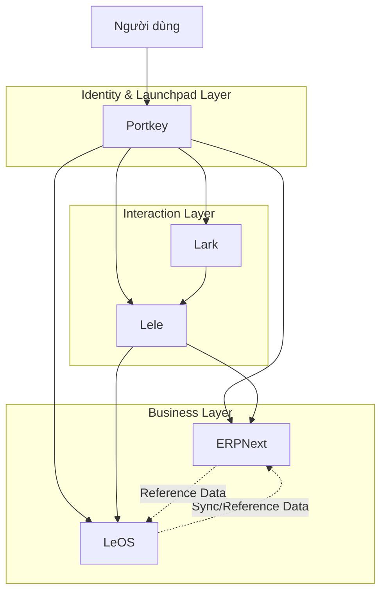
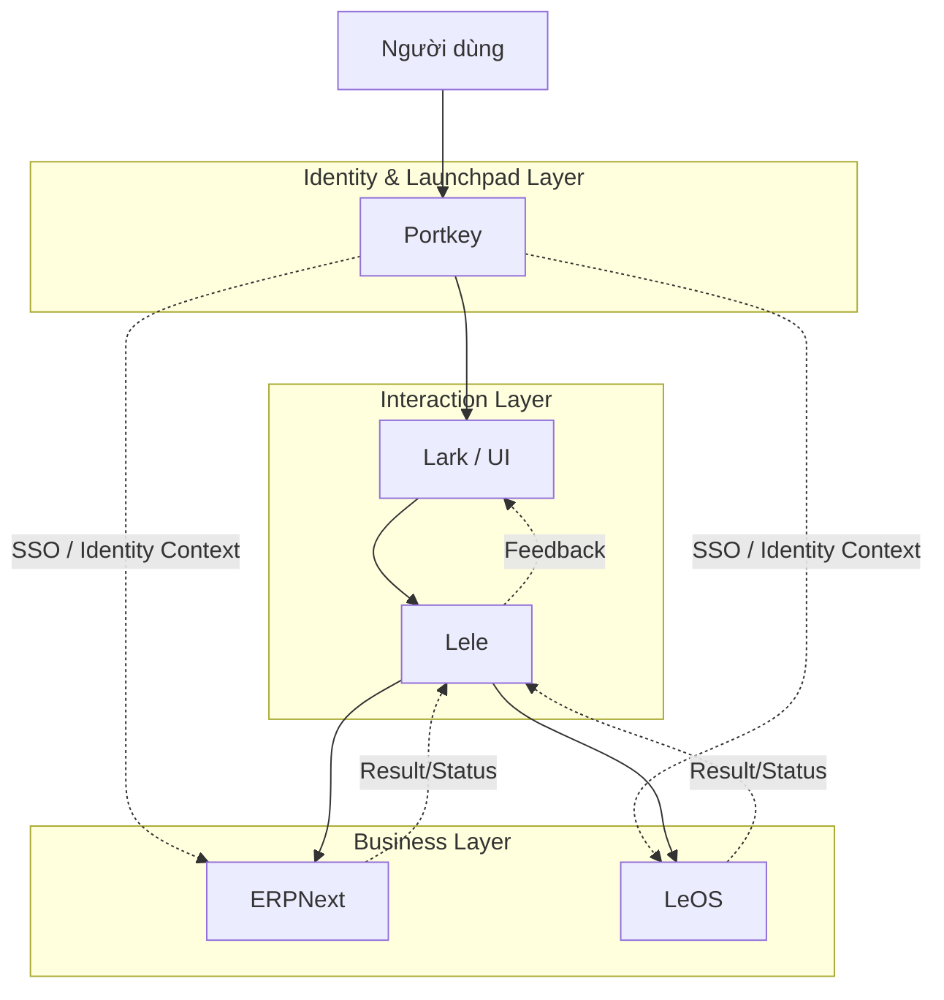
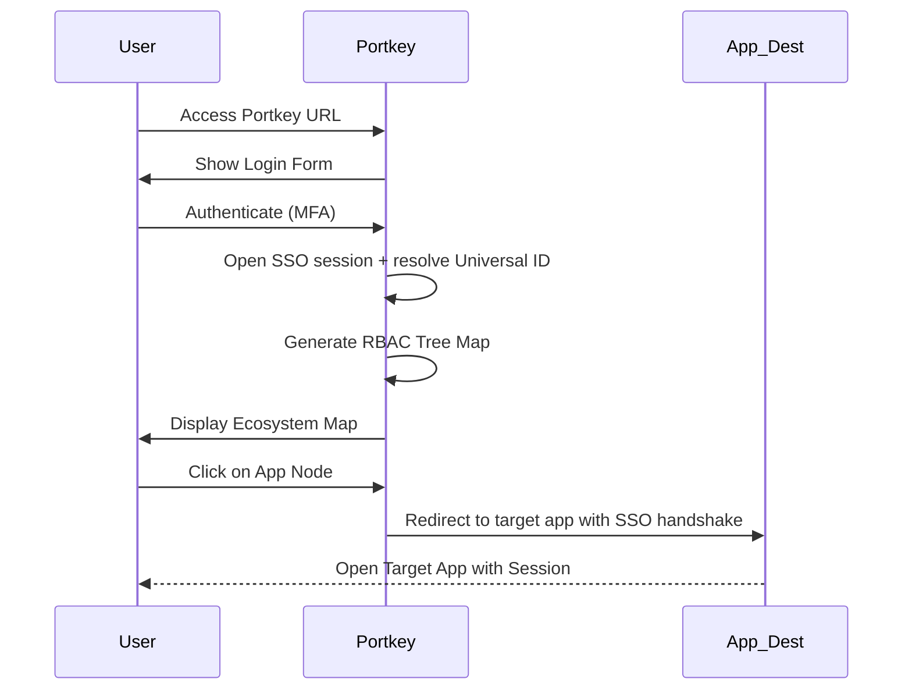
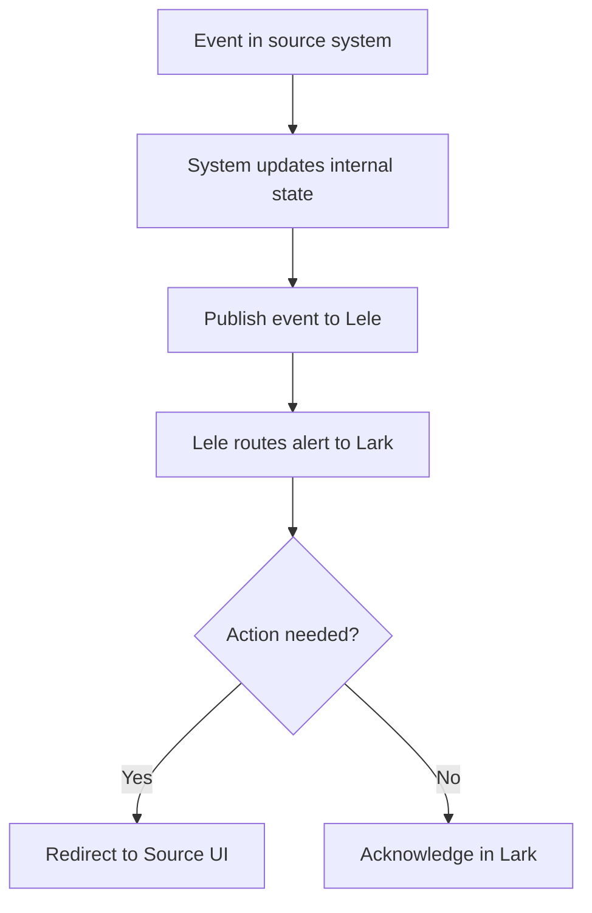
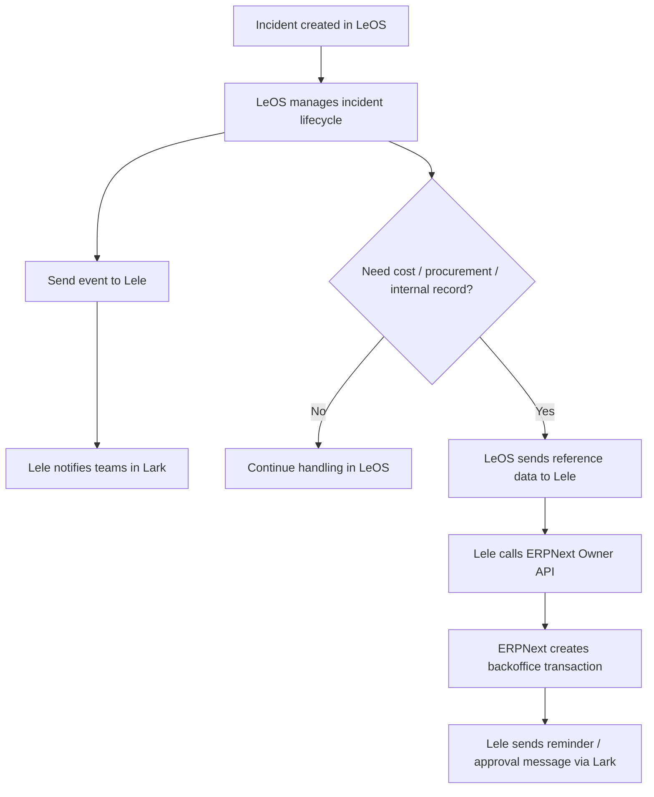
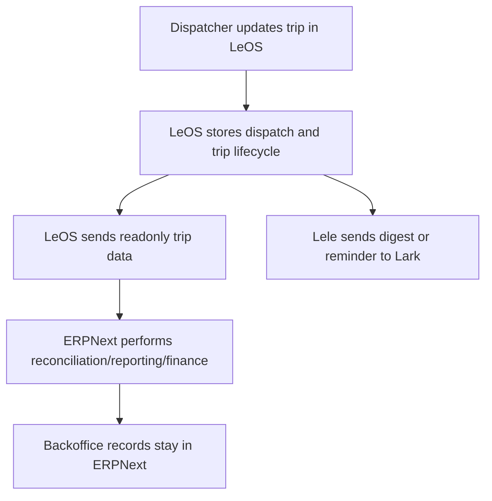
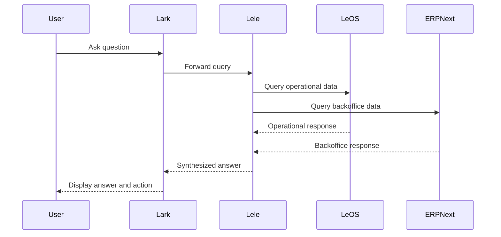
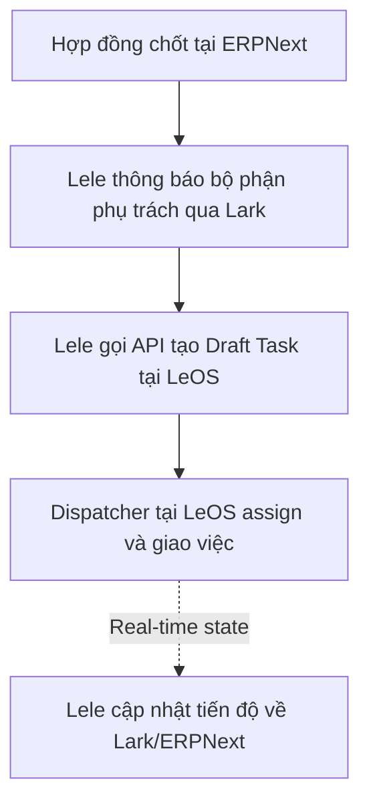
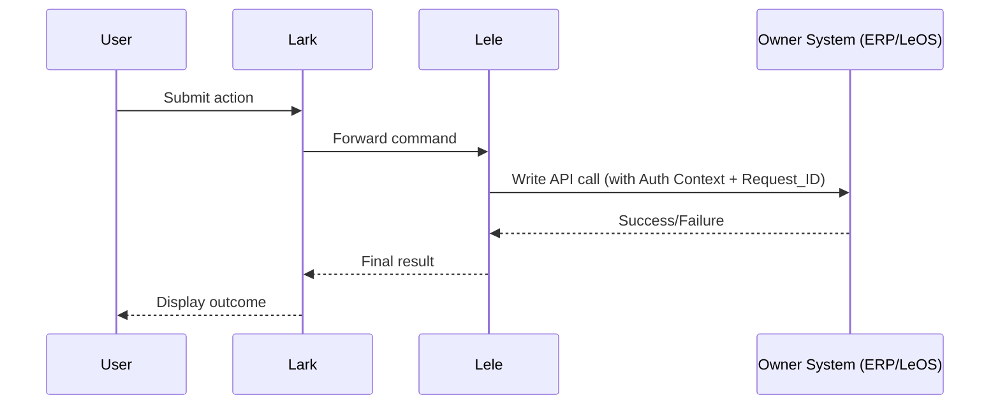

# LeOS Business Operation Ecosystem

## 1. Mục tiêu tài liệu

Tài liệu này mô tả **flow tương tác giữa các hệ thống** trong ecosystem, không đi sâu vào backlog tính năng hay boundary chi tiết.

Ecosystem gồm 5 thành phần:

* **Portkey**: cổng đăng nhập tập trung (SSO) tích hợp Ecosystem Tree Map (Launchpad)
* **Lark**: lớp giao diện tương tác và thông báo
* **Lele**: lớp assistant, orchestration và routing nghiệp vụ
* **LeOS**: hệ thống vận hành thực địa (auth via Portkey federation)
* **ERPNext**: hệ thống backoffice (auth via Portkey OIDC)

Mục tiêu chính là trả lời:

* người dùng đi vào hệ từ đâu
* dữ liệu đi từ hệ nào sang hệ nào
* khi nào là đọc, khi nào là ghi
* hệ nào tham gia vào từng business flow chính

---

## 2. Mô hình tương tác tổng thể

Hệ sinh thái (Ecosystem) được thiết kế theo cấu trúc phân tầng chức năng, đảm bảo tính nhất quán từ xác thực đến xử lý dữ liệu cuối cùng, tách biệt rõ ràng giữa truy vấn (Read) và thực thi lệnh (Write):

* **Lớp Định danh & Điều hướng (Identity & Launchpad Layer)**: `Portkey` (Powered by Keycloak) đóng vai trò cổng xác thực tập trung và bản đồ điều hướng Tree Map. Đây là điểm khởi đầu bắt buộc ("Khóa cảng") cho mọi hành trình người dùng.
* **Lớp Tích hợp & Tương tác (Interaction Layer)**: Gồm `Lark` (giao diện) và `Lele` (AI Agent). Tiếp nhận yêu cầu, kiểm tra quyền và điều phối lệnh tới đúng hệ thống nghiệp vụ sở hữu dữ liệu.
* **Lớp Nghiệp vụ & Dữ liệu (Business Layer)**: Gồm `LeOS` (Vận hành thực địa) và `ERPNext` (Quản trị văn phòng). Đây là nơi xác thực điều kiện nghiệp vụ và ghi trạng thái cuối cùng.

### 2.1 Luồng Truy vấn & Đồng bộ dữ liệu (Read-path & Sync)

Mục tiêu: mô tả cách người dùng và các hệ thống truy xuất dữ liệu, đồng thời cách dữ liệu tham chiếu được đồng bộ giữa các hệ lõi.

**Nguyên tắc vận hành:**

1. **Identity & Launchpad Layer**: Người dùng được xác thực qua `Portkey` và mở phiên truy cập tới `Lark`, `Lele`, `LeOS` hoặc `ERPNext` theo quyền được cấp.
2. **Interaction Layer**: Với nhu cầu tra cứu tức thời, `Lark` chuyển yêu cầu sang `Lele`; `Lele` xác định hệ thống đích cần truy vấn.
3. **Business Layer**: `LeOS` hoặc `ERPNext` kiểm tra quyền dựa trên danh tính/ngữ cảnh người dùng trước khi trả dữ liệu.
4. **Interaction Layer**: `Lele` có thể tổng hợp kết quả và trả lại cho người dùng qua `Lark`, nhưng không trở thành nơi lưu giữ business truth.
5. **Business Layer**: Với dữ liệu tham chiếu hoặc dữ liệu cần đối soát, `LeOS` và `ERPNext` đồng bộ nền theo lô hoặc theo sự kiện dưới dạng `sync có kiểm soát`.

### 2.2 Luồng Lệnh & Ghi dữ liệu (Write-path & Command Orchestration)

Mục tiêu: mô tả cách các hành động thay đổi trạng thái được tiếp nhận, điều phối và ghi vào đúng hệ thống sở hữu dữ liệu.

**Nguyên tắc vận hành:**

1. **Identity & Launchpad Layer**: Người dùng vào hệ qua `Portkey` và sử dụng phiên đã xác thực để thực hiện hành động.
2. **Interaction Layer**: Người dùng khởi tạo hành động từ `Lark` hoặc qua trải nghiệm có `Lele`.
3. **Interaction Layer**: `Lele` tiếp nhận yêu cầu, gắn ngữ cảnh người dùng và định tuyến lệnh tới đúng hệ thống owner.
4. **Business Layer**: Lệnh ghi được gửi trực tiếp từ `Lele` tới API hoặc service của hệ thống đích; không đi qua đường ghi chéo giữa các hệ thống nghiệp vụ.
5. **Business Layer**: `ERPNext` hoặc `LeOS` là nơi xác thực điều kiện nghiệp vụ, kiểm tra quyền và ghi trạng thái cuối cùng.
6. **Interaction Layer**: Sau khi ghi thành công hoặc thất bại, kết quả được phản hồi lại cho người dùng qua `Lark`.

---

## 3. Các Interaction Patterns (Atomic Flows)

### 3.0 Pattern 0: Identity Entrance & Launchpad

Mục tiêu: tạo một điểm tập trung duy nhất để xác thực, mở phiên SSO và điều hướng người dùng vào đúng ứng dụng trong ecosystem.
*Ví dụ: Người dùng đăng nhập vào Portkey, thấy Tree Map theo quyền hạn, rồi vào Lark, ERPNext hoặc LeOS mà không phải đăng nhập lại.*

1. Người dùng truy cập URL duy nhất của `Portkey`.
2. `Portkey` (Identity Provider) thực hiện xác thực và MFA.
3. `Portkey` mở phiên SSO và ánh xạ người dùng theo một `Universal ID` duy nhất dùng chung trong ecosystem.
4. Sau khi thành công, `Portkey` hiển thị **Ecosystem Tree Map** dựa trên phân quyền (RBAC) của người dùng.
5. Người dùng click vào một "Node" (ứng dụng) trên bản đồ.
6. `Portkey` thực hiện lệnh **SSO Redirection** tới ứng dụng đích; ứng dụng đích tự hoàn tất bước xác thực để mở session nội bộ.

### 3.1 Pattern 1: System-to-User Event Push (Real-time Alerting)

Mục tiêu: đẩy thông tin từ hệ thống tới bề mặt tương tác của người dùng.
*Ví dụ: Cảnh báo vạch xe từ LeOS, thông báo nhắc việc từ ERPNext.*

1. Sự kiện phát sinh tại hệ thống nguồn (`LeOS`/`ERPNext`).
2. Hệ thống nguồn đẩy event/summary sang `Lele`.
3. `Lele` thực hiện **Owl-post delivery**: định tuyến và đẩy alert/digest sang `Lark` theo thời gian thực.
4. Người dùng nhận tin và thực hiện điều hướng hành động (nếu cần).

### 3.2 Pattern 2: Operational-to-Backoffice Event Handoff

Mục tiêu: bàn giao sự kiện từ lớp vận hành sang lớp văn phòng để xử lý tiếp nối.
*Ví dụ: Sự cố xe phát sinh yêu cầu mua sắm/chi phí trong ERPNext, bàn giao hư hỏng vận hành.*

1. Sự cố/Sự kiện được tạo và quản lý vòng đời tại `LeOS`.
2. `LeOS` xác định sự kiện cần sự tham gia của khối văn phòng (cần chi phí, mua sắm hoặc ghi nhận hồ sơ tài sản).
3. `LeOS` gửi sự kiện kèm dữ liệu tham chiếu (Reference ID, Asset ID) sang `Lele`.
4. `Lele` điều phối việc khởi tạo bản ghi tương ứng tại `ERPNext` (thường là ở trạng thái Draft).
5. `Lele` gửi thông báo kèm link bản ghi tới bộ phận chuyên trách trên `Lark`.

### 3.3 Pattern 3: Structured Data Synchronization (ReadOnly/Batch)

Mục tiêu: đồng bộ hóa dữ liệu có cấu trúc giữa các hệ thống cho mục đích đối soát hoặc tổng hợp.
*Ví dụ: Đồng bộ dữ liệu chuyến đi từ LeOS sang ERPNext, đồng bộ mileage hàng tháng.*

1. Dữ liệu vận hành (Mileage, Fuel, Trip) được tích lũy tại `LeOS`.
2. Theo chu kỳ (cuối ca/ngày/tháng) hoặc theo trigger, `LeOS` tổng hợp tập dữ liệu (Aggregated data).
3. `LeOS` đẩy dữ liệu vào `ERPNext` dưới dạng bản ghi Read-only cho mục đích đối soát tài chính.
4. `ERPNext` thực hiện các nghiệp vụ kế toán, báo cáo dựa trên số liệu thực địa.
5. `Lele` gửi bản tin tóm tắt (Digest) kết quả đồng bộ lên `Lark` cho cấp quản lý.

### 3.4 Pattern 4: On-demand Information Retrieval (Data Pull)

Mục tiêu: truy vấn dữ liệu từ các hệ thống theo yêu cầu tức thời của người dùng.
*Ví dụ: Lãnh đạo hỏi Lele về doanh thu hôm nay hoặc vị trí xe A.*

1. Người dùng gửi câu hỏi (Chat/Voice) cho `Lele` trực tiếp hoặc qua `Lark`.
2. `Lele` xác định hệ thống đích cần truy vấn.
3. `Lele` gửi yêu cầu đọc dữ liệu kèm `User Identity Context` tới `LeOS` hoặc `ERPNext`.
4. Hệ thống nguồn kiểm tra quyền truy cập và trả về dữ liệu phù hợp với quyền của người dùng.
5. `Lele` tổng hợp kết quả và trả lời người dùng.

Guardrail: `Lele` không bypass quyền hạn; downstream luôn là nơi authorizer cuối cùng cho dữ liệu trả về.

### 3.5 Pattern 5: Interactive State-change Loop (Approval Workflow)

Mục tiêu: sử dụng bề mặt tương tác của người dùng để quyết định thay đổi trạng thái trong hệ thống đích.
*Ví dụ: Phê duyệt chi phí, xác nhận hoàn thành công việc, phê duyệt kế hoạch.*

1. `LeOS` hoặc `ERPNext` phát sinh nhu cầu phê duyệt hoặc xác nhận.
2. Hệ owner gửi approval request sang `Lele`.
3. `Lele` đẩy approval message sang `Lark`.
4. Người dùng đọc và xác nhận trong trải nghiệm tương tác.
5. `Lark` trả phản hồi về `Lele`.
6. `Lele` gửi kết quả ngược về hệ owner.
7. Hệ owner mới là nơi ghi nhận outcome cuối cùng.

Guardrail: Mọi yêu cầu phê duyệt phải có `request_id` và hệ owner là nơi quyết định outcome cuối cùng.

### 3.6 Pattern 6: Backoffice-to-Operational Task Assignment

Mục tiêu: chuyển đổi các yêu cầu/kế hoạch từ lớp văn phòng sang nhiệm vụ thực thi thực địa.
*Ví dụ: Giao lệnh điều phối từ hợp đồng bán hàng, phân công nhân sự từ kế hoạch.*

1. Hợp đồng/Đơn hàng được xác nhận trong `ERPNext`.
2. `Lele` gửi thông báo cho bộ phận phụ trách qua `Lark`.
3. `Lele` gửi yêu cầu tạo task trực tiếp tới API của `LeOS`.
4. `Dispatcher` tại `LeOS` tiếp nhận, gán việc và tiến hành điều phối thực địa.

Final write owner:

* `ERPNext` giữ hợp đồng gốc
* `LeOS` giữ task vận hành và dispatch state

### 3.7 Pattern 7: Direct Command Execution & Feedback

Mục tiêu: đảm bảo mọi lệnh ghi (Write) chỉ đi từ `Interaction Layer` tới đúng hệ thống owner và kết quả được phản hồi lại nhất quán cho người dùng.
*Ví dụ: Người dùng phê duyệt chi phí trên Lark, `Lele` gọi trực tiếp API của ERPNext, rồi trả kết quả cuối cùng về lại Lark.*

1. Hành động người dùng (Approve/Create/Update) được gửi từ `Lark` tới `Lele`.
2. `Lele` xác thực ngữ cảnh người dùng và xác định đúng hệ thống owner.
3. `Lele` gọi trực tiếp API ghi của hệ thống đích kèm `User Identity Context` và `request_id`.
4. Hệ thống owner kiểm tra quyền, kiểm tra điều kiện nghiệp vụ và thực hiện ghi.
5. Kết quả thành công hoặc thất bại được trả lại `Lele`.
6. `Lele` phản hồi kết quả cuối cùng về `Lark` để cập nhật UI hoặc approval card.

### 3.8 Use Case 1: Integrated Task Planning & Execution

Dưới đây là ví dụ về cách kết hợp các Atomic Patterns để giải quyết một chu trình nghiệp vụ trọn vẹn:

* **Lập kế hoạch**: Nhân viên xây dựng task plan trực tiếp trên Lark giao tiếp với Lele (Sử dụng Interaction Layer).
* **Phê duyệt lãnh đạo**: Lele gửi yêu cầu duyệt tới CEO/CFO qua Lark. Kết quả duyệt được ghi nhận lại (Sử dụng **Pattern 5**).
* **Kích hoạt Backoffice**: Sau khi duyệt, Lele gọi trực tiếp API của ERPNext để tạo yêu cầu cấp kinh phí/nhân lực (Sử dụng **Pattern 7**).
* **Thông báo chuyên trách**: Bộ phận thực thi nhận thông báo trên Lark kèm link trỏ thẳng vào bản ghi tương ứng trên ERPNext (Sử dụng **Pattern 1/2**).
* **Thực thi vận hành**: Nếu kế hoạch cần tác động vào máy móc/phương tiện, Lele gửi lệnh gọi API tới LeOS theo đúng contract (Sử dụng **Pattern 7**).

### 3.9 Use Case 2: Xử lý sự cố và Huy động tài chính khẩn cấp

* **Phát hiện sự cố**: LeOS phát hiện sự cố xe và gửi cảnh báo tới Lark qua Lele (Sử dụng **Pattern 1**).
* **Truy vấn nhanh**: Quản lý hỏi Lele về vị trí cứu hộ và tình trạng xe (Sử dụng **Pattern 4**).
* **Đề xuất chi phí**: Quản lý yêu cầu tạo yêu cầu chi phí thuê cứu hộ sang ERPNext (Sử dụng **Pattern 7**).
* **Duyệt chi**: CFO nhận tin nhắn và xác nhận phê duyệt ngay trên Lark (Sử dụng **Pattern 5**).
* **Ghi nhận**: ERPNext xác nhận cấp kinh phí và thông báo lại cho các bên qua Lark.

### 3.10 Use Case 3: Đối soát vận hành và Báo cáo điều hành

* **Chốt dữ liệu**: Dữ liệu mileage/ops từ LeOS được đồng bộ sang ERPNext cuối kỳ (Sử dụng **Pattern 3**).
* **Báo cáo Digest**: Lele gửi bản tin tóm tắt hiệu quả vận hành tháng cho CFO trên Lark (Sử dụng **Pattern 1**).
* **Truy vấn sâu**: CFO hỏi Lele về các xe có chi phí bảo trì bất thường (Sử dụng **Pattern 4**).
* **Điều hướng**: Lele trả lời và cung cấp URL trỏ sâu vào báo cáo chi tiết trong ERPNext (Sử dụng **Pattern 4**).

---

## 4. Vai trò của từng hệ trong flow

### 4.1 Portkey Portal (Identity & Launchpad Layer)

* mở phiên đăng nhập chung
* áp dụng MFA và chính sách truy cập
* **Sorting Hat Logic**: Tự động phân loại và phát hành hồ sơ danh tính/quyền hạn cho các ứng dụng thành viên dựa trên vai trò của người dùng.
* Hiển thị Ecosystem Tree Map điều hướng người dùng sang hệ cần thao tác chính thức.

### 4.2 Lark

* hiển thị alert, summary và message
* là một bề mặt tương tác cho người dùng
* có thể là cửa vào để người dùng làm việc với `Lele`
* là bề mặt giao tiếp cho approval và escalation
* điều hướng người dùng sang hệ cần thao tác chính thức

### 4.3 Lele

* có thể được dùng trực tiếp hoặc qua `Lark`
* nhận yêu cầu từ người dùng hoặc từ `Lark`
* điều phối query và interaction flow
* tổng hợp dữ liệu từ `LeOS` và `ERPNext`
* quyết định nội dung nào được đẩy sang `Lark`
* với các action có cấu trúc từ `Lark` (button click, approval, assign, create request), `Lele` hoạt động như `rule-based command handler`
* agent chỉ được dùng cho intent interpretation, suggestion và information retrieval; không dùng để quyết định outcome cuối cùng của command có cấu trúc
* không sở hữu business truth cuối cùng

### 4.4 LeOS

* xử lý fleet, dispatch, telemetry, incident, carbon
* phát event hoặc readonly data cho hệ khác
* giữ operational truth
* dùng `Cognito` làm auth bridge cho login path

### 4.5 ERPNext

* xử lý HR, finance, procurement, asset accounting
* tiêu thụ dữ liệu từ LeOS khi cần đối soát hoặc workflow nội bộ
* giữ backoffice truth

---

## 5. Quy tắc tương tác liên hệ

1. **Mọi truy cập** vào các hệ thống thành viên (Lark, Lele, LeOS, ERPNext) đều bắt buộc thực hiện qua **Portkey SSO**.
2. `Portkey` (Powered by Keycloak) chịu trách nhiệm xác thực và định danh, đồng thời điều hướng người dùng thông qua Tree Map Dashboard.
3. `Lark` là lớp giao diện, không sở hữu business truth.
4. `Lele` là lớp orchestration, không sở hữu business truth.
5. `LeOS` ghi operational state.
6. `ERPNext` ghi backoffice state.
7. Cross-system mặc định là `read`, `event`, hoặc `sync có kiểm soát`.
8. **Write-path Strategy**: Mọi lệnh ghi (Write/Command) xuyên hệ thống chỉ được phép đi từ `Interaction Layer` (`Lark`/`Lele`) tới đúng hệ thống owner qua API hoặc service được xác thực. Không được phép gọi API ghi trực tiếp giữa các hệ thống nghiệp vụ.
9. **Read-path Strategy**: Việc truy vấn dữ liệu (Read/Query) để hiển thị hoặc tham chiếu có thể thực hiện trực tiếp qua API Endpoint của hệ thống đích để tối ưu tốc độ.
10. Với `LeOS`, `Cognito JWT` hiện tại phải được giữ nguyên ở lớp backend.
11. **Master Data Consistency**: Các thực thể cốt lõi (Xe, Tài sản, Nhân viên, Dự án) phải sử dụng chung **Universal ID** để đảm bảo luồng Handoff (Pattern 3) không bị sai lệch dữ liệu.
12. **Idempotency**: Mọi API ghi phải hỗ trợ `request_id` để đảm bảo an toàn khi người dùng bấm lặp lại hoặc hệ thống thực hiện retry có kiểm soát.
13. **Logging**: Mọi lệnh ghi xuyên hệ thống đi qua `Lele` phải được ghi log tập trung phục vụ audit.
14. **Command Handling Principle**: Các action có cấu trúc từ `Lark` như button click, approval, assign hoặc create request phải đi qua `rule-based command handler`. Agent chỉ dùng cho query, suggestion hoặc diễn giải ý định, không thay thế rule business của hệ owner.
15. **Master Data Ownership (Source of Truth)**:
    * **Nhân viên/Bộ phận (Employees/Org)**: ERPNext (HR Module) -> Portkey -> Các hệ khác.
    * **Tài sản/Xe (Assets/Vehicles)**: ERPNext (Asset Management) -> LeOS.
    * **Đối tác/Khách hàng (Customers/Service Providers)**: ERPNext.
    * **Trip/Dispatch Data**: LeOS (Operational Truth).
    * **SSO Account**: Portkey (Credential Truth).

---

## 6. Integration map ngắn gọn

| From           | To                 | Mục đích chính                | Cách kết nối               |
| -------------- | ------------------ | --------------------------------- | ----------------------------- |
| User           | Portkey            | Đăng nhập tập trung           | HTTPS / Login Form + MFA      |
| Lark           | Portkey            | SSO                               | SAML 2.0 / OIDC               |
| ERPNext        | Portkey            | SSO                               | OIDC / OAuth2                 |
| Portkey        | LeOS (via Cognito) | SSO cho LeOS                      | OIDC Federation               |
| Lark           | Lele               | User request / interaction        | Webhook / Lark Gadget SDK     |
| LeOS           | Lele               | Alert, summary, operational event | Event-driven (WebSub/Webhook) |
| LeOS           | ERPNext            | Reconciliation, reporting         | Batch Sync / Readonly REST    |
| ERPNext        | Lele               | Approval request, reminders       | Webhook / REST API            |
| Lele           | Lark               | Alert, answer, approval messaging | Lark Bot API / App Push       |
| Lele           | LeOS/ERPNext       | Direct Query (Read-path)          | REST API (Auth Context)       |
| Lele           | LeOS/ERPNext       | Write Command (Owner API)         | REST API (Auth Context + Request_ID) |
