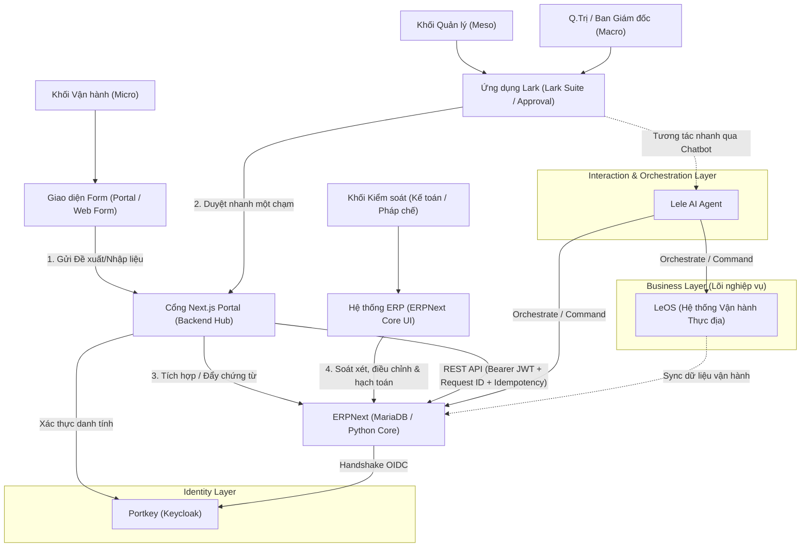
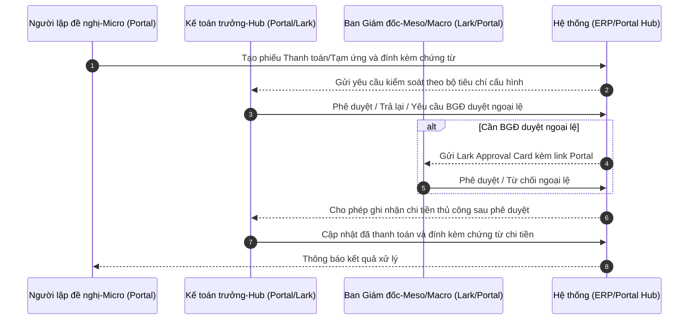
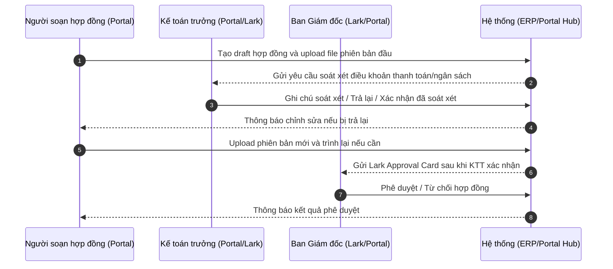
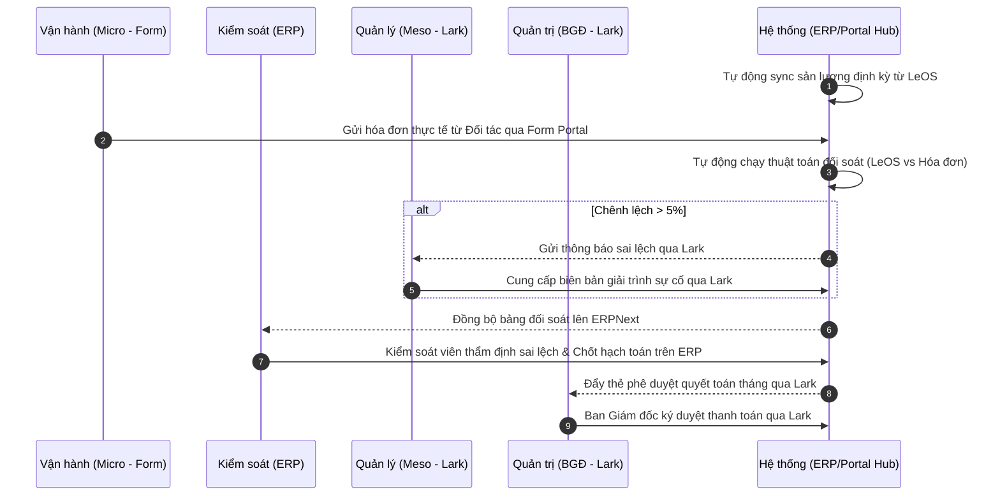
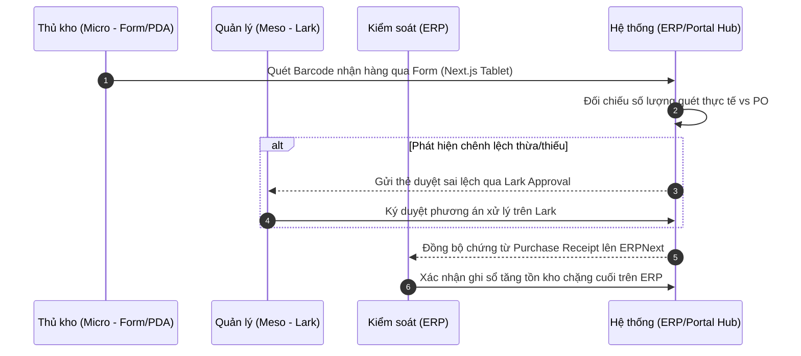
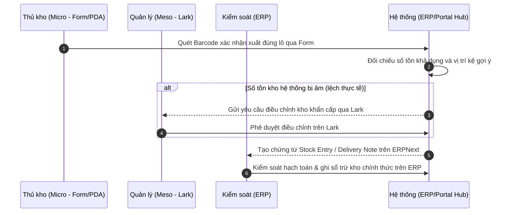

# PRODUCT REQUIREMENT DOCUMENT (PRD)

## DỰ ÁN HỆ THỐNG QUẢN TRỊ DOANH NGHIỆP ERP (NEXT.JS & ERPNEXT ECOSYSTEM)

## 1. TỔNG QUAN DỰ ÁN & MỤC TIÊU (OVERVIEW & OBJECTIVES)

### 1.1. Bối cảnh dự án

Dự án ERP này nằm trong hệ sinh thái vận hành tổng thể của LeOS (bao gồm Portkey, Lark, Lele, LeOS và ERPNext). Hệ thống ERPNext mặc định sở hữu toàn bộ logic nghiệp vụ kế toán, mua bán hàng và kho bãi (Backoffice Truth). Tuy nhiên, để tối ưu hóa trải nghiệm người dùng thực tế và tăng tốc độ thao tác cho các bộ phận chuyên môn như **Kế toán** và **Thủ kho**, doanh nghiệp lựa chọn xây dựng một cổng thông tin tùy biến bằng **Next.js** (Frontend) kết hợp với lõi thư viện nghiệp vụ mở của **ERPNext** (Backend).

### 1.2. Mục tiêu dự án

* **Tối ưu trải nghiệm (UX):** Xây dựng ứng dụng Next.js Portal có giao diện thân thiện, tập trung sâu vào tác vụ nghiệp vụ cốt lõi của Kế toán và Thủ kho, loại bỏ hoàn toàn các trường dữ liệu dư thừa của giao diện ERPNext gốc.
* **Đảm bảo tính nhất quán (Source of Truth):** Giữ nguyên lõi tính toán tài chính - kho của ERPNext. Toàn bộ giao dịch kinh tế phát sinh từ Next.js Portal phải tự động đồng bộ thời gian thực về sổ cái (General Ledger) và sổ kho (Stock Ledger) của ERPNext.
* **Vận hành liền mạch (Ecosystem Integration):** Tích hợp hoàn toàn với cơ chế đăng nhập một lần (Portkey SSO), cổng tương tác giao tiếp (Lark), và trợ lý thông minh (Lele).

### 1.3. Phạm vi triển khai Phase 1

Phase 1 tập trung vào việc chốt thiết kế tính năng cho hai luồng nghiệp vụ có mức độ ưu tiên cao nhất: **Thanh toán/Tạm ứng** và **Hợp đồng**. Các phân hệ còn lại trong PRD giữ vai trò định hướng tổng thể cho các phase sau, chưa dùng làm phạm vi triển khai chi tiết ở phase 1.

**In-scope Phase 1:**

* Module đề nghị **Thanh toán** và **Tạm ứng** trên Next.js Portal.
* Module **Hợp đồng** với luồng soát xét của Kế toán trưởng và phê duyệt của Ban Giám đốc.
* Phê duyệt qua **Lark + Portal**: Lark hiển thị thẻ duyệt tóm tắt, Portal là nơi xem chi tiết và xử lý nghiệp vụ đầy đủ.
* Màn hình **Portal Admin** để cấu hình bộ tiêu chí kiểm soát theo loại phiếu.
* Đồng bộ dữ liệu nghiệp vụ sang ERPNext theo cơ chế có idempotency, audit log và trạng thái lỗi đồng bộ.
* File/chứng từ đính kèm lưu theo cơ chế **ERPNext File** gắn với bản ghi nghiệp vụ.

**Out-of-scope Phase 1:**

* API ngân hàng tự động, tự động giải ngân hoặc tự động thực hiện chuyển khoản.
* Hoàn ứng, mua hàng đầy đủ, bán hàng, nhập/xuất kho barcode, offline warehouse mode.
* Đối soát LeOS nâng cao và các thuật toán đối soát vận hành tự động.
* Lele AI quyết định nghiệp vụ hoặc thay thế rule phê duyệt có cấu trúc.

**Nguyên tắc chi tiền Phase 1:** Sau khi đề nghị thanh toán/tạm ứng được phê duyệt, kế toán ghi nhận thủ công trạng thái đã thanh toán trên Portal/ERPNext và đính kèm chứng từ thanh toán như giấy báo nợ, phiếu chi hoặc biên nhận. Hệ thống không gọi API ngân hàng trong phase 1.

## 2. KIẾN TRÚC HỆ THỐNG & ĐỊNH HƯỚNG TƯƠNG TÁC (SYSTEM ARCHITECTURE)

Hệ thống được phát triển theo mô hình **Headless ERP (Decoupled Architecture)** phân tầng rõ rệt tương ứng với các công cụ chuyên biệt:

### 2.1. Các nguyên tắc tương tác dữ liệu theo tầng công cụ

1. **Phân vai công cụ rõ rệt:**
   * **Khối Vận hành (Micro):** Làm việc hoàn toàn trên các **Form** nhập liệu tối giản (Web Form trên Next.js Portal) để bắt đầu quy trình nghiệp vụ hoặc gửi đề xuất nhanh.
   * **Khối Quản lý (Meso) & Quản trị (Ban Giám đốc):** Sử dụng **Lark** làm kênh phê duyệt chính (Lark Approval Card). Ban Giám đốc phê duyệt chặng cuối một chạm trên Lark dựa trên kết quả đã được thẩm định.
   * **Khối Kiểm soát (Kế toán, Pháp chế):** Sử dụng trực tiếp hệ thống **ERP (ERPNext)** làm công cụ chuyên môn để soát xét ngân sách, thẩm định điều khoản hợp đồng, đối chiếu sai số chi tiết và hạch toán sổ sách tài chính.
2. **Xác thực tập trung (OIDC Keycloak):** Mọi quyền truy cập vào Next.js Portal, Lark Integration và ERPNext Backend đều được xác thực thông qua Portkey (Keycloak SSO). JWT Token phát hành bởi Portkey được truyền kèm trong header của mọi yêu cầu API.
3. **Nguyên tắc ghi dữ liệu (Write-Path Strategy):** Mọi hành động ghi dữ liệu (tạo chứng từ, đổi trạng thái) từ Next.js Portal hoặc Lark/Lele vào ERPNext phải thông qua API được định danh rõ ràng kèm `request_id` để đảm bảo tính **Idempotency** (chống trùng lặp giao dịch).
4. **Nguyên tắc đọc dữ liệu (Read-Path Strategy):** Next.js Portal và hệ thống tích hợp gọi trực tiếp các API Read-only của ERPNext để truy vấn số liệu tồn kho, danh mục tài khoản, hoặc báo cáo tài chính nhằm đảm bảo tốc độ phản hồi nhanh nhất.
5. **Ủy nhiệm & Chuyển tiếp (Delegation & Forwarding):** Bổ sung tính năng forward/ủy nhiệm phê duyệt tại kế toán trưởng. Hệ thống cho phép Kế toán trưởng ủy quyền hoặc chuyển tiếp (forward) luồng soát xét/phê duyệt cho nhân sự khác để đảm bảo không ách tắc quy trình vận hành.

## 3. PHÂN HỆ NGHIỆP VỤ CHI TIẾT (FUNCTIONAL REQUIREMENTS)

Hệ thống ERP Portal tích hợp tập trung vào việc phục vụ các khối nghiệp vụ thông qua các công cụ đã được tối ưu hóa.

### 3.1. Phân hệ Kế toán (Accounting Module)

#### 3.1.1. Quy trình Đề nghị Thanh toán & Tạm ứng (Payment & Advance Process)

Luồng phase 1 áp dụng cho hai loại phiếu: **Thanh toán** và **Tạm ứng**. Kế toán trưởng là người kiểm soát và phê duyệt chính đối với các khoản chi thường lệ; Ban Giám đốc chỉ tham gia khi đề nghị thuộc trường hợp ngoại lệ theo rule cấu hình.

**Chi tiết các bước thực hiện trên hệ thống:**

* **Bước 1: Lập phiếu Thanh toán/Tạm ứng**
  * **Người lập đề nghị:** Tạo phiếu trên Next.js Portal, nhập thông tin chi phí, đối tượng nhận tiền và đính kèm chứng từ liên quan.
* **Bước 2: Kế toán trưởng kiểm soát**
  * **Kế toán trưởng:** Kiểm tra phiếu theo bộ tiêu chí cấu hình trên Portal Admin, bao gồm chứng từ, ngân sách, công nợ, định khoản và hạn mức. Phase 1 không có bước kế toán viên trung gian.
* **Bước 3: Phê duyệt hoặc trả lại**
  * **Kế toán trưởng:** Phê duyệt phiếu thường lệ, trả lại nếu thiếu thông tin/chứng từ, hoặc chuyển BGĐ duyệt ngoại lệ khi rule cấu hình yêu cầu.
* **Bước 4: BGĐ duyệt ngoại lệ nếu cần**
  * **Ban Giám đốc:** Chỉ duyệt các phiếu vượt hạn mức, vượt ngân sách, loại chi đặc biệt hoặc rule cấu hình yêu cầu BGĐ. Các khoản chi thường lệ không cần BGĐ duyệt.
* **Bước 5: Ghi nhận chi tiền thủ công**
  * **Kế toán trưởng hoặc người được phân quyền kế toán:** Cập nhật trạng thái đã thanh toán và đính kèm chứng từ chi tiền. Hệ thống không tự động gọi API ngân hàng trong phase 1.

**Chi tiết phân bổ công cụ & tính năng:**

* **Người lập đề nghị - Portal:**
  * Web Form tối giản trên Next.js Portal, tối ưu hóa hiển thị trên desktop và mobile.
  * Hỗ trợ kéo thả file, biên lai, hợp đồng, hóa đơn; file được lưu theo ERPNext File gắn với bản ghi nghiệp vụ.
* **Kế toán trưởng - Portal/Lark:**
  * Nhận thông báo qua Lark, mở Portal để xem hồ sơ chi tiết và checklist kiểm soát.
  * Có quyền phê duyệt, trả lại, yêu cầu bổ sung thông tin, hoặc chuyển BGĐ duyệt ngoại lệ.
* **BGĐ - Lark/Portal:**
  * Nhận Lark Approval Card đối với phiếu ngoại lệ, xem tóm tắt và mở Portal khi cần xem chi tiết.
* **ERPNext - Backoffice Truth:**
  * Lưu chứng từ nghiệp vụ, trạng thái đồng bộ, audit log và dữ liệu phục vụ hạch toán.

#### 3.1.2. Quy trình Quản lý Hợp đồng Kinh tế (Contract Management)

Luồng phase 1 tập trung vào soạn thảo hợp đồng, soát xét của Kế toán trưởng và phê duyệt của Ban Giám đốc. Phase 1 chưa đưa Pháp chế vào luồng chính.

**Chi tiết các bước thực hiện trên hệ thống:**

* **Bước 1: Soạn thảo hợp đồng nháp**
  * **Người soạn hợp đồng:** Điền thông tin cơ bản của hợp đồng trên Portal và tải file hợp đồng lên. Trạng thái: *Draft*.
* **Bước 2: Kế toán trưởng soát xét**
  * **Kế toán trưởng:** Soát xét điều khoản thanh toán, ngân sách, hồ sơ chứng từ liên quan và rủi ro tài chính. Có thể ghi chú, trả lại để chỉnh sửa hoặc xác nhận đã soát xét.
* **Bước 3: Hoàn thiện & Trình duyệt**
  * **Người soạn hợp đồng:** Cập nhật phiên bản mới nếu bị trả lại, sau đó trình lại cho Kế toán trưởng hoặc chuyển tiếp đến BGĐ khi đã được Kế toán trưởng xác nhận.
* **Bước 4: BGĐ phê duyệt hợp đồng**
  * **Ban Giám đốc:** Nhận thẻ duyệt qua Lark, xem tóm tắt nội dung và mở Portal khi cần xem file/ghi chú chi tiết. Sau khi duyệt, trạng thái chuyển sang *Approved* hoặc *Active* tùy cách vận hành được cấu hình.

**Phân bổ công cụ & tính năng chi tiết:**

* **Người soạn hợp đồng - Portal:**
  * Form nhập thông tin hợp đồng, upload file và theo dõi timeline xử lý.
  * Hỗ trợ version file cơ bản: mỗi lần upload bản mới ghi nhận số phiên bản, người upload, thời gian và ghi chú.
* **Kế toán trưởng - Portal/Lark:**
  * Nhận thông báo soát xét, ghi chú nội dung cần chỉnh sửa hoặc xác nhận đã soát xét.
* **Ban Giám đốc - Lark/Portal:**
  * Thẻ duyệt hợp đồng hiển thị tên hợp đồng, đối tác, giá trị, ghi chú Kế toán trưởng và link mở file/chi tiết.
* **ERPNext - Backoffice Truth:**
  * Lưu bản ghi hợp đồng, file đính kèm, trạng thái phê duyệt và audit log.

### 3.2. Phân hệ Phê duyệt Động (Workflow & Approval Matrix)

Hệ thống quản lý phân cấp phê duyệt động dựa trên cấu trúc tổ chức 3 tầng với các công cụ tương tác chuyên biệt.

**Ma trận Phê duyệt Phase 1 cho Thanh toán/Tạm ứng:**

| Loại đề xuất chi phí                  | Điều kiện                                                                           | Luồng phê duyệt & Công cụ                                                                                                                                                       |
| :----------------------------------------- | :------------------------------------------------------------------------------------- | :----------------------------------------------------------------------------------------------------------------------------------------------------------------------------------- |
| **Chi thường lệ**                 | Đạt bộ tiêu chí kiểm soát, không vượt rule yêu cầu BGĐ                    | **Kế toán trưởng** kiểm soát và phê duyệt (**Portal/Lark**) $\rightarrow$ Kế toán ghi nhận chi tiền thủ công và đính kèm chứng từ.                |
| **Chi vượt hạn mức**             | Hạn mức cụ thể cấu hình theo loại phiếu -**Cần stakeholder xác nhận** | **Kế toán trưởng** kiểm soát (**Portal**) $\rightarrow$ **BGĐ** duyệt ngoại lệ (**Lark/Portal**) $\rightarrow$ ghi nhận chi tiền thủ công. |
| **Chi vượt ngân sách**           | Rule ngân sách cấu hình theo loại phiếu -**Cần stakeholder xác nhận**   | **Kế toán trưởng** kiểm soát (**Portal**) $\rightarrow$ **BGĐ** duyệt ngoại lệ (**Lark/Portal**) $\rightarrow$ ghi nhận chi tiền thủ công. |
| **Loại chi đặc biệt/khẩn cấp** | Danh mục loại chi đặc biệt -**Cần stakeholder xác nhận**                 | **Kế toán trưởng** kiểm soát (**Portal/Lark**) $\rightarrow$ **BGĐ** duyệt nếu rule yêu cầu (**Lark/Portal**).                                  |

**Quy tắc định tuyến phê duyệt đặc cách (Bỏ qua tầng trung gian):**

* Phase 1 không có bước phê duyệt trung gian của kế toán viên hoặc quản lý trực tiếp trong luồng Thanh toán/Tạm ứng.
* Portal Admin cho phép cấu hình rule xác định khi nào cần BGĐ duyệt ngoại lệ.
* Nếu đề nghị liên quan Incident ID từ LeOS, Portal ghi nhận mã tham chiếu để phục vụ kiểm soát; việc tự động xác minh Incident ID và định tuyến khẩn cấp nâng cao được đưa sang phase sau.

### 3.3. Tích hợp Đối soát Dữ liệu Vận hành (Operational & Service Reconciliation)

Luồng truyền nhận, hiển thị dữ liệu phục vụ đối soát chi phí tự động qua các công cụ Form, Lark và ERPNext:

**Phân bổ công cụ & tính năng chi tiết:**

* **Khối Vận hành (Micro) - Form:**
  * Sử dụng **Form** trên Portal để tải hóa đơn và bảng kê sản lượng của nhà thầu.
* **Khối Kiểm soát - ERP:**
  * Làm việc trực tiếp trên giao diện **ERP** (ERPNext) để kiểm duyệt bảng đối soát chi tiết, so khớp chứng từ gốc và ghi nhận các bút toán điều chỉnh chênh lệch.
* **Khối Quản lý (Meso) & Quản trị (BGĐ) - Lark:**
  * **Meso:** Tiếp nhận cảnh báo sai lệch và thảo luận tìm phương án xử lý trực tiếp trên Lark.
  * **BGĐ:** Xem báo cáo quyết toán chi tiêu tháng đã được khối Kiểm soát chốt trên ERP, thực hiện duyệt chi một chạm trên Lark.

### 3.4. Phân hệ Thủ kho (Warehouse Management Module)

Hệ thống cung cấp quy trình quản lý kho tối giản, phân định rõ ràng các kênh tương tác: Form nhập liệu thực địa (Micro), Lark hỗ trợ duyệt chênh lệch (Meso), và ERPNext để kiểm soát và ghi sổ chính thức (Kiểm soát).

#### 3.4.1. Nghiệp vụ Nhập kho (Purchase Receipt)

**Quy tắc xử lý ngoại lệ khi nhập kho:**

* **Quét Barcode lạ (không có trong danh mục):** Form trên Portal hiển thị hộp thoại cảnh báo nhanh "Sản phẩm chưa có mã trên hệ thống", cho phép thủ kho chụp ảnh sản phẩm, lưu tạm vào hàng chờ phân loại và tiếp tục quét các sản phẩm tiếp theo mà không làm gián đoạn tiến trình nhận hàng.
* **Chênh lệch số lượng:** Hệ thống tự động chuyển yêu cầu duyệt phương án xử lý chênh lệch sang **Lark** của Meso. Sau khi được duyệt, hệ thống tự động đồng bộ chứng từ lên ERPNext để **Kiểm soát** kiểm tra và hạch toán vào tài khoản chênh lệch kho.

#### 3.4.2. Nghiệp vụ Xuất kho (Delivery Note / Stock Entry)

**Cơ chế hoạt động ngoại tuyến (Offline Mode) cho Thủ kho:**

* **Lưu trữ cục bộ:** Khi mất kết nối mạng, giao diện **Form** trên Portal tự động lưu trữ lịch sử quét barcode và dữ liệu phiếu nhập/xuất vào **IndexedDB** của trình duyệt thiết bị.
* **Tự động đồng bộ (Auto-sync):** Khi có mạng trở lại, Portal tự động đẩy dữ liệu lên ERPNext Backend theo cơ chế FIFO.
* **Xử lý xung đột tồn kho:** Nếu trong quá trình offline, mặt hàng đó bị hệ thống khác xuất hết dẫn đến âm kho thực tế trên backend: Backend trả về lỗi xung đột, hệ thống đẩy thông báo lỗi qua **Lark** để Meso phối hợp với thủ kho (Micro) điều chỉnh và xử lý thủ công.

### 3.5. Thiết kế tính năng Phase 1 (Payment/Advance & Contract)

#### 3.5.1. Vai trò & phân quyền

| Vai trò                            | Mô tả                                                                  | Quyền chính Phase 1                                                                                                                                                                                       |
| :---------------------------------- | :----------------------------------------------------------------------- | :---------------------------------------------------------------------------------------------------------------------------------------------------------------------------------------------------------- |
| **Người lập đề nghị**   | Nhân sự phát sinh nhu cầu thanh toán/tạm ứng                      | Tạo, sửa bản nháp, gửi duyệt, xem phiếu của mình, bổ sung chứng từ khi bị trả lại.                                                                                                           |
| **Người soạn hợp đồng** | Bộ phận phát sinh hoặc phụ trách hợp đồng                       | Tạo draft hợp đồng, upload version file, gửi Kế toán trưởng soát xét, theo dõi trạng thái.                                                                                                    |
| **Kế toán trưởng (KTT)**  | Người kiểm soát tài chính và phê duyệt thanh toán thường lệ | Review hồ sơ, kiểm checklist tiêu chí, phê duyệt/trả lại thanh toán, xác nhận soát xét hợp đồng, chuyển BGĐ duyệt ngoại lệ, ghi nhận chi tiền thủ công nếu được phân quyền. |
| **Ban Giám đốc (BGĐ)**    | Người duyệt ngoại lệ thanh toán và duyệt hợp đồng             | Duyệt/từ chối phiếu thanh toán ngoại lệ, duyệt/từ chối hợp đồng sau khi KTT soát xét, xem file và timeline liên quan.                                                                      |
| **Portal Admin**              | Người quản trị cấu hình nghiệp vụ                                | Cấu hình bộ tiêu chí kiểm soát, file bắt buộc, rule yêu cầu BGĐ, hạn mức/ngân sách, xem audit/sync status.                                                                                  |

**Ghi chú phân quyền:** Role thực tế theo phòng ban/chức danh và phạm vi dữ liệu theo công ty/chi nhánh/bộ phận là **Cần stakeholder xác nhận**.

#### 3.5.2. Danh sách màn hình Phase 1

| Màn hình                                           | Người dùng chính                             | Mục đích                                                                                                      |
| :--------------------------------------------------- | :----------------------------------------------- | :--------------------------------------------------------------------------------------------------------------- |
| **Dashboard Portal**                           | Người lập, KTT, BGĐ, Admin                   | Xem số lượng phiếu chờ xử lý, phiếu bị trả lại, phiếu lỗi đồng bộ và các shortcut nghiệp vụ. |
| **Danh sách Thanh toán/Tạm ứng**           | Người lập, KTT, BGĐ                          | Tra cứu, lọc theo trạng thái, loại phiếu, người lập, ngày cần chi, số tiền.                         |
| **Form tạo/sửa Thanh toán/Tạm ứng**       | Người lập đề nghị                          | Nhập thông tin đề nghị, upload chứng từ, lưu nháp hoặc gửi KTT.                                       |
| **Chi tiết phiếu + Timeline**                | Tất cả role có quyền                         | Xem thông tin phiếu, file, trạng thái, lịch sử xử lý, lý do trả lại/từ chối.                        |
| **Màn hình KTT Review**                      | Kế toán trưởng                               | Kiểm checklist tiêu chí, ghi chú kiểm soát, phê duyệt, trả lại hoặc chuyển BGĐ duyệt ngoại lệ.   |
| **Ghi nhận chi tiền**                        | KTT hoặc người được phân quyền kế toán | Cập nhật đã thanh toán, đính kèm giấy báo nợ/phiếu chi/biên nhận.                                  |
| **Danh sách Hợp đồng**                     | Người soạn, KTT, BGĐ                         | Tra cứu hợp đồng theo trạng thái, đối tác, giá trị, thời hạn.                                       |
| **Form tạo/sửa Hợp đồng**                 | Người soạn hợp đồng                        | Nhập metadata hợp đồng, upload file version, gửi KTT soát xét.                                            |
| **Chi tiết Hợp đồng + Version + Timeline** | Người soạn, KTT, BGĐ                         | Xem version file, ghi chú KTT, lịch sử duyệt, trạng thái phê duyệt.                                      |
| **Cấu hình tiêu chí kiểm soát**          | Portal Admin, KTT                                | Cấu hình checklist, file bắt buộc, rule yêu cầu BGĐ theo loại phiếu.                                    |
| **Audit/Sync Status**                          | Portal Admin                                     | Xem log thay đổi, trạng thái đồng bộ ERPNext, lỗi và thao tác retry.                                   |

#### 3.5.3. Workflow State Table

**Thanh toán/Tạm ứng**

| Trạng thái               | Ý nghĩa                                           | Role thao tác chính                    | Hành động kế tiếp                                    |
| :------------------------- | :-------------------------------------------------- | :--------------------------------------- | :-------------------------------------------------------- |
| **Draft**            | Phiếu đang nháp                                  | Người lập đề nghị                  | Sửa, upload file, gửi duyệt hoặc hủy.                |
| **Submitted**        | Đã gửi vào luồng kiểm soát                   | Hệ thống                               | Gửi thông báo KTT qua Lark/Portal.                     |
| **KTT Reviewing**    | KTT đang kiểm soát                               | Kế toán trưởng                       | Phê duyệt, trả lại, yêu cầu BGĐ duyệt ngoại lệ. |
| **Returned**         | Bị trả lại để bổ sung                         | Người lập đề nghị                  | Sửa/bổ sung chứng từ và gửi lại.                   |
| **KTT Approved**     | KTT đã phê duyệt chi thường lệ               | KTT hoặc kế toán được phân quyền | Ghi nhận chi tiền thủ công.                           |
| **BGD Required**     | Cần BGĐ duyệt ngoại lệ                         | BGĐ                                     | Duyệt hoặc từ chối trên Lark/Portal.                 |
| **BGD Approved**     | BGĐ đã duyệt ngoại lệ                         | KTT hoặc kế toán được phân quyền | Ghi nhận chi tiền thủ công.                           |
| **Payment Recorded** | Đã ghi nhận chi tiền và đính kèm chứng từ | Hệ thống/KTT                           | Đồng bộ ERPNext, đóng vòng xử lý phase 1.         |
| **Cancelled**        | Phiếu bị hủy                                     | Người lập hoặc Admin theo quyền     | Kết thúc, không cho ghi chi tiền.                     |
| **Sync Failed**      | Đồng bộ ERPNext lỗi                             | Portal Admin                             | Xem lỗi, retry hoặc chuyển xử lý thủ công.         |

**Hợp đồng**

| Trạng thái                    | Ý nghĩa                                  | Role thao tác chính           | Hành động kế tiếp                                                             |
| :------------------------------ | :----------------------------------------- | :------------------------------ | :--------------------------------------------------------------------------------- |
| **Draft**                 | Hợp đồng đang nháp                    | Người soạn hợp đồng       | Sửa metadata, upload file, gửi KTT.                                              |
| **Submitted**             | Đã gửi soát xét                       | Hệ thống                      | Gửi thông báo KTT qua Lark/Portal.                                              |
| **KTT Reviewing**         | KTT đang soát xét                       | Kế toán trưởng              | Ghi chú, trả lại hoặc xác nhận đã soát xét.                              |
| **Returned**              | Bị trả lại để chỉnh sửa             | Người soạn hợp đồng       | Upload version mới và gửi lại.                                                 |
| **KTT Reviewed**          | KTT xác nhận đã soát xét             | Hệ thống                      | Chuyển BGĐ duyệt.                                                               |
| **BGD Approval Required** | Chờ BGĐ duyệt                           | BGĐ                            | Phê duyệt hoặc từ chối.                                                       |
| **Approved**              | BGĐ đã phê duyệt                      | Người soạn hợp đồng       | Chuyển đối tác ký/hoàn thiện theo quy trình thực tế.                     |
| **Active/Completed**      | Hợp đồng đã có hiệu lực/hoàn tất | Người soạn/Admin             | Cập nhật theo kết quả ký chính thức -**Cần stakeholder xác nhận**. |
| **Cancelled**             | Hợp đồng bị hủy                       | Người soạn/Admin theo quyền | Kết thúc, không trình duyệt tiếp.                                            |
| **Sync Failed**           | Đồng bộ ERPNext lỗi                    | Portal Admin                    | Xem lỗi, retry hoặc chuyển xử lý thủ công.                                  |

#### 3.5.4. Form Field Table

**Thanh toán/Tạm ứng**

| Nhóm field               | Field                                                                | Ghi chú                                                                                                            |
| :------------------------ | :------------------------------------------------------------------- | :------------------------------------------------------------------------------------------------------------------ |
| Thông tin chung          | Loại phiếu                                                         | Giá trị phase 1:`Thanh toán`, `Tạm ứng`.                                                                   |
| Thông tin chung          | Người lập, bộ phận, cost center                                 | Tự lấy theo tài khoản/ERPNext nếu có; phạm vi dữ liệu**Cần stakeholder xác nhận**.                |
| Đối tượng nhận tiền | Nhà cung cấp/nhân viên nhận tiền                               | Nguồn master data từ ERPNext.                                                                                     |
| Giá trị                 | Số tiền, loại tiền, ngày cần chi                               | Validation hạn mức/ngân sách theo cấu hình.                                                                   |
| Nội dung                 | Nội dung chi, loại chi phí, ngân sách liên quan                | Danh mục loại chi phí và ngân sách**Cần stakeholder xác nhận**.                                      |
| Thanh toán               | Tài khoản nhận tiền, phương thức chi                          | Phase 1 dùng để ghi nhận và kiểm soát, không tự động gọi ngân hàng.                                   |
| Chứng từ                | Hóa đơn, hợp đồng, biên bản nghiệm thu, chứng từ khác    | File bắt buộc theo loại phiếu do Portal Admin cấu hình.                                                       |
| Khẩn cấp                | Mức độ khẩn cấp, mã Incident ID nếu có                       | Tự động xác minh Incident ID để phase sau.                                                                    |
| Kiểm soát               | Checklist KTT, ghi chú kiểm soát, lý do trả lại/từ chối      | Checklist lấy từ cấu hình theo loại phiếu.                                                                    |
| Ghi nhận chi tiền       | Ngày chi, mã giao dịch/chứng từ, file giấy báo nợ/phiếu chi | Bắt buộc khi chuyển sang `Payment Recorded` - **Cần stakeholder xác nhận field bắt buộc cụ thể**. |

**Hợp đồng**

| Nhóm field      | Field                                                         | Ghi chú                                                               |
| :--------------- | :------------------------------------------------------------ | :--------------------------------------------------------------------- |
| Thông tin chung | Tên hợp đồng, loại hợp đồng, bộ phận phụ trách    | Loại hợp đồng**Cần stakeholder xác nhận**.                |
| Đối tác       | Đối tác/khách hàng/nhà cung cấp                        | Nguồn master data từ ERPNext.                                        |
| Giá trị        | Giá trị hợp đồng, loại tiền, thời hạn hiệu lực     | Validation theo cấu hình nếu có.                                   |
| Điều khoản    | Điều khoản thanh toán, ngân sách/cost center liên quan | Là trọng tâm soát xét của KTT.                                   |
| File hợp đồng | File hợp đồng, số version, ghi chú version               | Mỗi lần upload tạo version mới với người upload và thời gian. |
| Soát xét       | Ghi chú KTT, kết quả soát xét, lý do trả lại          | Bắt buộc khi KTT trả lại hoặc xác nhận soát xét.              |
| Phê duyệt      | Trạng thái BGĐ, lý do từ chối nếu có                  | Reject/return bắt buộc nhập lý do.                                 |

#### 3.5.5. Portal Admin Config Design

Portal Admin cung cấp màn hình cấu hình bộ tiêu chí kiểm soát theo **loại phiếu**. Phase 1 tối thiểu hỗ trợ:

| Nhóm cấu hình      | Nội dung                                                     | Ghi chú                                                                                                 |
| :-------------------- | :------------------------------------------------------------ | :------------------------------------------------------------------------------------------------------- |
| Checklist bắt buộc  | Danh sách tiêu chí KTT phải kiểm trước khi phê duyệt | Ví dụ: đủ chứng từ, đúng ngân sách, đúng đối tượng nhận tiền, không trùng yêu cầu. |
| File bắt buộc       | Loại file cần có theo loại phiếu                         | Ví dụ: hóa đơn, hợp đồng, biên bản nghiệm thu -**Cần stakeholder xác nhận**.         |
| Rule yêu cầu BGĐ   | Điều kiện chuyển sang BGĐ duyệt ngoại lệ              | Vượt hạn mức, vượt ngân sách, loại chi đặc biệt.                                             |
| Hạn mức/ngân sách | Ngưỡng tiền và rule ngân sách theo loại phiếu         | Giá trị ngưỡng cụ thể**Cần stakeholder xác nhận**.                                        |
| Audit cấu hình      | Ghi nhận người sửa, thời gian, giá trị trước/sau     | Bắt buộc đối với mọi thay đổi cấu hình.                                                        |

#### 3.5.6. ERPNext Mapping Table (DocType đề xuất)

| Nghiệp vụ Portal         | ERPNext DocType đề xuất                             | Ghi chú                                                                                                              |
| :------------------------- | :----------------------------------------------------- | :-------------------------------------------------------------------------------------------------------------------- |
| Đề nghị thanh toán NCC | `Payment Request` hoặc custom `Payment Proposal`  | Chốt DocType cuối cùng ở technical design sau khi rà soát ERPNext customization.                                |
| Tạm ứng                  | `Employee Advance` hoặc custom `Advance Request`  | Nếu tạm ứng cho nhà cung cấp/đối tượng khác nhân viên cần custom -**Cần stakeholder xác nhận**. |
| Ghi nhận đã chi tiền   | `Payment Entry`                                      | Phase 1 ghi nhận thủ công, chưa gọi API ngân hàng.                                                             |
| Hợp đồng                | `Contract` hoặc custom `Contract Review`          | Cần giữ version file và trạng thái soát xét KTT/BGĐ.                                                          |
| File/chứng từ            | `File` gắn với business record                     | ERPNext giữ file/chứng từ cùng bản ghi nghiệp vụ.                                                              |
| Audit log                  | `Version`, `Activity Log` hoặc custom audit table | Cần thống nhất với khả năng ERPNext/Frappe hiện có trong technical design.                                    |

#### 3.5.7. Lark Approval Card Design

| Card                                              | Nội dung hiển thị                                                                               | Hành động                                          |
| :------------------------------------------------ | :------------------------------------------------------------------------------------------------- | :---------------------------------------------------- |
| **Thanh toán/Tạm ứng - KTT**             | Mã phiếu, người lập, loại phiếu, số tiền, loại chi, trạng thái chứng từ, link Portal | Approve, Return, Request More Info, Escalate to BGĐ. |
| **Thanh toán/Tạm ứng - BGĐ ngoại lệ** | Mã phiếu, lý do ngoại lệ, số tiền, loại chi, ghi chú KTT, link Portal                     | Approve, Reject, Open Portal.                         |
| **Hợp đồng - KTT**                       | Tên hợp đồng, đối tác, giá trị, điều khoản thanh toán tóm tắt, link file/Portal     | Reviewed, Return, Request More Info.                  |
| **Hợp đồng - BGĐ**                      | Tên hợp đồng, đối tác, giá trị, ghi chú KTT, link file/Portal                            | Approve, Reject, Open Portal.                         |

**Quy tắc Lark Card:**

* Reject/Return bắt buộc nhập lý do.
* Button chỉ hiển thị khi người dùng có quyền tương ứng.
* Nếu thao tác trên Lark thành công nhưng ERPNext sync lỗi, Portal phải hiển thị `Sync Failed` và cho Portal Admin retry.
* Nếu Lark gửi card thất bại, hệ thống ghi lỗi vào Audit/Sync Status và cho phép gửi lại.

## 4. YÊU CẦU KỸ THUẬT & TÍCH HỢP HỆ THỐNG (TECHNICAL REQUIREMENTS)

### 4.0. Công nghệ áp dụng (Technology Stack)

* **Frontend Portal:** Next.js (React), TailwindCSS (xây dựng giao diện tùy chỉnh cao gọn nhẹ, tối ưu hóa cho nghiệp vụ kế toán, kho bãi).
* **Backend & Core Logic:** ERPNext (Frappe Framework - Python) kết hợp với cơ sở dữ liệu **AWS DynamoDB** (sử dụng dịch vụ quản trị NoSQL có khả năng mở rộng cao trên môi trường Production, và Local DynamoDB Docker cho môi trường Phát triển) nhằm vận hành các nghiệp vụ và lưu trữ dữ liệu lõi.
* **Identity & SSO Provider:** Portkey (Keycloak) đóng vai trò cổng xác thực tập trung theo giao thức OpenID Connect (OIDC).
* **Interaction & Message Hub:** Lark App (Lark Bot API, Lark Gadget SDK) kết hợp hệ thống AI Orchestrator Lele để xử lý các thẻ duyệt nhanh (Approval Cards) và thông báo nghiệp vụ.
* **Operational Integration:** Hệ thống vận hành thực địa LeOS (AWS Backend, Cognito JWT Auth) để đồng bộ chéo dữ liệu sản lượng và hiệu suất dịch vụ thực tế.

### 4.1. Tích hợp Identity qua Portkey (Keycloak)

* Next.js Portal phải cài đặt và cấu hình thư viện `next-auth` (hoặc Keycloak JS Adapter).
* Quy trình đăng nhập: Người dùng truy cập Portal $\rightarrow$ Bị định tuyến sang trang Đăng nhập tập trung của Portkey $\rightarrow$ Sau khi nhập tài khoản & MFA thành công, nhận Access Token (JWT).
* Next.js đính kèm Bearer Token này vào mỗi request gửi tới ERPNext. ERPNext giải mã JWT Token này để xác thực user và quyền hạn thao tác (RBAC).

### 4.2. Đảm bảo an toàn giao dịch tài chính (Idempotency)

* Mọi API ghi (POST/PUT) trên ERPNext từ Next.js hoặc Lele phải bắt buộc nhận header `X-Idempotency-Key` (thường là mã UUIDv4 được sinh từ Client khi khởi tạo hành động).
* Nếu ERPNext nhận được một request có `X-Idempotency-Key` đã tồn tại trong database trong vòng 24 giờ qua:
  * Nếu request trước đó đã thành công: Trả về ngay lập tức dữ liệu của giao dịch đã lưu, không thực hiện ghi lại.
  * Nếu request trước đó đang xử lý: Trả về mã lỗi `409 Conflict` (Transaction in progress).
  * Nếu request trước đó thất bại: Cho phép thực hiện lại.

### 4.3. Quy định đặt tên ID và Lưu vết (Master Data & Audit Trail)

* **Nhất quán mã định danh:** Các thực thể quan trọng như Xe cộ, Nhân viên, Mã tài sản phải dùng chung **Universal ID** đồng bộ từ Portkey và ERPNext gốc.
* **Lưu vết ghi chép (System Log):** Mọi hành động thay đổi số liệu kế toán hoặc kho trên Next.js Portal phải ghi log rõ ràng: *Ai thực hiện, thời gian nào, địa chỉ IP, giá trị trước và sau khi thay đổi*.

## 5. CHECKLIST REVIEW CHO STAKEHOLDER & ĐỘI TRIỂN KHAI

### 5.1. Checklist traceability Phase 1

| Hạng mục                                              | Trạng thái trong PRD | Ghi chú                                                             |
| :------------------------------------------------------ | :--------------------- | :------------------------------------------------------------------- |
| Payment/Advance có scope phase 1                       | Đã bổ sung          | Chỉ gồm Thanh toán và Tạm ứng, chưa gồm Hoàn ứng.          |
| Kế toán trưởng phê duyệt thanh toán thường lệ | Đã bổ sung          | Không có bước kế toán viên trung gian trong approval phase 1. |
| BGĐ chỉ duyệt thanh toán ngoại lệ                 | Đã bổ sung          | Điều kiện ngoại lệ cấu hình theo loại phiếu.                |
| Không tự động gọi API ngân hàng                  | Đã bổ sung          | Phase 1 ghi nhận chi tiền thủ công và đính kèm chứng từ.   |
| Hợp đồng có KTT soát xét và BGĐ duyệt          | Đã bổ sung          | Phase 1 chưa đưa Pháp chế vào luồng chính.                   |
| Screen inventory phase 1                                | Đã bổ sung          | Bao gồm dashboard, list, detail, review, config, audit/sync.        |
| Workflow state table                                    | Đã bổ sung          | Có state cho Payment/Advance và Contract.                          |
| Form field table                                        | Đã bổ sung          | Một số field/rule đánh dấu cần stakeholder xác nhận.         |
| ERPNext mapping mức DocType đề xuất                 | Đã bổ sung          | Chưa khóa API contract.                                            |
| Lark Approval Card design                               | Đã bổ sung          | Có nội dung card và hành động chính.                          |

### 5.2. Các điểm cần stakeholder xác nhận sau

* Hạn mức cụ thể để chuyển thanh toán sang BGĐ duyệt ngoại lệ.
* Rule vượt ngân sách và nguồn dữ liệu ngân sách áp dụng cho từng loại phiếu.
* Danh mục loại chi đặc biệt/khẩn cấp.
* Danh mục chứng từ bắt buộc theo loại phiếu.
* Phạm vi dữ liệu theo công ty, chi nhánh, phòng ban và role thực tế.
* Field bắt buộc khi ghi nhận đã chi tiền.
* Loại hợp đồng và trạng thái sau khi BGĐ phê duyệt: `Approved`, `Active` hoặc `Completed`.
* DocType ERPNext cuối cùng cho từng nghiệp vụ sau khi đội kỹ thuật rà soát khả năng customization.
