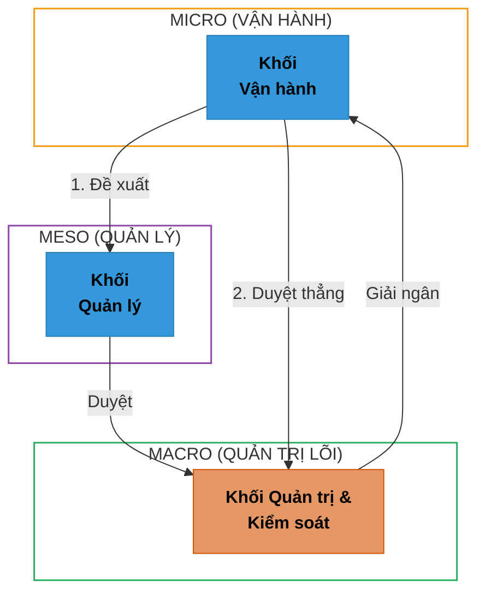
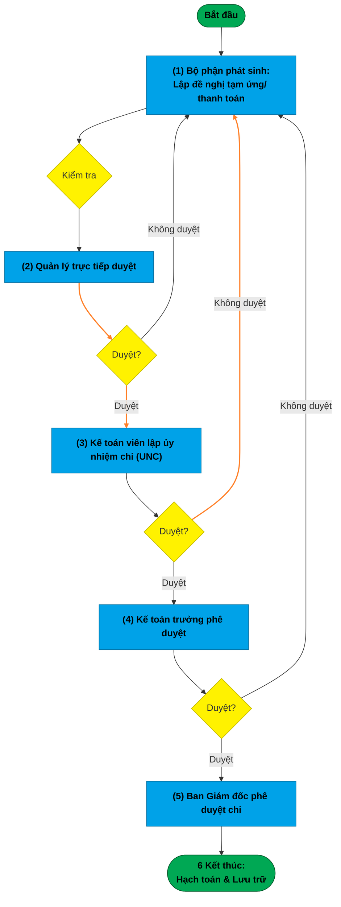
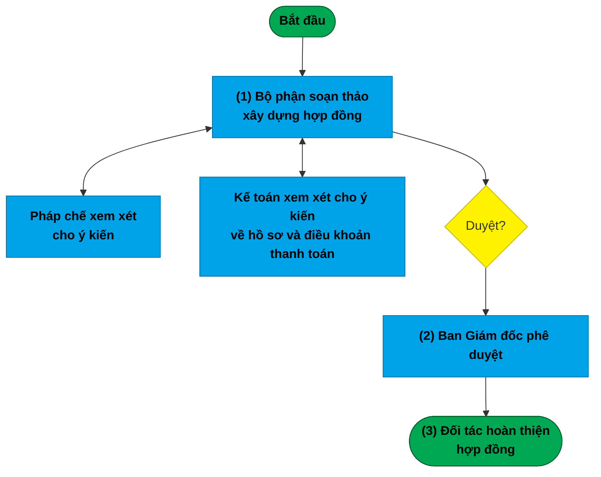
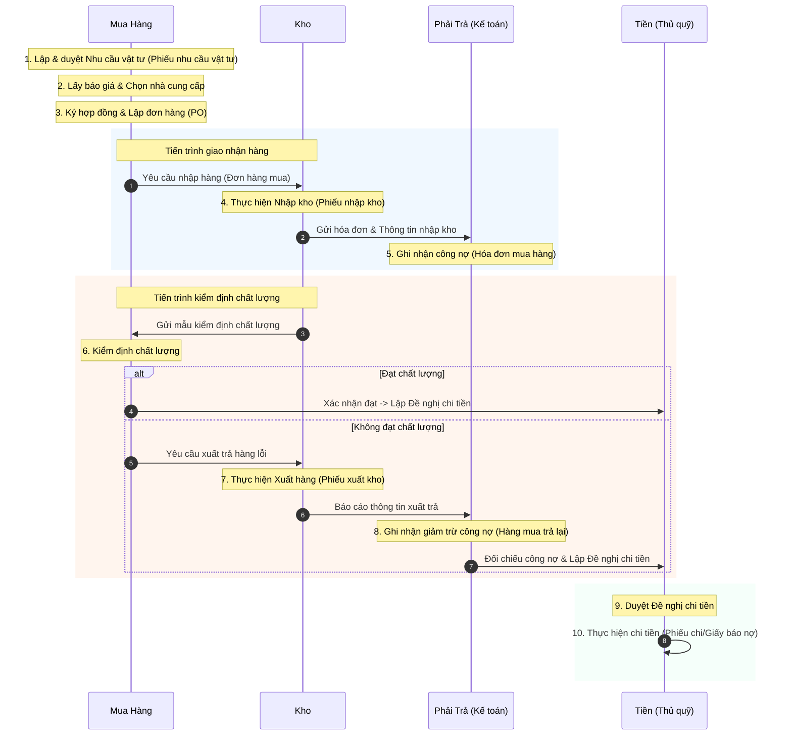
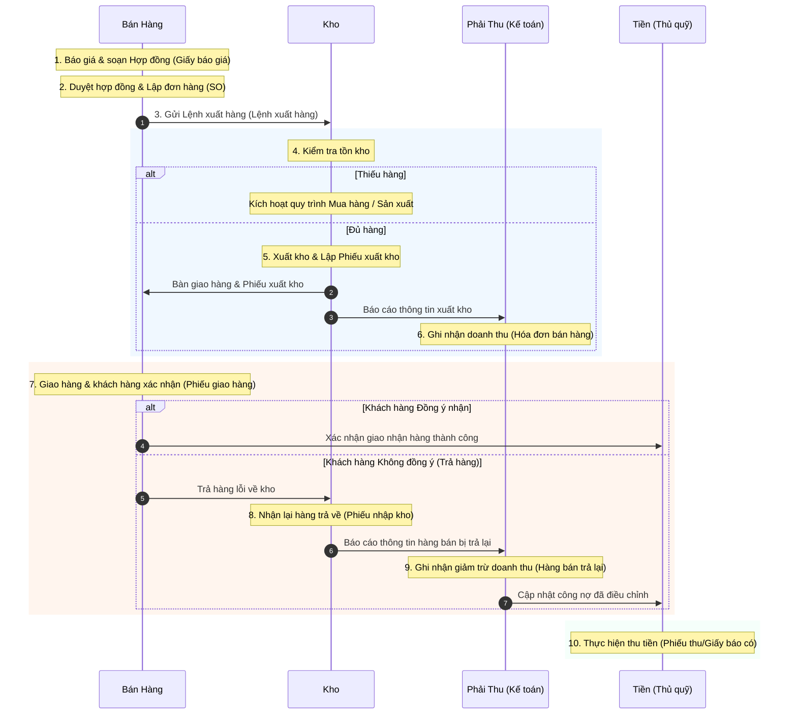

# TỔNG HỢP QUY TRÌNH NGHIỆP VỤ ERP

Tài liệu này tổng hợp toàn bộ các quy trình nghiệp vụ vận hành, bao gồm:
1. **Cấu trúc Tổ chức & Phân cấp phê duyệt** (Macro - Meso - Micro)
2. **Quy trình Thanh toán & Tạm ứng** (Áp dụng tổng quát)
3. **Quy trình Hợp đồng Kinh tế**
4. **Quy trình Mua hàng – Thanh toán** (Chuỗi cung ứng & Kho)
5. **Quy trình Bán hàng – Thu tiền** (Doanh thu & Kho)

---

# I. CẤU TRÚC PHẦN CẤP VẬN HÀNH ERP (MACRO - MESO - MICRO)

### Chi tiết các tầng và luồng vận hành giữa các Khối:

1. **Các Khối chức năng trong hệ thống:**
   * **Khối Vận hành (Tầng Micro):** Nơi trực tiếp phát sinh đề xuất nghiệp vụ hoặc các hoạt động sản xuất kinh doanh tại hiện trường (ví dụ: chi nhánh, trạm xe, xưởng...).
   * **Khối Quản lý (Tầng Meso):** Bộ đệm trung gian thực hiện việc kiểm tra thực tế đề xuất, đối chiếu ngân sách và duyệt bước đầu theo hạn mức quy định (ví dụ: trưởng bộ phận, quản lý khu vực...).
   * **Khối Quản trị & Kiểm soát (Tầng Macro):** Khối ra quyết định cao nhất (Ban Giám đốc) và chốt chặn chi phí tài chính (Kế toán trưởng).

2. **Luồng vận hành giữa các Khối:**
   * **Luồng 1 (Quy trình chuẩn):** Đề xuất đi từ `Khối Vận hành` $\rightarrow$ `Khối Quản lý trực tiếp` (duyệt dựa trên danh sách hạn mức ủy quyền) $\rightarrow$ chuyển tiếp lên `Khối Kiểm soát` duyệt chi.
   * **Luồng 2 (Quy trình đặc cách):** Đề xuất đi thẳng từ `Khối Vận hành` lên `Khối Kiểm soát` (Kế toán trưởng) để giải quyết các trường hợp khẩn cấp, sự cố đột xuất.
   * **Luồng phản hồi:** Sau khi `Khối Kiểm soát` (phối hợp với `Khối Quản trị`) duyệt chi hạch toán thành công, dòng tiền hoặc chỉ thị sẽ được phản hồi/giải ngân trực tiếp về cho `Khối Vận hành` thực thi.

---

# II. QUY TRÌNH THANH TOÁN (ÁP DỤNG TỔNG QUÁT)

### Các bước thực hiện chi tiết Quy trình Thanh toán:
* **Bước 1: Lập đề nghị thanh toán / tạm ứng**
    * **Bộ phận phát sinh:** Nhân viên hoặc Trưởng nhóm của bộ phận phát sinh nhu cầu lập đề nghị thanh toán hoặc tạm ứng.
    * **Hồ sơ bao gồm:**
        - [ ] Đề nghị tạm ứng, thanh toán
        - [ ] Hợp đồng liên quan (nếu có)
        - [ ] Biên bản bàn giao, nghiệm thu công việc/sản phẩm (nếu có)
        - [ ] Hóa đơn tài chính, biên lai mua hàng
        - [ ] Các chứng từ xác minh chi phí khác
* **Bước 2: Phê duyệt đề xuất bước đầu**
    * **Quản lý trực tiếp (Trưởng bộ phận)** xem xét và phê duyệt đề nghị thanh toán/tạm ứng. 
    * *Lưu ý:* Nếu yêu cầu không hợp lệ hoặc thiếu chứng từ, hồ sơ sẽ bị trả lại cho bộ phận phát sinh điều chỉnh.
* **Bước 3: Kiểm tra hồ sơ & Lập ủy nhiệm chi (UNC)**
    * **Kế toán viên (Kế toán thanh toán)** căn cứ vào đề xuất đã được Quản lý duyệt để kiểm tra tính hợp pháp của hóa đơn, đối chiếu công nợ nhà cung cấp/nhân viên, và lập Ủy nhiệm chi (UNC) hoặc phiếu chi.
* **Bước 4: Soát xét kế toán chuyên sâu**
    * **Kế toán trưởng** kiểm tra sự phù hợp với kế hoạch ngân sách tuần/tháng, kiểm tra định khoản kế toán và ký phê duyệt hồ sơ.
* **Bước 5: Ký duyệt chi cuối cùng**
    * **Ban Giám đốc (hoặc người được ủy quyền tối cao)** ký duyệt duyệt chi trên hệ thống hoặc chứng từ giấy.
* **Bước 6: Thực thi & Lưu trữ chứng từ**
    * **Kế toán thanh toán** thực hiện chuyển khoản/chi tiền mặt, nhận chứng từ xác nhận thanh toán thành công và hạch toán kế toán, lưu hồ sơ phục vụ kiểm toán và báo cáo thuế.

---

# III. QUY TRÌNH HỢP ĐỒNG KINH TẾ

### Các bước thực hiện chi tiết Quy trình Hợp đồng:
* **Bước 1: Bắt đầu & Xây dựng hợp đồng**
    * **Bộ phận soạn thảo (Bộ phận phát sinh nhu cầu)** tiến hành xem xét và xây dựng dự thảo hợp đồng kinh tế.
    * Trong quá trình xây dựng, tiến hành gửi xin ý kiến song song từ các bộ phận:
        * **Pháp chế:** Xem xét và cho ý kiến pháp lý để đảm bảo tính an toàn pháp lý.
        * **Kế toán:** Xem xét và cho ý kiến về hồ sơ chứng từ đi kèm và các điều khoản thanh toán.
* **Bước 2: Trình duyệt & Phê duyệt**
    * Sau khi hoàn tất lấy ý kiến phản hồi và chỉnh sửa dự thảo, hồ sơ được chuyển duyệt.
    * **Ban Giám đốc (CEO)** xem xét và ký phê duyệt hợp đồng.
* **Bước 3: Hoàn thiện hợp đồng**
    * Hợp đồng đã duyệt được chuyển gửi cho **Đối tác** để hoàn thiện việc ký kết chính thức.

---

# IV. QUY TRÌNH MUA HÀNG – THANH TOÁN (SEQUENCE DIAGRAM)

### Mô tả chi tiết Quy trình Mua hàng - Thanh toán:

* **Bước 1: Lập & duyệt Nhu cầu vật tư**
  * Bộ phận phát sinh nhu cầu lập **Phiếu nhu cầu vật tư** trình duyệt nội bộ.
* **Bước 2: Lấy báo giá & Chọn nhà cung cấp**
  * Bộ phận Mua Hàng gửi **Giấy đề nghị báo giá** tới các NCC, cập nhật phản hồi báo giá và lập báo cáo **Chọn nhà cung cấp**.
* **Bước 3: Ký hợp đồng & Lập đơn hàng (PO)**
  * Soạn thảo và ký duyệt **Hợp đồng** thương mại, phát hành **Đơn hàng mua (PO)** gửi NCC (đồng thời mở Tờ khai hải quan nếu là hàng nhập khẩu).
* **Bước 4: Thực hiện Nhập kho**
  * Kho thực hiện tiếp nhận hàng hóa từ NCC, hạch toán nhập kho và xuất **Phiếu nhập kho**.
* **Bước 5: Ghi nhận công nợ**
  * Kế toán căn cứ vào Phiếu nhập kho và **Hóa đơn mua hàng** để hạch toán ghi nhận công nợ phải trả.
* **Bước 6: Kiểm định chất lượng**
  * Kho gửi mẫu hàng đi kiểm định. Nếu đạt chất lượng (Đồng ý), chuyển tiếp đến bước hạch toán **Đề nghị chi tiền** (Bước 9). Nếu không đạt, chuyển sang Bước 7.
* **Bước 7: Thực hiện Xuất hàng (Trả lại)**
  * Đối với hàng lỗi không đạt kiểm định, Kho tiến hành xuất trả hàng cho NCC kèm theo **Phiếu xuất kho**.
* **Bước 8: Ghi nhận giảm trừ công nợ**
  * Kế toán ghi nhận nghiệp vụ giảm trừ công nợ cho NCC dựa trên lượng **Hàng mua trả lại** thực tế.
* **Bước 9: Lập & Duyệt đề nghị chi tiền**
  * Kế toán đối chiếu công nợ cuối cùng (đã trừ hàng lỗi trả lại) để lập hồ sơ **Đề nghị chi tiền** trình lãnh đạo phê duyệt.
* **Bước 10: Thực hiện chi tiền**
  * Bộ phận Tiền thực hiện thanh toán chuyển khoản hoặc tiền mặt cho NCC, nhận **Phiếu chi / Giấy báo nợ** để hoàn tất hồ sơ.

---

# V. QUY TRÌNH BÁN HÀNG – THU TIỀN (SEQUENCE DIAGRAM)

### Mô tả chi tiết Quy trình Bán hàng - Thu tiền:

* **Bước 1: Báo giá & soạn Hợp đồng**
  * Phòng Bán Hàng gửi **Giấy báo giá** cho đối tác, đàm phán và soạn thảo **Hợp đồng** kinh tế.
* **Bước 2: Duyệt hợp đồng & Lập đơn hàng (SO)**
  * Ban Giám đốc duyệt hợp đồng và Bán hàng lập **Đơn hàng bán (SO)** trên hệ thống ERP.
* **Bước 3: Gửi Lệnh xuất hàng**
  * Phát hành và chuyển giao **Lệnh xuất hàng** chính thức xuống bộ phận Kho.
* **Bước 4: Kiểm tra tồn kho**
  * Kho đối chiếu lượng hàng tồn: Nếu thiếu, kích hoạt quy trình sản xuất hoặc quy trình mua hàng để bù đắp. Nếu đủ, tiến hành xuất kho ở Bước 5.
* **Bước 5: Xuất kho**
  * Kho chuẩn bị hàng, xuất hàng đi kèm **Phiếu xuất kho** bàn giao cho bộ phận vận chuyển và gửi thông tin sang kế toán.
* **Bước 6: Ghi nhận doanh thu**
  * Kế toán hạch toán ghi nhận doanh thu phải thu và phát hành **Hóa đơn bán hàng** gửi khách hàng.
* **Bước 7: Giao hàng & khách hàng xác nhận**
  * Vận chuyển giao hàng kèm **Phiếu giao hàng**. Khách hàng kiểm tra: Nếu đồng ý nhận hàng, chuyển sang Bước 10 để thực hiện thu tiền. Nếu từ chối nhận, chuyển trả về Kho ở Bước 8.
* **Bước 8: Nhận lại hàng trả về**
  * Kho nhận lại số hàng lỗi/bị trả lại từ khách hàng, xử lý nhập kho kiểm kê và xuất **Phiếu nhập kho** (nhập lại).
* **Bước 9: Ghi nhận giảm trừ doanh thu**
  * Kế toán ghi nhận giảm trừ công nợ phải thu và điều chỉnh giảm doanh thu đối với lượng **Hàng bán trả lại**.
* **Bước 10: Thực hiện thu tiền**
  * Kế toán thanh toán/Thủ quỹ thực hiện thu tiền từ khách hàng, cập nhật trạng thái hóa đơn và lưu **Phiếu thu / Giấy báo có**.
