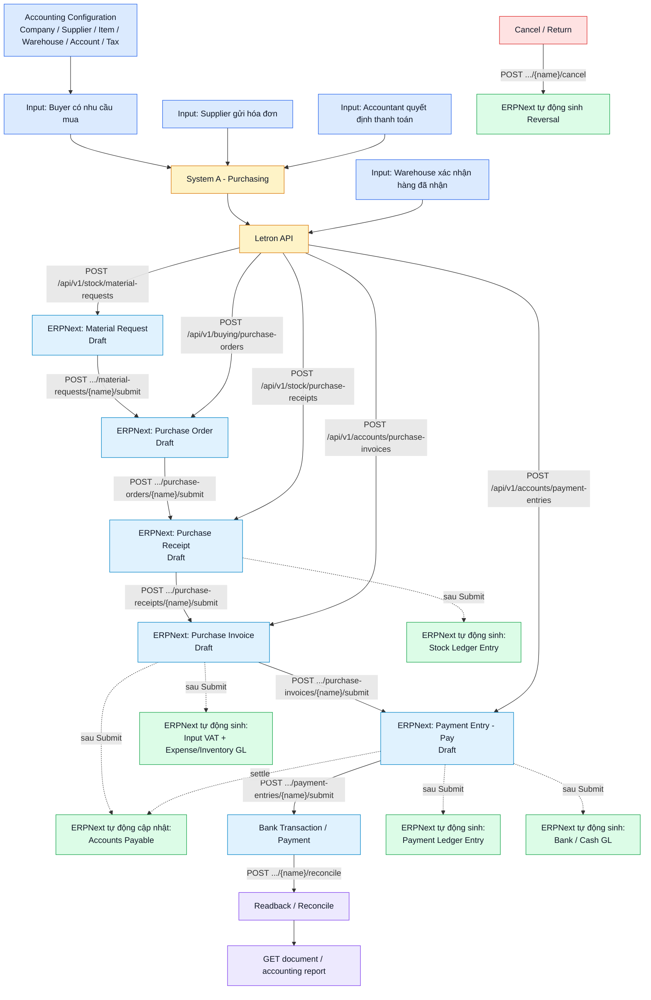

# Accounting Master Flow — Procure-to-Pay

```mermaid
flowchart TB

    CONFIG["Accounting Configuration<br/>Company / Supplier / Item / Warehouse / Account / Tax"]
    BUYER["Input: Buyer có nhu cầu mua"]
    SYSTEM_A["System A - Purchasing"]
    API["Letron API"]

    CONFIG --> BUYER
    BUYER --> SYSTEM_A
    SYSTEM_A --> API

    MR["ERPNext: Material Request<br/>Draft"]
    PO["ERPNext: Purchase Order<br/>Draft"]
    PR["ERPNext: Purchase Receipt<br/>Draft"]
    PI["ERPNext: Purchase Invoice<br/>Draft"]
    PE["ERPNext: Payment Entry - Pay<br/>Draft"]

    API -- "POST /api/v1/stock/material-requests" --> MR
    MR -- "POST .../material-requests/{name}/submit" --> PO
    API -- "POST /api/v1/buying/purchase-orders" --> PO
    PO -- "POST .../purchase-orders/{name}/submit" --> PR

    GOODS["Input: Warehouse xác nhận hàng đã nhận"]
    GOODS --> API
    API -- "POST /api/v1/stock/purchase-receipts" --> PR
    PR -- "POST .../purchase-receipts/{name}/submit" --> PI

    SLE["ERPNext tự động sinh:<br/>Stock Ledger Entry"]
    PR -. "sau Submit" .-> SLE

    INVOICE["Input: Supplier gửi hóa đơn"]
    INVOICE --> SYSTEM_A
    API -- "POST /api/v1/accounts/purchase-invoices" --> PI
    PI -- "POST .../purchase-invoices/{name}/submit" --> PE

    AP["ERPNext tự động cập nhật:<br/>Accounts Payable"]
    TAX_GL["ERPNext tự động sinh:<br/>Input VAT + Expense/Inventory GL"]
    PI -. "sau Submit" .-> AP
    PI -. "sau Submit" .-> TAX_GL

    PAYMENT["Input: Accountant quyết định thanh toán"]
    PAYMENT --> SYSTEM_A
    API -- "POST /api/v1/accounts/payment-entries" --> PE
    PE -- "POST .../payment-entries/{name}/submit" --> BANK_TX["Bank Transaction / Payment"]

    PLE["ERPNext tự động sinh:<br/>Payment Ledger Entry"]
    BANK_GL["ERPNext tự động sinh:<br/>Bank / Cash GL"]
    PE -. "sau Submit" .-> PLE
    PE -. "sau Submit" .-> BANK_GL
    PE -. "settle" .-> AP

    RECON["Readback / Reconcile"]
    BANK_TX -- "POST .../{name}/reconcile" --> RECON
    RECON --> REPORT["GET document / accounting report"]

    CANCEL["Cancel / Return"]
    CANCEL -- "POST .../{name}/cancel" --> REVERSAL["ERPNext tự động sinh Reversal"]

    classDef input fill:#dbeafe,stroke:#2563eb,color:#111827;
    classDef system fill:#fef3c7,stroke:#d97706,color:#111827;
    classDef document fill:#e0f2fe,stroke:#0284c7,color:#111827;
    classDef generated fill:#dcfce7,stroke:#16a34a,color:#111827;
    classDef output fill:#ede9fe,stroke:#7c3aed,color:#111827;
    classDef reversal fill:#fee2e2,stroke:#dc2626,color:#111827;

    class CONFIG,BUYER,GOODS,INVOICE,PAYMENT input;
    class SYSTEM_A,API system;
    class MR,PO,PR,PI,PE,BANK_TX document;
    class SLE,AP,TAX_GL,PLE,BANK_GL,REVERSAL generated;
    class RECON,REPORT output;
    class CANCEL reversal;
```

## Luồng kế toán

`Input → API → ERPNext Document → Submit → ERPNext tự sinh ledger → Readback / Reconcile`.
