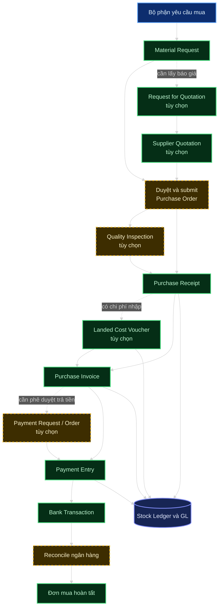
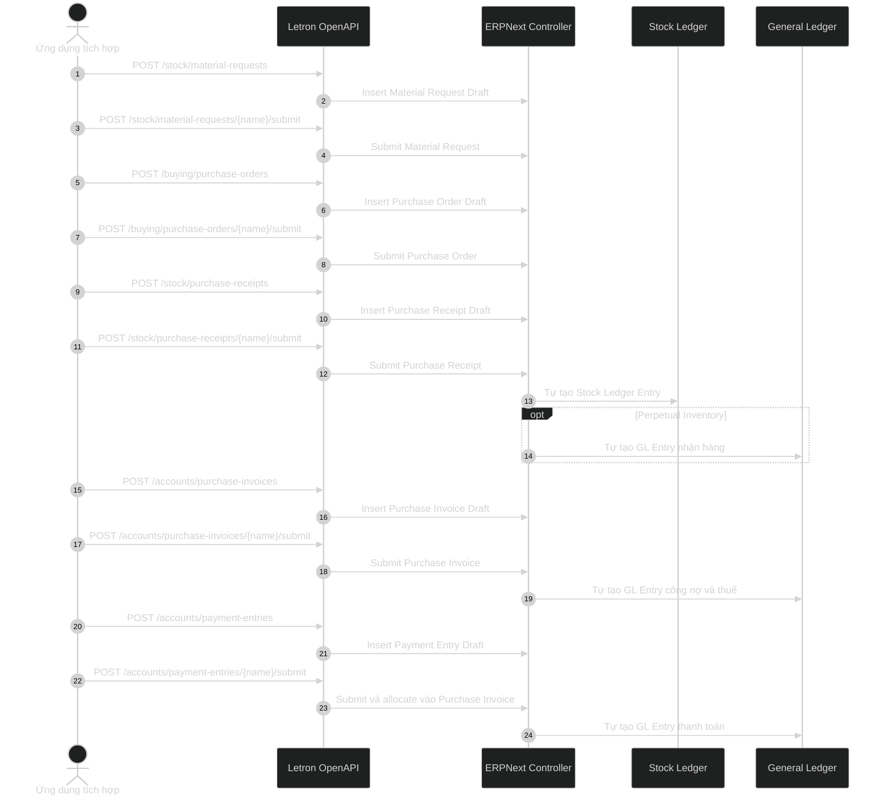
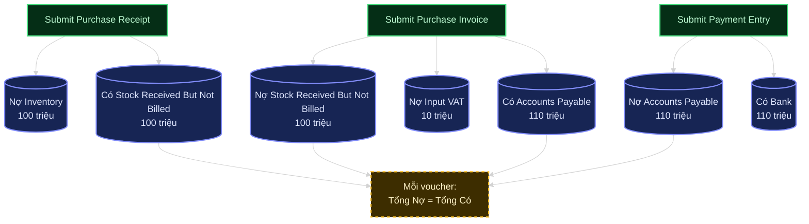
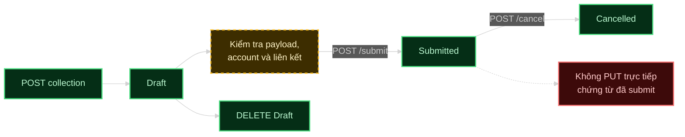
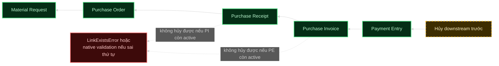

# Master design nghiệp vụ kế toán và Accounting API của Letron ERP

## 1. Mục đích

Đây là master design duy nhất cho toàn bộ nghiệp vụ kế toán; Purchase-to-Pay là
lát cắt chi tiết được trình bày trước, còn các domain AR, GL, banking, tax,
asset, deferred, POS/subscription, period closing và report được quy định tại
phần 14 trở đi. Tài liệu đồng thời ánh xạ từng bước sang API đang được công bố
trong `contracts/generated/openapi/modules`.

Tài liệu phân biệt rõ:

- chứng từ nghiệp vụ do consumer tạo;
- lifecycle `Draft → Submitted → Cancelled` do ERPNext kiểm soát;
- Stock Ledger Entry và GL Entry do ERPNext tự sinh;
- các bước bắt buộc, bước tùy chọn và khoảng trống của contract hiện tại.

Phạm vi hạch toán minh họa giả định công ty bật **Perpetual Inventory** và mua
hàng tồn kho theo hình thức trả chậm. Nếu công ty không bật Perpetual Inventory,
Purchase Receipt thông thường chỉ tạo Stock Ledger, không tạo GL.

## 2. Nguyên tắc tích hợp

1. Consumer chỉ tạo chứng từ nghiệp vụ; không ghi trực tiếp `GL Entry` hoặc
   `Stock Ledger Entry`.
2. `POST` tạo chứng từ ở trạng thái Draft; `POST .../{name}/submit` mới làm phát
   sinh tác động nghiệp vụ và ledger.
3. Mỗi chứng từ sau phải giữ tham chiếu đến chứng từ và child row nguồn để
   ERPNext cập nhật đúng trạng thái ordered, received, billed và outstanding.
4. Chỉ sửa chứng từ Draft. Với chứng từ đã submit, phải hủy từ bước cuối về bước
   đầu rồi tạo lại hoặc amend theo quy trình được phê duyệt.
5. Mỗi lệnh tạo hoặc lifecycle phải có `X-Request-Id`; lệnh có khả năng retry
   phải có `X-Idempotency-Key` ổn định.

## 3. Vai trò và chứng từ chính

| Nhóm | Entity/DocType | Tên nghiệp vụ | Tác động ledger |
|---|---|---|---|
| Master data | Supplier | Nhà cung cấp | Không |
| Master data | Item, Warehouse, Item Price | Hàng hóa, kho, giá mua | Không |
| Nhu cầu | Material Request | Yêu cầu mua hàng | Không |
| Sourcing | Request for Quotation | Yêu cầu báo giá | Không |
| Sourcing | Supplier Quotation | Báo giá nhà cung cấp | Không |
| Cam kết mua | Purchase Order | Đơn mua hàng | Không |
| Nhận hàng | Purchase Receipt | Phiếu nhận/nhập hàng | Stock Ledger; GL nếu Perpetual Inventory |
| Chi phí nhập | Landed Cost Voucher | Phân bổ chi phí mua hàng | Điều chỉnh valuation và GL khi submit |
| Công nợ | Purchase Invoice | Hóa đơn mua hàng | GL và Accounts Payable |
| Phê duyệt trả tiền | Payment Request, Payment Order | Yêu cầu/lệnh thanh toán | Không phải dòng tiền thực tế |
| Thanh toán | Payment Entry | Chứng từ thanh toán | GL, giảm Accounts Payable |
| Đối chiếu | Bank Transaction | Dòng sao kê ngân hàng | Liên kết với chứng từ thanh toán khi reconcile |
| Điều chỉnh | Journal Entry | Bút toán tổng hợp đặc biệt | GL sau khi submit |

## 4. Sơ đồ nghiệp vụ tổng thể



Luồng tối thiểu không dùng sourcing, kiểm tra chất lượng, landed cost hoặc phê
duyệt thanh toán là:

```text
Material Request → Purchase Order → Purchase Receipt
→ Purchase Invoice → Payment Entry
```

## 5. Chuỗi API cốt lõi

Nếu master data đã tồn tại, một giao dịch mua hàng đầy đủ cần tối thiểu 10 lệnh
mutation: năm lệnh tạo Draft và năm lệnh submit.



## 6. API theo từng nghiệp vụ

### 6.1. Master data

| Nghiệp vụ | Collection API | Detail API |
|---|---|---|
| Nhà cung cấp | `GET/POST /api/v1/buying/suppliers` | `GET/PUT/DELETE /api/v1/buying/suppliers/{name}` |
| Địa chỉ | `GET/POST /api/v1/contacts/addresses` | `GET/PUT/DELETE /api/v1/contacts/addresses/{name}` |
| Liên hệ | `GET/POST /api/v1/contacts/contacts` | `GET/PUT/DELETE /api/v1/contacts/contacts/{name}` |
| Hàng hóa | `GET/POST /api/v1/stock/items` | `GET/PUT/DELETE /api/v1/stock/items/{name}` |
| Giá mua | `GET/POST /api/v1/stock/item-prices` | `GET/PUT/DELETE /api/v1/stock/item-prices/{name}` |
| Kho | `GET/POST /api/v1/stock/warehouses` | `GET/PUT/DELETE /api/v1/stock/warehouses/{name}` |
| Ngân hàng | `GET/POST /api/v1/accounts/banks` | `GET/PUT/DELETE /api/v1/accounts/banks/{name}` |
| Tài khoản ngân hàng | `GET/POST /api/v1/accounts/bank-accounts` | `GET/PUT/DELETE /api/v1/accounts/bank-accounts/{name}` |
| Phương thức thanh toán | `GET/POST /api/v1/accounts/modes-of-payment` | `GET/PUT/DELETE /api/v1/accounts/modes-of-payment/{name}` |
| Trung tâm chi phí | `GET/POST /api/v1/accounts/cost-centers` | `GET/PUT/DELETE /api/v1/accounts/cost-centers/{name}` |

Master data phải được cấu hình đúng Company, Account, currency và permission
trước khi chạy transaction API.

### 6.2. Nhu cầu mua hàng

| Hành động | API |
|---|---|
| Tạo Material Request | `POST /api/v1/stock/material-requests` |
| Liệt kê | `GET /api/v1/stock/material-requests` |
| Đọc chi tiết | `GET /api/v1/stock/material-requests/{name}` |
| Sửa Draft | `PUT /api/v1/stock/material-requests/{name}` |
| Xóa Draft | `DELETE /api/v1/stock/material-requests/{name}` |
| Xác nhận | `POST /api/v1/stock/material-requests/{name}/submit` |
| Hủy | `POST /api/v1/stock/material-requests/{name}/cancel` |

Giá trị nghiệp vụ quan trọng:

- `material_request_type = "Purchase"`;
- `company`, `transaction_date`, `schedule_date`;
- `items[].item_code`, `items[].qty`, `items[].warehouse`;
- lưu lại `name` của Material Request và từng child row để liên kết bước sau.

### 6.3. Sourcing tùy chọn

| Hành động | API |
|---|---|
| Tạo Request for Quotation | `POST /api/v1/crm/request-for-quotations` |
| Đọc/sửa/xóa RFQ | `GET/PUT/DELETE /api/v1/crm/request-for-quotations/{name}` |
| Tạo Supplier Quotation | `POST /api/v1/crm/supplier-quotations` |
| Đọc/sửa/xóa báo giá | `GET/PUT/DELETE /api/v1/crm/supplier-quotations/{name}` |

RFQ liên kết Material Request qua `items[].material_request` và
`items[].material_request_item`. Supplier Quotation liên kết RFQ qua
`items[].request_for_quotation` và `items[].request_for_quotation_item`.

Contract hiện tại chưa công bố `submit/cancel` cho hai DocType này. Do đó bước
sourcing chưa có lifecycle API hoàn chỉnh.

### 6.4. Đặt hàng

| Hành động | API |
|---|---|
| Tạo Purchase Order | `POST /api/v1/buying/purchase-orders` |
| Liệt kê | `GET /api/v1/buying/purchase-orders` |
| Đọc chi tiết | `GET /api/v1/buying/purchase-orders/{name}` |
| Sửa Draft | `PUT /api/v1/buying/purchase-orders/{name}` |
| Xóa Draft | `DELETE /api/v1/buying/purchase-orders/{name}` |
| Xác nhận | `POST /api/v1/buying/purchase-orders/{name}/submit` |
| Hủy | `POST /api/v1/buying/purchase-orders/{name}/cancel` |

Mỗi dòng PO cần liên kết nguồn bằng một trong hai nhóm:

- `material_request` và `material_request_item`; hoặc
- `supplier_quotation` và `supplier_quotation_item`.

Khi cập nhật PO có child rows, consumer phải đọc lại document và gửi đầy đủ child
row hiện hữu, đặc biệt khi thay đổi `schedule_date`.

### 6.5. Kiểm tra chất lượng tùy chọn

| Hành động | API |
|---|---|
| Tạo Quality Inspection | `POST /api/v1/stock/quality-inspections` |
| Liệt kê | `GET /api/v1/stock/quality-inspections` |
| Đọc/sửa/xóa | `GET/PUT/DELETE /api/v1/stock/quality-inspections/{name}` |

Các trường liên kết chính là `reference_type`, `reference_name`, `item_code` và
`inspection_type`. Contract chưa công bố `submit/cancel` cho Quality Inspection.

### 6.6. Nhận hàng

| Hành động | API |
|---|---|
| Tạo Purchase Receipt | `POST /api/v1/stock/purchase-receipts` |
| Liệt kê | `GET /api/v1/stock/purchase-receipts` |
| Đọc chi tiết | `GET /api/v1/stock/purchase-receipts/{name}` |
| Sửa Draft | `PUT /api/v1/stock/purchase-receipts/{name}` |
| Xóa Draft | `DELETE /api/v1/stock/purchase-receipts/{name}` |
| Xác nhận nhập kho | `POST /api/v1/stock/purchase-receipts/{name}/submit` |
| Hủy | `POST /api/v1/stock/purchase-receipts/{name}/cancel` |

Mỗi dòng receipt liên kết PO qua `purchase_order` và `purchase_order_item`.
Một PO có thể được nhận thành nhiều Purchase Receipt; không được mặc định toàn bộ
số lượng đã đặt đã được nhận.

### 6.7. Chi phí nhập hàng tùy chọn

| Hành động | API |
|---|---|
| Tạo Landed Cost Voucher | `POST /api/v1/stock/landed-cost-vouchers` |
| Liệt kê | `GET /api/v1/stock/landed-cost-vouchers` |
| Đọc/sửa/xóa | `GET/PUT/DELETE /api/v1/stock/landed-cost-vouchers/{name}` |

Các nhóm dữ liệu chính là `purchase_receipts[]`, `taxes[]` và
`distribute_charges_based_on`. Contract chưa công bố `submit/cancel`, nên chưa
thể hoàn tất việc phân bổ landed cost chỉ bằng API curated hiện tại.

### 6.8. Hóa đơn và công nợ phải trả

| Hành động | API |
|---|---|
| Tạo Purchase Invoice | `POST /api/v1/accounts/purchase-invoices` |
| Liệt kê | `GET /api/v1/accounts/purchase-invoices` |
| Đọc chi tiết | `GET /api/v1/accounts/purchase-invoices/{name}` |
| Sửa Draft | `PUT /api/v1/accounts/purchase-invoices/{name}` |
| Xóa Draft | `DELETE /api/v1/accounts/purchase-invoices/{name}` |
| Ghi nhận công nợ | `POST /api/v1/accounts/purchase-invoices/{name}/submit` |
| Hủy | `POST /api/v1/accounts/purchase-invoices/{name}/cancel` |

Mỗi dòng invoice phải giữ liên kết bằng:

- `purchase_order` và `po_detail`;
- `purchase_receipt` và `pr_detail` nếu hàng đã nhận qua Purchase Receipt.

Các trường hạch toán chính gồm `credit_to`, `taxes[]`, `cost_center`, currency và
exchange rate. Nếu bỏ qua Purchase Receipt và dùng `update_stock = true`, Purchase
Invoice có thể vừa cập nhật kho vừa ghi nhận công nợ; đây là nhánh rút gọn, không
phải flow tách nhiệm vụ nhận hàng và kế toán.

### 6.9. Phê duyệt thanh toán tùy chọn

| Nghiệp vụ | Collection và detail | Lifecycle |
|---|---|---|
| Payment Request | `GET/POST /api/v1/accounts/payment-requests`; `GET/PUT/DELETE /api/v1/accounts/payment-requests/{name}` | `POST /api/v1/accounts/payment-requests/{name}/submit`; `POST /api/v1/accounts/payment-requests/{name}/cancel` |
| Payment Order | `GET/POST /api/v1/accounts/payment-orders`; `GET/PUT/DELETE /api/v1/accounts/payment-orders/{name}` | `POST /api/v1/accounts/payment-orders/{name}/submit`; `POST /api/v1/accounts/payment-orders/{name}/cancel` |

Với thanh toán nhà cung cấp, Payment Request phải là loại `Outward` và tham chiếu
Purchase Invoice đã submit, còn outstanding lớn hơn 0. Hai chứng từ này phục vụ
đề nghị hoặc tổ chức thanh toán; chúng chưa thay thế Payment Entry.

### 6.10. Thanh toán nhà cung cấp

| Hành động | API |
|---|---|
| Tạo Payment Entry | `POST /api/v1/accounts/payment-entries` |
| Liệt kê | `GET /api/v1/accounts/payment-entries` |
| Đọc chi tiết | `GET /api/v1/accounts/payment-entries/{name}` |
| Sửa Draft | `PUT /api/v1/accounts/payment-entries/{name}` |
| Xóa Draft | `DELETE /api/v1/accounts/payment-entries/{name}` |
| Ghi nhận thanh toán | `POST /api/v1/accounts/payment-entries/{name}/submit` |
| Hủy | `POST /api/v1/accounts/payment-entries/{name}/cancel` |

Payload nghiệp vụ cần bảo đảm:

- `payment_type = "Pay"`;
- `party_type = "Supplier"` và `party` là nhà cung cấp của invoice;
- `paid_from` là ledger account ngân hàng/tiền mặt;
- `paid_to` là tài khoản phải trả;
- `references[].reference_doctype = "Purchase Invoice"`;
- `references[].reference_name` là invoice đã submit;
- tổng `allocated_amount` không vượt outstanding.

### 6.11. Đối chiếu ngân hàng

| Hành động | API |
|---|---|
| Tạo Bank Transaction | `POST /api/v1/accounts/bank-transactions` |
| Liệt kê | `GET /api/v1/accounts/bank-transactions` |
| Đọc/sửa/xóa | `GET/PUT/DELETE /api/v1/accounts/bank-transactions/{name}` |
| Xác nhận | `POST /api/v1/accounts/bank-transactions/{name}/submit` |
| Đối chiếu | `POST /api/v1/accounts/bank-transactions/{name}/reconcile` |
| Bỏ đối chiếu | `POST /api/v1/accounts/bank-transactions/{name}/unreconcile` |
| Hủy | `POST /api/v1/accounts/bank-transactions/{name}/cancel` |

Bank Transaction đại diện dòng sao kê; Payment Entry mới là chứng từ làm giảm
tiền và công nợ. Reconcile liên kết hai phía, không được tạo thêm một khoản thanh
toán trùng.

### 6.12. Bút toán đặc biệt

| Hành động | API |
|---|---|
| Tạo Journal Entry | `POST /api/v1/accounts/journal-entries` |
| Liệt kê | `GET /api/v1/accounts/journal-entries` |
| Đọc/sửa/xóa | `GET/PUT/DELETE /api/v1/accounts/journal-entries/{name}` |
| Ghi sổ | `POST /api/v1/accounts/journal-entries/{name}/submit` |
| Hủy | `POST /api/v1/accounts/journal-entries/{name}/cancel` |

Journal Entry chỉ dùng cho nghiệp vụ không có chứng từ chuyên biệt, ví dụ trích
trước, phân bổ hoặc điều chỉnh được phê duyệt. Không dùng Journal Entry để thay
Purchase Invoice, Purchase Receipt hoặc Payment Entry.

## 7. Quan hệ giữa các chứng từ

```mermaid
---
config:
  look: classic
  theme: dark
---
flowchart LR
    SYS_MR["Material Request"]
    SYS_RFQ["Request for Quotation"]
    SYS_SQ["Supplier Quotation"]
    SYS_PO["Purchase Order"]
    SYS_PR["Purchase Receipt"]
    SYS_LCV["Landed Cost Voucher"]
    SYS_PI["Purchase Invoice"]
    SYS_PAYREQ["Payment Request / Order"]
    SYS_PE["Payment Entry"]
    SYS_BT["Bank Transaction"]

    SYS_MR -->|"material_request + item"| SYS_RFQ
    SYS_RFQ -->|"request_for_quotation + item"| SYS_SQ
    SYS_MR -->|"material_request + item"| SYS_PO
    SYS_SQ -->|"supplier_quotation + item"| SYS_PO
    SYS_PO -->|"purchase_order + item"| SYS_PR
    SYS_PR -->|"receipt_document"| SYS_LCV
    SYS_PO -->|"purchase_order + po_detail"| SYS_PI
    SYS_PR -->|"purchase_receipt + pr_detail"| SYS_PI
    SYS_PI -.-> SYS_PAYREQ
    SYS_PI -->|"reference_doctype + reference_name"| SYS_PE
    SYS_PAYREQ -.-> SYS_PE
    SYS_PE -->|"reconcile allocation"| SYS_BT

    classDef actor fill:#0d2d6e,stroke:#60a5fa,stroke-width:2px,color:#e0f2fe;
    classDef control fill:#3d2d00,stroke:#fbbf24,stroke-width:2px,stroke-dasharray:5 5,color:#fef3c7;
    classDef risk fill:#3d0a0a,stroke:#f87171,stroke-width:2px,color:#fecaca;
    classDef system fill:#052e16,stroke:#4ade80,stroke-width:2px,color:#bbf7d0;

    class SYS_MR,SYS_RFQ,SYS_SQ,SYS_PO,SYS_PR,SYS_LCV,SYS_PI,SYS_PAYREQ,SYS_PE,SYS_BT system;
```



`name` của parent document chưa đủ để liên kết chính xác. Với chứng từ có bảng
items, consumer phải lưu cả `name` của child row nguồn, ví dụ
`purchase_order_item`, `po_detail` hoặc `pr_detail`.

## 8. Hạch toán tự động

Ví dụ:

- hàng trước thuế: 100 triệu;
- VAT đầu vào: 10 triệu;
- thanh toán nhà cung cấp: 110 triệu;
- không có landed cost, làm tròn hoặc chênh lệch tỷ giá.



| Chứng từ | Số GL Entry trong ví dụ | Tổng Nợ | Tổng Có |
|---|---:|---:|---:|
| Purchase Receipt | 2 | 100 triệu | 100 triệu |
| Purchase Invoice | 3 | 110 triệu | 110 triệu |
| Payment Entry | 2 | 110 triệu | 110 triệu |
| **Tổng phát sinh** | **7** | **320 triệu** | **320 triệu** |

Con số 7 chỉ đúng với ví dụ đơn giản. Thuế, phí, landed cost, làm tròn, tỷ giá,
write-off, accounting dimension và cấu hình gộp account có thể làm thay đổi số
dòng. Invariant bắt buộc là tổng Nợ bằng tổng Có trong cùng company và base
currency, không phải số dòng luôn chẵn.

## 9. Lifecycle, hủy và hoàn tác

### 9.1. Trạng thái một chứng từ



### 9.2. Thứ tự hủy giao dịch mua



Với immutable ledger, cancel chứng từ nguồn tạo bút toán đảo; không xóa hoặc hủy
riêng từng GL Entry.

## 10. Trả hàng, debit note và thanh toán một phần

| Tình huống | Cách xử lý |
|---|---|
| Giao hàng nhiều lần | Tạo nhiều Purchase Receipt cùng tham chiếu một PO, mỗi lần theo số lượng thực nhận |
| Hóa đơn nhiều lần | Tạo nhiều Purchase Invoice theo phần đã nhận/được xuất hóa đơn |
| Thanh toán một phần | Payment Entry chỉ allocate phần thanh toán; invoice vẫn còn outstanding |
| Trả hàng nhà cung cấp | Dùng Purchase Receipt return với `is_return` và `return_against` theo schema/runtime hợp lệ |
| Debit Note | Dùng Purchase Invoice return với `is_return` và `return_against` |
| Điều chỉnh không có chứng từ chuyên biệt | Tạo Journal Entry cân bằng và submit sau phê duyệt |

Không dùng số âm tùy ý để mô phỏng return nếu ERPNext đã có native return flow.

## 11. Khoảng trống của contract hiện tại

### 11.1. Chưa có mapped-document action

Contract chưa có action chuyên biệt cho các phép chuyển:

```text
Material Request → Request for Quotation/Purchase Order
Supplier Quotation → Purchase Order
Purchase Order → Purchase Receipt
Purchase Receipt/Purchase Order → Purchase Invoice
Purchase Invoice → Payment Entry
```

Consumer hiện phải tự dựng payload chứng từ kế tiếp. Đây là rủi ro vì có thể bỏ
sót child row reference, tax, conversion factor, account hoặc native defaults.

### 11.2. Trường liên kết bị đánh dấu readOnly

Một số trường cần để giữ chuỗi chứng từ như `material_request`,
`supplier_quotation`, `purchase_order`, `purchase_receipt`, `po_detail` và
`pr_detail` đang mang `readOnly` trong generated schema. Runtime Frappe có thể xử
lý các field này khi document được dựng đúng, nhưng một OpenAPI client tuân thủ
chặt schema sẽ không gửi field read-only. Contract cần tách request schema hoặc
công bố mapped-document action trước khi gọi luồng liên kết là hoàn chỉnh.

### 11.3. Thiếu lifecycle action cho một số bước tùy chọn

Contract chưa có `submit/cancel` cho:

- Request for Quotation;
- Supplier Quotation;
- Quality Inspection;
- Landed Cost Voucher.

Không dùng generic RPC/resource fallback để lách khoảng trống này. Cần bổ sung
explicit typed action nếu các bước trên trở thành bắt buộc.

### 11.4. Chưa có API đọc General Ledger

Các module không công bố `/api/v1/accounts/gl-entries` hoặc API report General
Ledger. Đây là boundary đúng cho việc cấm CRUD trực tiếp vào ledger, nhưng vẫn
thiếu một API báo cáo read-only nếu consumer cần kiểm tra các dòng hạch toán do
Purchase Receipt, Purchase Invoice và Payment Entry tạo ra.

### 11.5. Artifact Stock YAML đang không hợp lệ

Working copy của `contracts/generated/openapi/modules/stock.yaml` hiện bắt đầu
bằng `onnxopenapi: 3.1.0` thay vì `openapi: 3.1.0`. Các route vẫn đọc được và bản
JSON tương ứng vẫn parse được, nhưng công cụ OpenAPI strict sẽ từ chối YAML này.
Tài liệu không tự sửa generated artifact.

## 12. Checklist nghiệm thu end-to-end

- [ ] Supplier, Item, Warehouse, Company, Account và tax master hợp lệ.
- [ ] Material Request loại Purchase được tạo, submit và đọc lại đúng trạng thái.
- [ ] Purchase Order tham chiếu đúng Material Request/Supplier Quotation và child row.
- [ ] Purchase Receipt tham chiếu PO, cập nhật đúng received quantity và Stock Ledger.
- [ ] Nếu bật Perpetual Inventory, Purchase Receipt tạo GL cân bằng.
- [ ] Landed cost được xử lý hoặc xác nhận không áp dụng.
- [ ] Purchase Invoice tham chiếu đúng PO/PR, tax đúng và outstanding đúng.
- [ ] Payment Entry loại Pay allocate đúng invoice, không vượt outstanding.
- [ ] Bank Transaction được reconcile đúng Payment Entry, không tạo thanh toán trùng.
- [ ] Tổng Debit bằng tổng Credit cho từng voucher trong base currency.
- [ ] Partial receipt, partial invoice, partial payment và return được kiểm thử riêng.
- [ ] Cancel được kiểm thử từ downstream về upstream, không để residue.
- [ ] Mọi retry dùng cùng idempotency key và không tạo document trùng.

## 13. Nguồn contract

- [`buying.yaml`](../contracts/generated/openapi/modules/buying.yaml) và `.json`;
- [`stock.yaml`](../contracts/generated/openapi/modules/stock.yaml) và `.json`;
- [`accounts.yaml`](../contracts/generated/openapi/modules/accounts.yaml) và `.json`;
- [`contacts.yaml`](../contracts/generated/openapi/modules/contacts.yaml) và `.json`.

Các operation liên quan đang mang metadata `x-test-status: passed` trong generated
contract. Tài liệu này là ánh xạ contract/source tại working copy hiện tại; nó
không thay thế một lần chạy Docker acceptance mới trên revision được đóng băng.

## 14. Phạm vi master design kế toán

“Bao phủ toàn bộ” nghĩa là mỗi capability phải có đủ năm lớp: nghiệp vụ và người
thực hiện; điều kiện hạch toán debit/credit; liên kết parent/child/party/tax;
cancel, return, amend, reversal và repost; API, quyền, readback và bằng chứng.
`GL Entry`, `Payment Ledger Entry`, `Stock Ledger Entry` và các bảng repost là
derived ledger do native ERPNext controller sở hữu, không public CRUD.

Không coi field schema, unit test hoặc `x-test-status: passed` là bằng chứng
runtime. Capability chỉ được đánh dấu `COMPLETE` khi có native document readback,
ledger/report readback, permission negative case, retry/idempotency, rollback và
zero-residue evidence trên cùng revision.

### 14.1. Ownership và invariant chung

| Lớp | Owner | Quy tắc |
|---|---|---|
| Policy/master | Finance admin, Accountant | Company, COA, currency, tax matrix, payment master, dimension, period, budget |
| Business document | AR/AP/Stock/Asset/Treasury user | Tạo Draft, giữ source link và child link, không tự tính lại ledger |
| Lifecycle | Native ERPNext controller | Submit tạo side effect; Cancel tạo reversal; amend/repost theo native rule |
| Derived ledger | ERPNext | GL, Payment Ledger, Stock Ledger, outstanding, valuation và reports là read-only với consumer |
| Integration | Letron API + provider adapter | typed command, idempotency, audit/outbox; provider failure không xóa accounting voucher |

Invariant bắt buộc:

- Mỗi voucher submit cân bằng Debit = Credit trong base currency; exchange rate và
  transaction/account currency phải được lưu và đối chiếu.
- Voucher đã submit không được sửa/xóa trực tiếp; correction dùng reversal, cancel,
  amend hoặc Journal Entry phù hợp.
- Child row downstream giữ cả source parent và source child name; không liên kết
  chỉ bằng item code, party hoặc parent name.
- Account, party, tax, warehouse, asset, cost center, dimension và company phải
  cùng phạm vi hợp lệ; disabled/group account không được post.
- Outstanding, ordered/received/billed, allocated, advance, valuation, clearance
  và period state là derived state phải đọc lại từ ERPNext.
- Frozen date, Accounting Period, budget, mandatory dimension và permission phải
  do native engine enforce; không dùng `null` như một cách bypass.
- Retry cùng external reference/idempotency key không tạo document, payment,
  statement line, e-invoice request hoặc ledger duplicate.

### 14.2. Phạm vi triển khai hiện tại

Phiên bản này chỉ tập trung vào kế toán lõi của Letron: mua hàng, bán hàng, kho,
công nợ, thanh toán, ngân hàng, thuế, tài sản, Journal Entry, báo cáo và đóng kỳ.

Manufacturing, Project, Payroll, Loan và Lease không thuộc phạm vi hiện tại. Nếu
phát sinh nhu cầu, chúng sẽ được thiết kế thành phase riêng; không làm phức tạp
master design và API của phiên bản này.

## 15. Bản đồ nghiệp vụ kế toán đầy đủ

| Domain | Nghiệp vụ đi kèm | Accounting effect | Trạng thái API hiện tại | Acceptance |
|---|---|---|---|---|
| Setup | Company, COA, Account, Fiscal Year, Accounting Period, Finance Book, currency, dimension, cost center, budget | Điều kiện cho phép ghi sổ | Một phần policy/bootstrap; Account/COA chưa public | ACC-001, ACC-002 |
| Tax | Tax Category/Rule, sales-purchase-item template, VAT, withholding/TDS, effective date | Tax GL, withholding entry, tax reports | Một phần policy; cần tax matrix được duyệt | ACC-003, ACC-008, ACC-020 |
| AR | Quotation, SO, DN, SI, credit note, return, dunning, statement, aging | Revenue, AR, output VAT, COGS/stock | Sales flow một phần | ACC-011 đến ACC-013 |
| AP | RFQ, Supplier Quotation, PO, PR, LCV, PI, debit note, return, subcontracting | Inventory/expense/deferred/asset, RBNB, AP, input VAT | Purchase slice hiện có | ACC-004 đến ACC-010 |
| Payment | Advance, Payment Request/Order/Entry, partial allocation, refund, deduction, write-off | Bank/cash, AR/AP, advance, FX, withholding | Payment resources một phần | ACC-006, ACC-007, ACC-012, ACC-013 |
| Banking | Statement import, rule, Bank Transaction, clearance, reconcile/unreconcile, cashier, cheque | Clearance/reconciliation và voucher native | Bank Transaction/reconcile một phần | ACC-014, ACC-021, ACC-022 |
| GL | JE, opening, bank/cash/contra, intercompany, accrual, reclass, write-off, depreciation, FX, deferred | GL sau submit | Journal Entry có public route | ACC-015, ACC-019 |
| Stock accounting | Receipt, delivery/issue, transfer, reconciliation, serial/batch, LCV, future repost | Stock value, COGS, RBNB, valuation adjustment | Stock routes một phần | ACC-004, ACC-009, ACC-018 |
| Fixed asset | Capitalization, CWIP, depreciation, movement, repair, value adjustment, disposal | Asset/CWIP, depreciation, gain/loss | Native-only, chưa public Assets API | ACC-016 |
| Deferred/recurring | Deferred expense/revenue, schedule, Subscription, recurring invoice | Phân bổ theo ngày/tháng và recurring GL | Native-only | ACC-005, ACC-017 |
| POS/loyalty | POS opening/invoice/closing, return, loyalty earn/redeem/expiry | Cash/card, sales/tax, loyalty liability/expense | Native-only | ACC-017 |
| Close/report | TB, GL, P&L, BS, cash flow, AR/AP aging, tax, asset, ledger health, PCV, period close | Đối soát và khóa kỳ | Report/close API chưa public đủ | ACC-019, ACC-021, ACC-022 |
| External handoff | E-invoice, MISA/provider export, webhook/outbox, immutable snapshot | Provider state độc lập, không sửa ledger | Contract riêng | ACC-020, ACC-022 |

## 16. Thiết kế AR, AP và stock accounting

### 16.1. Order-to-Cash

Luồng chuẩn là `Customer → Quotation → Sales Order → Delivery Note → Sales
Invoice → Payment Request/Order → Payment Entry → Bank Reconciliation`. Policy có
thể cho phép invoice không qua Delivery Note đối với service hoặc advance.

Phải bao phủ stock item (stock ledger, COGS, revenue), service item, output VAT,
discount Net/Grand Total, inclusive tax, rounding, credit note/sales return,
partial delivery/invoice/payment, advance receipt, payment terms, write-off,
exchange gain/loss, dunning, credit-limit Stop/Warn, customer statement, AR aging
và invoice discounting. Payment và credit note phải cập nhật Payment Ledger và
outstanding, không chỉ cập nhật field trên Sales Invoice.

### 16.2. Procure-to-Pay mở rộng

Phần 1-13 mô tả chi tiết Material Request → RFQ/Quotation → PO → PR → LCV → PI →
Payment Entry. Các nhánh bắt buộc bổ sung là:

- non-stock service vào expense hoặc deferred expense;
- fixed asset/CWIP, asset received but not billed và capitalization;
- provisional accounting, purchase cash invoice (`is_paid`), supplier advance;
- input VAT được khấu trừ/không được khấu trừ, purchase tax valuation và TDS;
- threshold/category/group/lower deduction certificate cho withholding;
- write-off, discount, rounding, FX difference, payment terms;
- intercompany/internal supplier, subcontracting, rejected quantity, supplier
  warehouse và supplier return/debit note;
- nhiều receipt/invoice/payment, rate mismatch, partial flow và downstream
  cancellation.

Landed Cost Voucher là command cập nhật valuation và re-post SLE/GLE của receipt
hoặc invoice liên kết; không thiết kế một `LCV GL Entry` độc lập. Khi thay đổi
valuation phải kiểm tra future SLE/GLE và ledger health.

### 16.3. Stock handoff

Purchase Receipt, Delivery Note, Stock Entry, Stock Reconciliation và Invoice có
`update_stock` phải tuân native valuation method (FIFO/Moving Average), negative
stock policy, serial/batch bundle, warehouse account, stock-in-transit và
perpetual/periodic accounting. Perpetual Inventory không phải điều kiện duy nhất:
item type, account, valuation, provisional account và policy cũng quyết định có
GL hay chỉ có Stock Ledger. Future repost và mismatch stock-account là acceptance
case riêng.

## 17. Payment, banking và reconciliation

Ba lớp phải tách rõ:

1. `Payment Request` là đề nghị thanh toán;
2. `Payment Order` là lệnh/tập hợp phê duyệt;
3. `Payment Entry` là dòng tiền và allocation AR/AP thực tế.

Payment phải bao phủ Pay/Receive/Internal Transfer, advance trước chứng từ nguồn,
clear advance vào invoice, partial allocation, unallocated receipt, refund,
payment terms, deductions (bank fee, write-off, FX, withholding, tax) và cancel.
GL của Payment Entry ghi bank/cash + party + deduction; Payment Ledger ghi
allocation/outstanding. Không tạo Payment Entry thứ hai khi reconcile sao kê.

`Bank Transaction` là dòng sao kê, có transaction ID, date, deposit/withdrawal,
fee và bank account; nó không thay thế Payment Entry. Import phải chống duplicate
statement line. Reconcile/unreconcile phải phân biệt allocation vào voucher có
sẵn với voucher được native flow tạo; trường hợp thứ hai phải cancel voucher khi
unreconcile nếu native controller yêu cầu. Bank clearance date không đồng nghĩa
posting date hay reconciliation date. Cashier closing và cheque/reference cũng
phải có owner, approval, state và reversal.

## 18. GL, tax, asset và deferred accounting

### 18.1. General Ledger

Journal Entry phải hỗ trợ Journal, Opening, Bank, Cash, Contra, Credit Card,
Inter Company, Write Off, Debit/Credit Note, Depreciation, Asset Disposal,
Periodic Accounting, Exchange Revaluation/Gain-Loss và Deferred Revenue/Expense.
Submit validate balance, party account, reference, multi-currency, rate, stock
account restriction, dimension, budget và period. Cancel reverse GL và unlink
advance/asset/intercompany theo native controller. Mọi correction là JE hoặc
reversal/amend, tuyệt đối không ghi trực tiếp GL.

### 18.2. Tax và e-invoice

Tax engine phải xử lý effective date, charge type (Net Total, Previous Row Amount,
Previous Row Total, Item Quantity, Actual), Add/Deduct, inclusive, row-wise,
valuation tax, tax account/cost center/company/currency, input/output VAT, import
tax, non-deductible VAT và withholding/TDS. Tax amount là derived; policy chỉ lưu
master đã duyệt, không lưu số tiền GL đã tính hoặc provider secret.

E-invoice tách khỏi accounting submit:
`Submitted Invoice → immutable snapshot → idempotent provider request →
pending/submitted/issued/rejected/cancelled/adjusted`. Provider lỗi không rollback
invoice kế toán; rejected không được tự chuyển thành issued; adjustment/cancel
giữ link invoice gốc và audit log.

### 18.3. Fixed asset

Asset Category phải có account theo Company/Finance Book. Bao phủ Asset từ
Purchase Receipt/Purchase Invoice hoặc Asset Capitalization, CWIP-to-asset,
depreciation method/frequency/shift/finance book, schedule, Asset Movement,
custodian/location, Asset Repair, capitalizable repair, Asset Value Adjustment,
partial/full disposal, scrap, gain/loss và manual/system depreciation JE.
Purchase asset chỉ tạo GL khi item/category/CWIP accounts hợp lệ; landed cost của
asset phải cập nhật purchase amount và valuation trước depreciation. Hiện tại
Assets/Maintenance chưa nằm trong public API, phải mở typed lifecycle trước khi
đánh dấu COMPLETE.

### 18.4. Deferred, recurring, POS và loyalty

Deferred Expense/Revenue cần source document, start/end date, Days/Months basis,
schedule, process run, generated JE và reversal. Subscription cần plan, billing
cycle, recurring invoice, payment và cancellation. POS cần opening, invoice,
payment mode, tax, cash/card, return và consolidated closing entry. Loyalty cần
earning/redemption, liability/expense account, expiry và cancellation. Không giả
lập các process này bằng JE tùy ý; nếu chưa public thì đánh dấu native-only hoặc
mở typed process command có permission, idempotency và readback.

## 19. Month-end, year-end và report

Trước khi đóng kỳ phải kiểm tra: không còn Draft quá hạn hoặc thiếu source link;
AR/AP aging khớp Payment Ledger; bank không duplicate/over-allocated; VAT/TDS và
e-invoice đã đối chiếu; stock value khớp stock account và đã xử lý repost; asset
register/depreciation/disposal khớp GL; FX revaluation, accrual, prepaid/deferred
và write-off đã duyệt; GL, Trial Balance, P&L, Balance Sheet và Cash Flow không
mismatch. Sau đó submit Period Closing Voucher, đóng Accounting Period theo role,
lưu backup/evidence/audit trail và xác nhận zero residue.

Report API chỉ read-only, tối thiểu cần:

```text
GET /api/v1/accounts/reports/general-ledger
GET /api/v1/accounts/reports/payment-ledger
GET /api/v1/accounts/reports/trial-balance
GET /api/v1/accounts/reports/profit-and-loss
GET /api/v1/accounts/reports/balance-sheet
GET /api/v1/accounts/reports/cash-flow
GET /api/v1/accounts/reports/accounts-receivable
GET /api/v1/accounts/reports/accounts-payable
GET /api/v1/accounts/reports/bank-reconciliation
GET /api/v1/accounts/reports/tax-withholding
GET /api/v1/accounts/reports/asset-register
GET /api/v1/accounts/reports/ledger-health
```

Mỗi report nhận `company`, ngày, currency/base currency, account/party,
dimension, pagination và trả source voucher/detail khi native report cho phép.

## 20. API contract và approval

Parent resource dùng lifecycle typed:

```text
GET collection
POST collection                         # Draft
GET detail/{name}
PUT detail/{name}                        # Draft only
DELETE detail/{name}                     # Draft only
POST detail/{name}/submit
POST detail/{name}/cancel
```

Command riêng cần schema, permission, idempotency, failure contract và readback:
`reconcile/unreconcile`, `import/preview/apply`, `allocate/unallocate`, `amend`,
`repost`, `process deferred`, `run depreciation`, `capitalize/move/adjust/dispose`
và `close period`. Child table chỉ đi trong parent payload, không public CRUD.

| Hành động | Tạo | Kiểm tra | Submit/cancel | Bằng chứng |
|---|---|---|---|---|
| Account/tax master | Finance admin | Accountant | Accounts Manager | Readback + approval |
| Customer/Supplier invoice | AR/AP user | Accountant | Accounts Manager | Tax + GL readback |
| Payment/advance | AR/AP user | Treasury | Accounts Manager | Allocation + bank evidence |
| Journal Entry | Accountant | Controller | Accounts Manager | Balanced lines |
| Asset capitalization/disposal | Asset user | Accountant | Asset/Accounts Manager | Register + GL |
| Period close | Accountant | Controller/CFO | Authorized closing role | Reports + PCV + period state |
| E-invoice | Integration service | Tax accountant | Provider-authorized role | Provider response + audit |

### 20.1. Quy ước schema chung

Schema API phải phân biệt **business-required** với `required` kỹ thuật của
OpenAPI. Việc ERPNext có default hoặc generated schema chỉ yêu cầu `name` và
`naming_series` không có nghĩa là nghiệp vụ được phép thiếu Company, Party,
posting date hoặc child rows.

| Nhóm field | Quy tắc |
|---|---|
| Input | Consumer được gửi khi tạo/sửa Draft; phải validate theo Company và policy |
| Required business | Thiếu thì trả validation error dù OpenAPI có thể không đánh dấu required |
| Optional | Có default native hoặc chỉ bắt buộc ở một branch như tax/return/cash |
| Read-only | `name`, `docstatus`, status, totals, outstanding, ledger links; consumer không ghi đè |
| Derived | Tax amount, grand total, outstanding, allocated, valuation, debit/credit totals |
| Enum | Chỉ nhận giá trị native như `Pay/Receive/Internal Transfer`, `Pending/Reconciled` |
| Link | Phải kiểm tra target DocType, Company, parent name và source child name |

Response chuẩn hiện tại giữ envelope `data` và `message`; mọi request phải gửi
`X-Request-Id`, còn create/submit/import/reconcile phải có
`X-Idempotency-Key`. Sau command, consumer luôn `GET` lại parent và đối chiếu
derived state; ledger đối chiếu qua report read-only, không đọc bằng CRUD GL.

### 20.2. Canonical business schema cho 5 chứng từ chính

Đây là business schema tối thiểu, không thay thế toàn bộ generated OpenAPI. Các
child table đi trong parent payload và không có endpoint riêng.

```yaml
PurchaseInvoiceCreate:
  required: [supplier, company, posting_date, items]
  properties:
    supplier: Link<Supplier>
    company: Link<Company>
    posting_date: date
    due_date: date?
    currency: Link<Currency>?
    conversion_rate: number?
    is_paid: boolean?
    is_return: boolean?
    return_against: Link<PurchaseInvoice>?
    update_stock: boolean?
    apply_tds: boolean?
    taxes: PurchaseInvoiceTax[]?
    items: PurchaseInvoiceItem[]
  item_required: [item_code, qty, rate]
  item_links: [purchase_order, purchase_order_item, purchase_receipt, pr_detail]
  read_only: [name, docstatus, totals, outstanding_amount]

SalesInvoiceCreate:
  required: [customer, company, posting_date, items]
  properties:
    customer: Link<Customer>
    company: Link<Company>
    posting_date: date
    due_date: date?
    currency: Link<Currency>?
    is_return: boolean?
    return_against: Link<SalesInvoice>?
    update_stock: boolean?
    taxes: SalesInvoiceTax[]?
    items: SalesInvoiceItem[]
  item_required: [item_code, qty, rate]
  item_links: [sales_order, so_detail, delivery_note, dn_detail]
  read_only: [name, docstatus, totals, outstanding_amount]

PaymentEntryCreate:
  required: [payment_type, posting_date, company, paid_from, paid_to]
  properties:
    payment_type: enum[Pay, Receive, Internal Transfer]
    posting_date: date
    company: Link<Company>
    party_type: Link<DocType>?
    party: Link<Customer|Supplier|Employee>?
    paid_from: Link<Account>
    paid_to: Link<Account>
    paid_amount: number?
    received_amount: number?
    references: PaymentEntryReference[]?
    deductions: PaymentEntryDeduction[]?
    reference_no: string?
    reference_date: date?
  reference_required: [reference_doctype, reference_name, allocated_amount]
  amount_rule: Pay=>paid_amount, Receive=>received_amount,
    Internal Transfer=>paid_amount+received_amount
  read_only: [name, docstatus, unallocated_amount, outstanding]

JournalEntryCreate:
  required: [voucher_type, posting_date, company, accounts]
  properties:
    voucher_type: enum[Journal Entry, Opening Entry, Bank Entry, Cash Entry,
      Contra Entry, Inter Company Journal Entry, Write Off Entry,
      Depreciation Entry, Asset Disposal, Exchange Rate Revaluation,
      Deferred Revenue, Deferred Expense, Periodic Accounting Entry]
    posting_date: date
    company: Link<Company>
    accounts: JournalEntryAccount[]
    multi_currency: boolean?
    is_opening: enum[No, Yes]?
    apply_tds: boolean?
  account_required: [account, debit, credit]
  invariant: sum(debit) == sum(credit) in base currency
  read_only: [name, docstatus, total_debit, total_credit]

BankTransactionCreate:
  required: [date, bank_account, currency]
  properties:
    date: date
    bank_account: Link<BankAccount>
    currency: Link<Currency>
    description: string?
    reference_number: string?
    deposit: number?
    withdrawal: number?
    included_fee: number?
    excluded_fee: number?
    payment_entries: BankTransactionPayments[]?
  invariant: exactly one of deposit/withdrawal is positive
  read_only: [name, status, clearance_date, reconciliation_state]
```

### 20.3. Quan hệ chứng từ và hạch toán

| Chứng từ | Link nghiệp vụ bắt buộc | Submit tạo/cập nhật | Cancel/return |
|---|---|---|---|
| Purchase Invoice | Supplier, PO/PR child nếu có, tax/asset/warehouse theo branch | AP, expense/inventory/RBNB, input VAT, withholding, Payment Ledger | Reversal GL, trả outstanding và unlink downstream theo native rule |
| Sales Invoice | Customer, SO/DN child nếu có, income/warehouse/tax | AR, revenue, output VAT, COGS/stock nếu có | Credit note/return hoặc reversal native |
| Payment Entry | Party và `references[]` hoặc account transfer | Bank/cash, AR/AP, advance, deduction, Payment Ledger | Reversal GL và reverse allocation |
| Journal Entry | Company và `accounts[]`; party/reference khi account yêu cầu | GL trực tiếp sau balance/period validation | Reversal GL, unlink advance/asset/intercompany |
| Bank Transaction | Bank Account, deposit/withdrawal, external reference | Statement state và reconciliation allocation; không tự là payment | Unreconcile hoặc cancel voucher native được tạo |

Nếu field link không có trong generated request schema nhưng cần cho chuỗi chứng
từ, contract phải tách request schema khỏi response schema và giữ field đó ở
request; không bỏ link chỉ vì metadata `readOnly` bị sinh sai.

### 20.4. Error và retry contract

| Tình huống | HTTP | Quy tắc consumer |
|---|---:|---|
| Payload/field/link/tax sai | 400 hoặc 417 | Sửa dữ liệu, không retry mù |
| Chưa đăng nhập/không có quyền | 401/403 | Dừng và xử lý credential/role |
| Không tìm thấy source hoặc target | 404 | Kiểm tra reference và thứ tự chứng từ |
| Duplicate, state conflict, closed period hoặc idempotency conflict | 409 | GET lại bằng external reference/request ID |
| Native/server failure | 500 | Retry có giới hạn với cùng idempotency key; kiểm tra residue |

Mọi lỗi submit phải trả được `request_id`, document name nếu đã tạo, trạng thái
native sau lỗi và thông tin có thể retry hay không. Không retry một business 4xx;
không coi HTTP 200 là thành công nếu `docstatus`, outstanding hoặc ledger
readback chưa đúng.

## 21. Acceptance matrix master

Mỗi test dùng fixture prefix, request/response snapshot, native readback, ledger
readback và cleanup trong `finally`.

| ID | Scenario | Kết quả tối thiểu |
|---|---|---|
| ACC-001 | Bootstrap Company/COA/Fiscal Year/Period | defaults đúng, không partial record |
| ACC-002 | Account/dimension/cost center | sai company/disabled/group/mandatory dimension bị chặn |
| ACC-003 | Tax matrix | account type, amount, rounding và GL đúng |
| ACC-004 | P2P stock | PR/PI/PE, RBNB, tax, AP, payment và reversal đúng |
| ACC-005 | Purchase service/deferred | expense hoặc schedule/JE đúng |
| ACC-006 | Cash purchase invoice | cash GL đúng, không AP duplicate |
| ACC-007 | Supplier advance | advance account, clear PI, cancel unlink đúng |
| ACC-008 | TDS/withholding | threshold, tax link, GL và cancel đúng |
| ACC-009 | Landed cost | valuation và linked repost đúng, không shadow GL |
| ACC-010 | Purchase return/debit note | stock/AP/tax/outstanding reversal đúng |
| ACC-011 | O2C | DN/SI/PE, COGS/revenue/AR/tax/credit note đúng |
| ACC-012 | Partial/payment terms | allocation và outstanding không vượt |
| ACC-013 | FX/multi-currency | transaction/base/account currency và gain/loss đúng |
| ACC-014 | Bank import/reconcile | duplicate, clearance, unreconcile và voucher cancel đúng |
| ACC-015 | JE variants | balanced, party/reference, intercompany/opening/deferred đúng |
| ACC-016 | Asset lifecycle | capitalization, depreciation, movement, repair, disposal/reversal |
| ACC-017 | POS/subscription/loyalty | closing, consolidation, deferred, liability effect đúng |
| ACC-018 | Stock valuation/repost | valuation, future repost và health pass |
| ACC-019 | Month-end close | reports reconcile, PCV/period close, back-date block đúng |
| ACC-020 | E-invoice handoff | idempotent request, provider state, rejection/cancel link đúng |
| ACC-021 | Permission/approval | restricted role không write; bypass đúng policy |
| ACC-022 | Retry/rollback/residue | same key không duplicate, failure zero residue |

Không đánh dấu `COMPLETE` nếu chỉ pass ACC-001/003/004. Toàn bộ ACC-001..022
phải pass trên cùng revision cùng với Docker/runtime acceptance, generated OpenAPI
validation, Ruff/typing, `git diff --check`, permission, rollback, idempotency,
report readback và audit evidence. Các capability `TARGET`, `NATIVE_ONLY`, `GAP`
hoặc `SEPARATE_INTEGRATION` không được gắn `x-test-status: passed` trước khi có
bằng chứng tương ứng.
