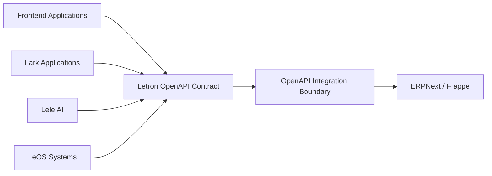

# System Architecture — OpenAPI Interaction Boundary

## 1. Mục đích

Tài liệu này mô tả kiến trúc tổng quan của lớp tương tác OpenAPI trong hệ sinh
thái Letron ERP.

OpenAPI là contract chung để các ứng dụng và hệ thống bên ngoài tương tác với
ERPNext/Frappe. Tài liệu không mô tả source code, business workflow, field
implementation, deployment hoặc chi tiết vận hành.

## 2. Phạm vi

Kiến trúc tập trung vào:

- các nhóm consumer sử dụng API;
- OpenAPI contract và cách tổ chức theo module nghiệp vụ;
- integration boundary giữa consumer và ERPNext/Frappe;
- sự khác nhau giữa curated contract và runtime catalog.

Các hệ thống như Identity, Data, Event Delivery và hạ tầng triển khai không
thuộc phạm vi của tài liệu này.

## 3. System context



OpenAPI là điểm tương tác công khai giữa các consumer và ERPNext/Frappe.
Consumer không phụ thuộc vào chi tiết nội bộ của ERPNext hoặc DocType runtime.

## 4. Các thành phần

| Thành phần | Trách nhiệm kiến trúc |
|---|---|
| Frontend Applications | Sử dụng contract để hiển thị và thao tác dữ liệu ERP |
| Lark Applications | Sử dụng contract cho các tương tác được cấp phép |
| Lele AI | Gọi các capability được công bố qua contract |
| LeOS Systems | Trao đổi dữ liệu với ERP qua contract |
| OpenAPI Contract | Công bố operation, schema, module và capability được hỗ trợ |
| Integration Boundary | Chuẩn hóa tương tác giữa consumer và ERPNext/Frappe |
| ERPNext/Frappe | Thực thi metadata, validation, transaction và lifecycle của ERP |

`OpenAPI Integration Boundary` là boundary logic của contract; không mặc định
là một service độc lập.

## 5. Tổ chức OpenAPI theo module

OpenAPI chính được tổ chức theo các module nghiệp vụ của ERPNext, ví dụ:

- Accounts;
- Selling;
- Buying;
- Stock;
- Manufacturing;
- Projects;
- CRM;
- Setup và System.

Mỗi module có contract riêng cho các capability được chọn. Một operation chỉ
được đưa vào OpenAPI module khi đã có contract rõ ràng về:

- mục đích operation;
- HTTP method và URL;
- request và response schema;
- resource hoặc action được tác động;
- lỗi có thể trả về.

Tên module và URL public không nhất thiết phải trùng tên DocType nội bộ của
ERPNext. DocType có khoảng trắng hoặc tên kỹ thuật chỉ được dùng bên trong
integration boundary, không trở thành URL public mặc định.

## 6. Hai loại artifact

### 6.1. Curated OpenAPI contract

Đây là contract public chính, chỉ chứa các module, resource và RPC đã được
chọn và mô tả đầy đủ. Đây là artifact dùng cho consumer, tài liệu API và SDK.

### 6.2. Runtime catalog

Catalog ghi nhận toàn bộ DocType và method được phát hiện từ ERPNext/Frappe,
kể cả những API chưa được đưa vào public contract.

Catalog phục vụ discovery và mở rộng contract, không tự động biến mọi runtime
method thành public OpenAPI operation.

```text
ERPNext/Frappe runtime
        |
        +--> Runtime catalog: đầy đủ những gì được phát hiện
        |
        +--> Curated OpenAPI: chỉ những capability đã được công bố
```

## 7. Nguyên tắc interaction boundary

1. Consumer chỉ phụ thuộc vào OpenAPI contract.
2. Contract được chia theo module để consumer dễ khám phá và sử dụng.
3. Capability nghiệp vụ phải có operation và schema cụ thể.
4. Public contract không công bố resource hoặc RPC fallback động.
5. Runtime discovery không tự động mở rộng public contract.
6. ERPNext/Frappe vẫn là nơi thực thi validation và lifecycle của dữ liệu.
7. Thay đổi nội bộ ERPNext không được làm thay đổi public contract nếu chưa có
   quyết định cập nhật contract.

## 8. Trạng thái kiến trúc

- OpenAPI curated là interaction contract chính.
- Runtime catalog là discovery artifact đầy đủ.
- Các module được công bố tăng dần theo nhu cầu tích hợp.
- Webhook, realtime hoặc consumer cụ thể chỉ thuộc OpenAPI contract khi
  capability delivery tương ứng đã được xác định và công bố rõ.
- Phase 5 dùng `Letron Event Outbox` làm durable boundary: business transaction
  chỉ ghi queued state; worker gửi webhook/realtime sau commit, retry có giới hạn,
  và consumer deduplicate theo event ID. REST tiếp tục là source of truth.

Các quyết định về business workflow, identity provider, data storage và cơ chế
triển khai phải được ghi ở tài liệu chuyên biệt, không đưa vào kiến trúc
OpenAPI interaction boundary này.
