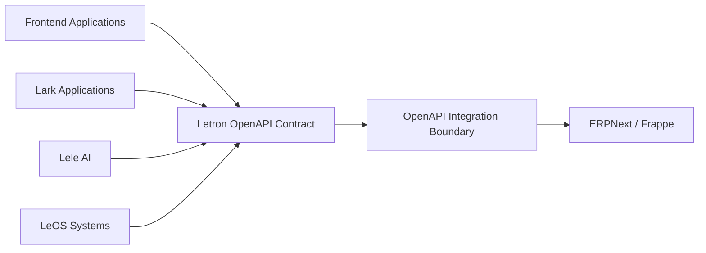

# System Architecture — OpenAPI Interaction Boundary

## 1. Mục đích

Tài liệu này mô tả kiến trúc tổng quan của lớp tương tác OpenAPI trong hệ sinh
thái Letron ERP.

OpenAPI là contract chung để các ứng dụng và hệ thống bên ngoài tương tác với
ERPNext/Frappe. Tài liệu chốt các boundary và source of truth, nhưng không mô
tả source code, field implementation hoặc runbook vận hành chi tiết.

## 2. Phạm vi

Kiến trúc tập trung vào:

- các nhóm consumer sử dụng API;
- OpenAPI contract và cách tổ chức theo module nghiệp vụ;
- integration boundary giữa consumer và ERPNext/Frappe;
- sự khác nhau giữa curated contract và runtime catalog.

Chi tiết triển khai Identity, Data, Event Delivery và hạ tầng không thuộc phạm
vi; tài liệu chỉ ghi ranh giới sở hữu cần thiết để các lớp không chồng lấn.

## 3. System context



OpenAPI là điểm tương tác công khai giữa các consumer và ERPNext/Frappe.
Consumer không phụ thuộc vào chi tiết nội bộ của ERPNext hoặc DocType runtime.

## 4. Các thành phần

| Thành phần | Trách nhiệm kiến trúc |
|---|---|
| Frontend Applications | Sử dụng contract để hiển thị và thao tác dữ liệu ERP |
| Lark Applications | Sử dụng contract cho các tương tác được cấp phép |
| Lele AI | Gọi các capability được công bố qua contract |
| LeOS Systems | Trao đổi dữ liệu với ERP qua contract |
| OpenAPI Contract | Công bố operation, schema, module và capability được hỗ trợ |
| Integration Boundary | Chuẩn hóa tương tác giữa consumer và ERPNext/Frappe |
| ERPNext/Frappe | Thực thi metadata, validation, transaction và lifecycle của ERP |

`OpenAPI Integration Boundary` là boundary logic của contract; không mặc định
là một service độc lập.

## 5. Tổ chức OpenAPI theo module

OpenAPI public hiện được tổ chức đúng theo năm module nghiệp vụ:

- Accounts;
- Buying;
- Contacts;
- Selling;
- Stock;

Các module khác chỉ có thể xuất hiện trong runtime catalog để discovery; chúng
không phải public module và không tự sinh route. Public contract hiện có đúng
23 resource và 137 operation. Manufacturing không thuộc roadmap public hiện
tại.

Mỗi module có contract riêng cho các capability được chọn. Một operation chỉ
được đưa vào OpenAPI module khi đã có contract rõ ràng về:

- mục đích operation;
- HTTP method và URL;
- request và response schema;
- resource hoặc action được tác động;
- lỗi có thể trả về.

Tên module và URL public không nhất thiết phải trùng tên DocType nội bộ của
ERPNext. DocType có khoảng trắng hoặc tên kỹ thuật chỉ được dùng bên trong
integration boundary, không trở thành URL public mặc định.

## 6. Hai loại artifact

### 6.1. Curated OpenAPI contract

Đây là contract public chính, chỉ chứa các module, resource và RPC đã được
chọn và mô tả đầy đủ. Đây là artifact dùng cho consumer, tài liệu API và SDK.

### 6.2. Runtime catalog

Catalog ghi nhận toàn bộ DocType và method được phát hiện từ ERPNext/Frappe,
kể cả những API chưa được đưa vào public contract.

Catalog phục vụ discovery và mở rộng contract, không tự động biến mọi runtime
method thành public OpenAPI operation.

```text
ERPNext/Frappe runtime
        |
        +--> Runtime catalog: đầy đủ những gì được phát hiện
        |
        +--> Curated OpenAPI: chỉ những capability đã được công bố
```

## 7. Nguyên tắc interaction boundary

1. Consumer chỉ phụ thuộc vào OpenAPI contract.
2. Contract được chia theo module để consumer dễ khám phá và sử dụng.
3. Capability nghiệp vụ phải có operation và schema cụ thể.
4. Public contract không công bố resource hoặc RPC fallback động.
5. Runtime discovery không tự động mở rộng public contract.
6. ERPNext/Frappe vẫn là nơi thực thi validation và lifecycle của dữ liệu.
7. Thay đổi nội bộ ERPNext không được làm thay đổi public contract nếu chưa có
   quyết định cập nhật contract.

## 8. Configuration và policy boundary

OpenAPI business contract và control plane cấu hình là hai boundary tách biệt:

| Loại | Owner/SOT |
|---|---|
| Docker, database, Redis, worker, backup, endpoint | `config/config.yaml` |
| Language, timezone, date/number format, system runtime | `config/config.yaml` |
| Company bootstrap, selected ERPNext business settings | `config/policy.yaml` |
| Secret thật | `.env` hoặc secret store |
| Identity theo cá nhân | Identity API và ERPNext DB |
| Entity, master, transaction, ledger | Business API và ERPNext DB |
| Executable customization/migration | Source/fixture của `letron_api` |
| Metadata/catalog/OpenAPI sinh ra | Artifact, không phải SOT |

`policy.yaml` không sở hữu toàn bộ compliance của doanh nghiệp. E-invoice
provider, chữ ký số, cấp mã/gửi cơ quan thuế và vòng đời thay thế/điều chỉnh hóa
đơn thuộc integration contract của Headless BE với nhà cung cấp e-invoice. Tax
matrix, accounting regime, account mapping, hồ sơ phê duyệt và retention evidence
thuộc quy trình kế toán/compliance riêng. `policy-full.yaml` chỉ là fallback kỹ
thuật/reference, không phải nguồn apply độc lập.

Một Docker project/Frappe site tương ứng một tenant và đúng một Company.
`letron_api` chỉ điều phối native controller/DocType; không tạo business
DocType, policy language hoặc workflow engine song song. System Manager có thể
sửa đúng hai YAML bind-mounted qua fixed-path control API. Production deploy
chỉ chạy `.\docker-start.ps1` trên Windows hoặc `./erpctl` trên Ubuntu, không
truyền action.

Luồng mutation cấu hình duy nhất:

```text
System Manager -> fixed-path control API -> validate/hash check
               -> atomic YAML replace -> native apply/readback
               -> health + zero-drift acknowledgement
```

Direct mutation managed policy qua Desk/generic resource API bị chặn hoặc làm
readiness fail-closed. Company identity là ngoại lệ bootstrap trong policy;
Account, Cost Center, Warehouse và entity do controller Company tạo vẫn thuộc
DB, policy chỉ tham chiếu chúng.

Policy inventory chỉ bao phủ module public và Frappe policy dùng chung trực tiếp
cho chúng. Module mới phải mở rộng inventory trước khi được public. User,
Employee, API key, user-role assignment và User Permission theo cá nhân thuộc
identity API/DB, không thuộc policy YAML.

## 9. Invariant và trạng thái triển khai

1. Một field chỉ có một owner; secret không xuất hiện trong YAML hoặc artifact.
2. Business write luôn qua permission, validation và controller native.
3. Runtime catalog không tự mở rộng curated contract.
4. Event outbox được ghi cùng business transaction; worker gửi sau commit và
   consumer deduplicate theo event ID. REST vẫn là source of truth.
5. Country/currency chỉ có owner là `policy.yaml`; launcher lấy bootstrap input
   từ policy và `config.yaml` không giữ mirror business jurisdiction.
6. Phase 8 `COMPLETE` trên Windows/Docker: production policy có 25 document thật;
   56 source managed/conditional được chứng minh bằng disposable fixture, schema
   fingerprint, native readback, controller effect, idempotency, rollback từng
   mutation boundary và cleanup zero-residue.
7. Phase 9 chỉ được mở rộng public contract sau khi có typed API/OpenAPI cho
   Bank Transaction, reconciliation và Payment Order cùng native controller
   evidence. `Bank Transaction Rule` có thể thuộc policy; transaction và ledger
   luôn là runtime entity, không được đưa vào policy YAML.
   Completeness thuộc [PRD](ERP_PRD.md), classification chi tiết thuộc
   [Configuration Inventory](Configuration_Inventory.md).
