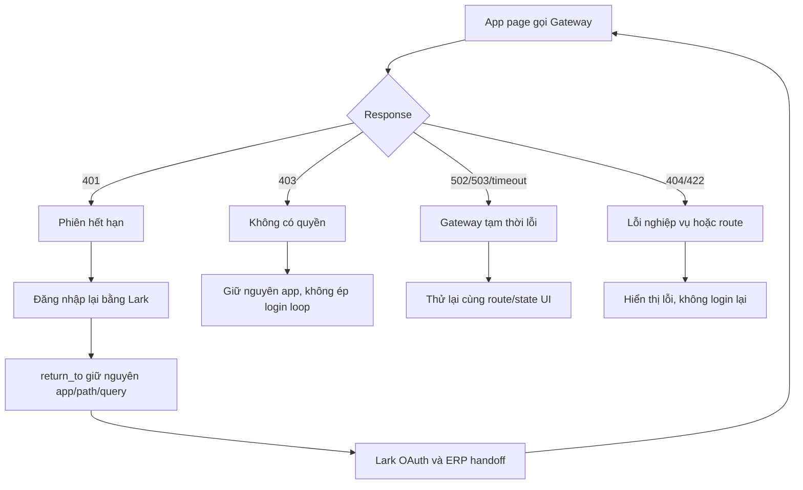

# ERP three-app routing and login-failure design — 2026-09-11

## 1. Quyết định

ERP không còn một Global Portal dành cho người dùng. `auth.letron.vn` vẫn tồn
tại như dịch vụ xác thực backend, nhưng browser chỉ làm việc trong một trong
ba app:

| App | Root người dùng | Màu/namespace | Login return mặc định |
|---|---|---|---|
| Assets | `/assets` | emerald | `/assets` |
| Purchase | `/purchase` | violet | `/purchase` |
| Accounts | `/accounts` | blue | `/accounts` |

Mỗi app phải giữ người dùng trong namespace của nó khi login thất bại, login
lại thành công, logout, hoặc Gateway tạm thời lỗi. Không dùng `/accounts` làm
fallback chung cho Assets/Purchase.

`auth.letron.vn` chỉ nhận một browser-facing start route là `/login/start`.
Callback Lark giữ nguyên URI đã đăng ký:

```text
https://auth.letron.vn/api/auth/lark/callback
```

## 2. Phát hiện từ routing hiện tại

### Đã đúng

- ERP có ba route namespace độc lập: `/assets`, `/purchase`, `/accounts`.
- ERP session là host-only cookie `__Host-letron_erp`, chứa opaque Gateway
  session token; không có thêm Redis BFF session.
- Gateway trả `401` riêng cho thiếu/hết session và `403` riêng cho thiếu quyền.
- ERP login đã dùng `return_to` và BFF handoff; callback nhận Gateway session và
  phát hành cookie ERP duy nhất.
- Auth callback vẫn dùng Pages Router tại `pages/api/auth/lark/callback.ts`, đây
  là route hợp lệ và khớp Lark Developer Console.

### Rủi ro cần sửa

1. `GET /api/auth/logout` luôn redirect về `/accounts/bank-accounts`, làm logout
   từ Assets/Purchase nhảy sai app.
2. `UserSessionStatus` gọi `/api/auth/login` không có `return_to`, nên header của
   cả ba app đều rơi về fallback Accounting.
3. Một số server page dùng link `/api/auth/login` không có path/query hiện tại;
   sau login người dùng mất deep link, bộ lọc hoặc trang đang xem.
4. Purchase là Client Component; nút login hiện tại không mang theo pathname
   hiện hành, còn nút retry chỉ gọi lại API list chứ không khởi động lại login.
5. Một số copy hiển thị “Global Portal” dù đây không còn là khái niệm người
   dùng. Tên backend gateway có thể giữ trong code/config, nhưng UI phải nói
   “Letron Gateway” hoặc “Đăng nhập bằng Lark”.
6. `/accounts` đang là fallback implicit của root `/`; đây là default kỹ thuật,
   không được dùng làm fallback auth cho hai app còn lại.

## 3. Route contract đích

| Route | Vai trò | Khi lỗi |
|---|---|---|
| `/` | launcher hoặc redirect có chủ đích tới app mặc định | không phải auth fallback |
| `/assets/*` | Assets UI | 401 login về đúng `/assets/*`; 403 giữ nguyên app |
| `/purchase/*` | Purchase UI | 401 login về đúng `/purchase/*`; retry giữ state UI |
| `/accounts/*` | Accounts UI | 401 login về đúng `/accounts/*`; 403 giữ nguyên app |
| `/api/auth/login?return_to=...` | ERP bắt đầu BFF handoff | chỉ nhận URL cùng origin, không `/api/*`, chỉ 3 app |
| `/api/auth/oidc/callback` | ERP nhận handoff | invalid/expired trả lỗi có thể retry, không redirect sang app khác |
| `/api/auth/logout?return_to=...` | revoke ERP/Auth gateway session | redirect về app root tương ứng |
| `auth.letron.vn/login/start` | browser-facing Lark start | tạo transaction/cookie rồi redirect Lark |
| `auth.letron.vn/api/auth/lark/callback` | Lark callback | hoàn thành auth, không đổi URL |

## 4. Luồng thành công

```mermaid
flowchart TD
    A[User mở /assets hoặc /purchase hoặc /accounts] --> B{ERP session hợp lệ?}
    B -- Có --> C[Page gọi Letron Gateway]
    C --> D[Gateway 200: render đúng app]
    B -- Không --> E[Page hiển thị Login bằng Lark]
    E --> F[/api/auth/login?return_to=current route]
    F --> G[auth.letron.vn/login/start?handoff=1]
    G --> H[Lark authorize]
    H --> I[auth.letron.vn/api/auth/lark/callback]
    I --> J[Auth tạo one-time ERP handoff]
    J --> K[/api/auth/oidc/callback]
    K --> L[ERP tạo __Host-letron_erp]
    L --> C
```

ERP handoff dùng TTL cấu hình `LETRON_ERP_SESSION_TTL_SECONDS` (mặc định 24
giờ). Gateway database là nguồn sự thật cho expiry và revoke; cookie chỉ là
credential host-only để BFF chuyển tiếp.

## 5. Luồng lỗi login và retry



## 6. Nguyên tắc UI khi lỗi

- `401`: một nút duy nhất `Đăng nhập lại bằng Lark`; callback phải quay về đúng
  route hiện tại. Không thêm nút “Về trang chính” nếu người dùng đang ở đúng
  app và nút đó không giúp khôi phục thao tác.
- `403`: hiển thị “Tài khoản chưa được cấp quyền cho phân hệ này”; không tự
  redirect sang Auth/Lark và không tạo redirect loop.
- `502/503`: nút `Thử lại` gọi lại request hiện tại; không xóa session hoặc
  chuyển người dùng sang `/accounts`.
- Login link trong header phải mang `return_to` là app root hiện tại; không có
  login link nào được fallback ngầm về Accounts.
- Không đặt `return_to` trỏ tới `/api/*`, domain khác, `//host`, hoặc route
  ngoài ba app.

## 7. Kế hoạch triển khai

1. Tạo helper build login URL có `return_to` an toàn.
2. Cập nhật server pages Assets/Accounts và reports/detail/edit để giữ
   pathname/query.
3. Cập nhật Purchase Client Component để login lại về pathname hiện tại và
   giữ retry là retry API hiện tại.
4. Cập nhật `UserSessionStatus` và ba app shell để login/logout giữ app root.
5. Cập nhật `/api/auth/logout` validate `return_to` theo ba app.
6. Xóa copy Global Portal khỏi UI; giữ tên `portalAuthBaseUrl` nội bộ cho tới
   khi có đợt rename riêng.
7. Test matrix bắt buộc với session thiếu, session hết hạn, 403, Gateway 503,
   deep link có query, login success và logout từ cả ba app.

## 8. Acceptance criteria

- Mở `/assets`, `/purchase`, `/accounts` khi chưa login không đi sang app khác.
- Login từ `/assets/...`, `/purchase/...`, `/accounts/...` quay lại đúng URL
  ban đầu sau Lark callback.
- 401 không tạo loop và không đưa browser tới Global Portal UI.
- 403 không hiện nút login lại nếu chỉ thiếu quyền.
- Retry 503 giữ đúng app, path, query và state UI cần thiết.
- Logout từ mỗi app quay về root của chính app đó.
- Không còn source UI tham chiếu “Global Portal” hoặc link login không có
  `return_to`.
- Callback production vẫn là `/api/auth/lark/callback`.

## 9. Trạng thái triển khai lần này

- Đã thêm `larkLoginHref` để mọi login action mang theo `return_to`.
- Đã cập nhật Assets và Accounts server pages để quay lại đúng deep link.
- Đã cập nhật Purchase client page để login lại bằng Lark tại pathname/query
  hiện tại mà không dùng `useSearchParams` gây CSR bailout khi build.
- Đã cập nhật header login và logout của cả ba app theo app root tương ứng.
- `/api/auth/login` và `/api/auth/logout` chỉ chấp nhận return path thuộc
  `/assets`, `/purchase` hoặc `/accounts`.
- UI không còn hiển thị Global Portal; Auth Server vẫn là backend identity/
  gateway dependency, không phải user-facing portal.
- ERP production build đã pass sau khi xử lý lỗi prerender của Purchase route.
