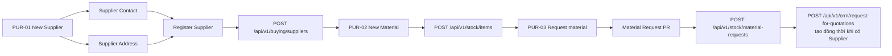

# Purchase Features — Frontend Design

## 1. Mục tiêu và phạm vi

Đây là thiết kế FE tối giản cho các nghiệp vụ Purchase cần người dùng thao
tác. Thiết kế giữ nguyên ba screen trong sơ đồ gốc và không tạo thêm screen
ERPNext mới.

```text
PUR-01 Supplier
→ PUR-02 Material
→ PUR-03 Material Request
```

ERPNext backend và automation đã có sẵn. FE chỉ gọi các official public API
trong OpenAPI contract. Approval ngoài ERPNext không được thiết kế trong FE
ERPNext.

Các bước sau Material Request nếu đã được automation xử lý thì nằm ngoài phạm vi
tài liệu này. Không bổ sung Purchase Order, Receipt, Invoice, Dashboard,
Timeline hoặc Exception Queue thành screen riêng.

## 2. Luồng gốc — giữ nguyên



## 3. PUR-01 — Supplier

- Route: `/purchase/supplier`
- [x] Danh sách Supplier: search, native filter/sort theo contract và pagination.
- Modal detail/create/edit Supplier.
- [x] Contact và Address được tạo trong modal cùng context Supplier.
- [x] Contact/Address detail, edit và refresh context sau khi tạo.
- [x] Chọn và hiển thị `supplier_primary_contact` và `supplier_primary_address` khi options đã có.
- [x] Upload tệp private và attach vào Supplier qua endpoint dùng chung.
- [x] Tự refresh options và cập nhật primary ngay sau khi tạo Contact/Address.
- Hiển thị lỗi validation do official API trả về tại đúng field.
- Không tạo screen Contact hoặc Address riêng.

| UI action | Method | Official API |
|---|---|---|
| Danh sách Supplier | GET | `/api/v1/buying/suppliers` |
| Chi tiết Supplier | GET | `/api/v1/buying/suppliers/{name}` |
| Tạo Supplier | POST | `/api/v1/buying/suppliers` |
| Sửa Supplier | PUT | `/api/v1/buying/suppliers/{name}` |
| Tạo/sửa Contact | POST/PUT | `/api/v1/contacts/contacts[/{name}]` |
| Tạo/sửa Address | POST/PUT | `/api/v1/contacts/addresses[/{name}]` |
| Attach file vào Supplier/Contact/Address/Item/Material Request | POST | `/api/v1/files/attachments` |

## 4. PUR-02 — New Material

- Route: `/stock/item`
- [x] Danh sách Item/Material: search, native filter/sort theo contract và pagination.
- Modal detail/create/edit Item.
- Field tối thiểu: Item code, name, group, UOM và trạng thái active. Warehouse mặc
  định không được thêm vì không có trong Item contract được public cho FE.
- Chỉ sử dụng các field Item mà official API trả về và cho phép kiểm tra trước
  khi lưu.
- Không tạo screen Item riêng ngoài PUR-02.

| UI action | Method | Official API |
|---|---|---|
| Danh sách Item | GET | `/api/v1/stock/items` |
| Chi tiết Item | GET | `/api/v1/stock/items/{name}` |
| Tạo Item | POST | `/api/v1/stock/items` |
| Sửa Item | PUT | `/api/v1/stock/items/{name}` |

## 5. PUR-03 — Material Request

- Route: `/purchase/requests`
- [x] Danh sách Material Request: search, native filter theo các field được public
  trong contract và pagination.
- Modal hoặc detail view để xem/tạo/sửa request.
- [x] Header dùng các field native/public contract: title, material request type,
  company, transaction date, required date, warehouse và buying price list.
- [x] Người tạo lấy từ `owner` read-only của ERPNext.
- [x] Child table có Item, quantity, UOM, schedule date và warehouse.
- [x] Thêm/xóa nhiều dòng Item theo child table Material Request.
- [x] Chọn một hoặc nhiều Supplier tham gia báo giá ngay trong Material Request.
- Khi tạo Material Request mới, FE chỉ gọi một Next/Vercel action nội bộ. Action
  này gọi tuần tự đúng hai official ERP API: Material Request trước, sau đó
  Request for Quotation bằng cùng Item và Supplier đã chọn. Không có nút
  `Create RFQ` riêng và không chuyển sang screen RFQ.
- Action theo trạng thái official API: Edit Draft, Submit và Cancel.
- Hai official API không có transaction atomic chung. Nếu MR thành công nhưng
  RFQ lỗi, orchestration phải giữ trạng thái `partial_failure`, lưu tên MR và
  chỉ retry bước RFQ; tuyệt đối không tạo lại MR.
- Không tạo screen RFQ riêng trong phạm vi thiết kế này.

| UI action | Method | Official API |
|---|---|---|
| Danh sách request | GET | `/api/v1/stock/material-requests` |
| Chi tiết request | GET | `/api/v1/stock/material-requests/{name}` |
| Tạo draft | POST | `/api/v1/stock/material-requests` |
| Sửa draft | PUT | `/api/v1/stock/material-requests/{name}` |
| Submit | POST | `/api/v1/stock/material-requests/{name}/submit` |
| Cancel | POST | `/api/v1/stock/material-requests/{name}/cancel` |
| Tạo RFQ đồng thời khi tạo request | POST | `/api/v1/crm/request-for-quotations` |

### Orchestration contract nội bộ

Đây là route BFF của Next/Vercel, không thay thế hoặc mở thêm ERPNext business
API:

```text
POST /api/purchase/requests/create
  -> POST /api/v1/stock/material-requests
  -> POST /api/v1/crm/request-for-quotations
```

Request nội bộ gồm `material_request`, `suppliers` và header
`X-Idempotency-Key`. Redis chỉ giữ state/index và lock trong thời gian hữu hạn;
correlation ID `custom_letron_orchestration_id` được lưu trên Material Request
và Request for Quotation để ERPNext giữ dấu vết bền vững. BFF không còn giới hạn
lookup state theo cookie session.

- MR lỗi: kết thúc `failed`, không gọi RFQ.
- RFQ lỗi hoặc timeout sau khi MR thành công: `partial_failure`, lưu
  `material_request_name`, lỗi và số lần retry; retry chỉ POST RFQ với cùng
  idempotency key.
- Cả hai thành công: `completed`, lưu cả `material_request_name` và
  `request_for_quotation_name`.
- Nếu action bị ngắt sau khi MR đã tạo, lần recovery tiếp theo read-back MR theo
  correlation ID trước khi POST lại; vì list response có thể không phản ánh filter
  custom field, BFF xác minh correlation trên detail trước khi coi là cùng document.
  RFQ retry cũng read-back trước POST để tránh tạo trùng khi response thất lạc.
  Người dùng có thể retry RFQ thủ công. Không
  dùng worker, cron, QStash hoặc retry tự động trong flow này.
- PUR-03 có khu vực `Cần xử lý` đọc active orchestration từ Redis sau mỗi lần mở
  trang hoặc khi user bấm `Làm mới`. Khu vực này giữ các trạng thái chưa hoàn tất,
  hiển thị MR, lỗi và số lần retry; khi RFQ thành công, bản ghi được xoá khỏi
  danh sách. Redis state và active index được namespace bằng hash của session
  cookie, nên không trả orchestration giữa các user/session. Đây là thông báo
  trong FE, không phải approval hay Lark notification.
- Không dùng cancel MR để giả lập rollback; đó chỉ là compensation tùy chính
  sách nghiệp vụ và không được coi là atomic transaction.

Action validate payload theo OpenAPI, forward quyền qua Gateway và dùng
idempotency key riêng cho MR/RFQ. Gateway timeout được hiển thị như lỗi có thể
retry; Redis state không chứa file content, token hoặc secret.

## 6. UI dùng chung

- Modal/drawer giữ nguyên context, không điều hướng thừa.
- Skeleton loading, empty state, lỗi và nút retry.
- Hiển thị lại dữ liệu form khi request thất bại nếu dữ liệu còn trong phiên hiện
  tại.
- Disable nút trong lúc submit để tránh gửi lặp.
- Với PUR-03, FE chỉ phát sinh một request tới orchestration action; action có
  thể phát sinh tuần tự hai request official: MR rồi RFQ.
- Partial failure phải có nút/flow retry RFQ riêng trong cùng context request;
  không retry mù toàn bộ action.
- Timeout sau khi gửi request được giữ theo idempotency key; người dùng không
  được tạo lại ngay mà phải tra cứu state hoặc retry RFQ nếu MR đã tạo.
- `401`: xử lý theo Global Portal.
- `403`: hiển thị không có quyền.
- `502/503`: hiển thị backend/Gateway unavailable có kiểm soát.
- Không hiển thị raw HTML lỗi từ proxy hoặc Cloudflare.
- Filter/sort được gửi bằng `filters`, `order_by`, `limit_page_length` và
  `limit_start` theo contract. Alias public ở ERPNext đồng bộ các query này vào
  `frappe.local.form_dict` trước khi chuyển sang native `/api/resource`, nên
  projection, filter, sort và pagination được áp dụng server-side.
- Sidebar active đúng ở list, detail và nested route.
- Không dùng việc ẩn button làm cơ chế authorization.

## 7. So sánh ngắn với ERPNext FE

| Screen | Thiết kế Letron | ERPNext FE | Khác biệt cần giữ |
|---|---|---|---|
| Supplier | PUR-01 với Contact/Address trong modal | List/Form riêng theo DocType | Một context, ít điều hướng |
| Material | PUR-02 CRUD Item tối giản | Item List/Form nhiều field | Chỉ hiển thị field cần cho Purchase |
| Material Request | PUR-03 child table + RFQ tự tạo | Form + child table | Flow ngắn, không có RFQ management UI |
| UI state | Chuẩn hóa trong 3 screen | Theo từng Desk view | Một bộ loading/error/permission thống nhất |

ERPNext chỉ là nguồn backend và tham chiếu pattern UI. Không dùng nguyên si
ERPNext Desk và không tạo screen theo mọi DocType.

## 8. Acceptance FE

- [x] Ba screen PUR-01, PUR-02, PUR-03 đúng route và đúng luồng trong sơ đồ.
- [x] Supplier tạo/sửa được cùng Contact và Address trong context hiện tại.
- [x] Item tạo từ PUR-02 được chọn trong Material Request.
- [x] Material Request tạo/sửa/submit/cancel đúng trạng thái official API.
- [x] Material Request tạo mới với Item và Supplier gửi một orchestration action;
  action chỉ gọi đúng hai official API.
- [x] Partial failure và idempotency giữ lại MR đã tạo; retry RFQ thủ công không
  tạo lại MR. Đã kiểm tra bằng session Playwright `letron-prod-test`.
- [x] Chọn một tệp private và attach vào bản ghi sau khi tạo/sửa.
- [x] Loading, empty, validation, retry, 401, 403 và 502/503 có UI rõ ràng.
- [x] Không có screen mới ngoài ba screen chính.
- [x] Không có request nào gọi API ngoài official public contract.
- [x] Attachment dùng endpoint dùng chung `/api/v1/files/attachments`, không gọi
  trực tiếp `/api/method/upload_file`.
- [x] Quyền upload được kiểm tra qua Global Portal policy với resource
  `files/attachments:create`; ERPNext chỉ tiếp tục kiểm tra quyền `write` trên
  document đích.

## 9. UX behavior bắt buộc

| Khu vực | UX behavior | Mục đích |
|---|---|---|
| Supplier | [x] Cảnh báo rời form khi chưa lưu | Tránh mất dữ liệu |
| Supplier | [x] Giữ Supplier context sau khi tạo Contact/Address | Không phải tìm lại |
| Supplier | [x] Xác nhận trước khi inactive | Tránh thao tác nhầm |
| Material | [x] Autocomplete và keyboard navigation | Chọn Item nhanh |
| Material | [x] Hiển thị field bắt buộc ngay trên form | Giảm lỗi submit |
| Material Request | [x] Cảnh báo rời form khi chưa lưu | Tránh mất request nhiều dòng |
| Material Request | [x] Thêm/xóa child item trong bảng | Nhập liệu nhanh |
| Material Request | [x] Hiển thị tổng quantity và thông tin chính | Kiểm tra trước khi gửi |
| Material Request | [x] Confirmation trước Submit/Cancel | Tránh gửi/hủy nhầm |
| Cả 3 screen | [x] Giữ filter/search khi quay lại list | Không mất context |
| Cả 3 screen | [x] Focus management cho modal | Hỗ trợ keyboard/accessibility |
| Cả 3 screen | [x] Toast thành công/lỗi cụ thể | Phản hồi rõ ràng |
| Cả 3 screen | [x] Disable action khi đang gửi | Tránh double-click/request lặp |

## 10. Thông tin cần thiết cho nhân viên mua hàng

Phạm vi FE chỉ dừng ở việc lên đơn và nhận biết trạng thái request.

| Khu vực | Thông tin/tính năng |
|---|---|
| Supplier | Tên, mã, Contact, Address và trạng thái hoạt động |
| Material | Mã, tên, mô tả/specification và UOM |
| Material Request | Số lượng, ngày cần hàng, nơi nhận và người/phòng ban yêu cầu |
| List | Filter theo các field được public trong contract |
| Detail | Mã request, thời gian tạo, người tạo và tổng số lượng |
| Draft | Lưu và sửa khi request còn Draft |
| Submit | Confirmation trước khi gửi và hiển thị mã request sau khi gửi |

### Trạng thái ERPNext người dùng cần nhìn thấy

```text
Draft
→ Submitted
→ Cancelled
```

FE chỉ hiển thị status và lỗi do official ERPNext API trả về.

Không hiển thị trong flow nhân viên mua hàng các document ngoài phạm vi ba
screen: Purchase Order, Purchase Receipt, Purchase Invoice, Payment và
accounting.

### Bằng chứng triển khai và kiểm thử

- Trạng thái triển khai: `COMPLETE` — cập nhật ngày `2026-09-08`.
- Đã kiểm tra browser bằng session thật `letron-prod-test`, không tạo screen
  hoặc session đăng nhập mới.
- Đã mở thành công cả ba route `/purchase/supplier`, `/stock/item` và
  `/purchase/requests`; sidebar active đúng và user Global Portal được nhận
  diện.
- Đã kiểm tra Supplier context: tạo Contact qua official API, cập nhật primary
  Contact và hiển thị toast thành công.
- Đã kiểm tra confirmation khi chuyển Supplier sang inactive; từ chối dialog
  không gửi PUT. Fixture được trả lại trạng thái active.
- Đã kiểm tra Material Request orchestration thành công trước đó với MR
  `MAT-MR-2026-00005` và RFQ `RFQ-2026-00002`; đã kiểm tra partial failure và
  retry với MR `MAT-MR-2026-00006`.
- Đã kiểm tra attachment private, loading/empty/error, retry và các trạng thái
  permission đã có trong FE.
- Static verification: `npm run typecheck`, `npm run lint`, `npm run build` và
  `git diff --check` đều đạt.

### Ghi chú runtime list

List request gửi `fields`, `filters`, `order_by`, `limit_page_length` và
`limit_start` đúng OpenAPI contract. Backend alias giữ nguyên các tham số khi
rewrite sang native Frappe resource route; regression runtime đã xác nhận list
trả projection nhiều field và filter không khớp trả `data: []` cho các resource
Accounts, Assets, Buying, Contacts, Selling, Stock và CRM. FE vẫn giữ lớp lọc
hiển thị bảo vệ UX trong trường hợp gateway cũ còn được cache, nhưng đây không
phải authorization boundary và không thay thế server-side permission/filter.

## Trạng thái tài liệu

Đây là thiết kế FE tối giản, phát triển từ sơ đồ `PURCHASE FEATURES` gốc. Tài
liệu mô tả screen, UI behavior và API mapping của official ERPNext contract;
orchestration là BFF action nội bộ ở Next/Vercel, không phải custom business API
ERPNext. Không đặc tả automation phía sau hoặc approval workflow.
