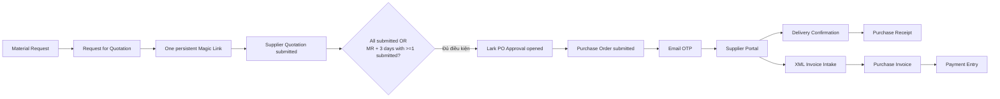
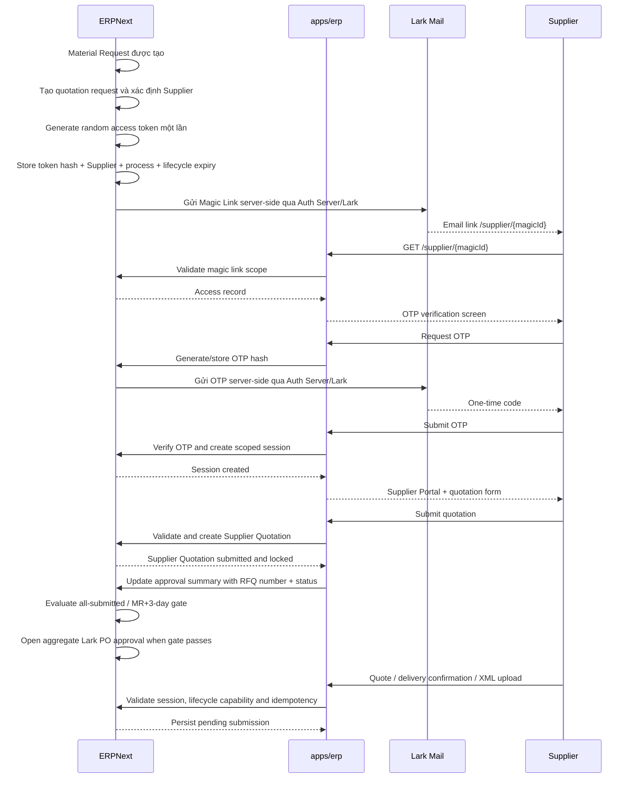

# Supplier Portal — Magic Link và Email OTP

> **Trạng thái:** IMPLEMENTED — đã triển khai code path MR → RFQ → Magic Link/OTP → Supplier Quotation → chọn giá thấp nhất → Lark approval → PO → delivery/XML/payment status; runtime acceptance phải giữ điều kiện `REAL_MR_TEST=PASS`.
>
> **Ngày:** 2026-09-09

> **Kết luận kiểm tra:** Code đã đủ các route/backend path của vòng đời; chỉ đánh dấu hoàn tất toàn bộ sau khi migration, email provider, scheduler và browser acceptance chạy thành công.

## 1. Mục tiêu

Thiết kế một cổng dành cho nhà cung cấp với **một URL duy nhất cho một
procurement process**. Ngay sau khi Material Request được tạo và Supplier đã
được xác định, hệ thống tạo quotation request, tạo Magic Link và gửi email cho
Supplier. Nhà cung cấp dùng cùng URL đó xuyên suốt từ RFQ/Supplier Quotation
đến Purchase Order, giao hàng, hóa đơn và theo dõi thanh toán; quyền thao tác
thay đổi theo trạng thái nghiệp vụ.

Supplier Portal là luồng external riêng. Nó không dùng Lark SSO, không dùng
`letron_sso` và không được trở thành một nhánh của identity `lark + tenant_key +
union_id` dành cho nhân viên.

## 2. Phạm vi

### Có trong phạm vi

- [x] Phát hành một access link theo từng procurement process và Supplier ngay sau
  khi Material Request tạo thành công và quotation request đã được tạo; không
  tạo URL mới khi quy trình chuyển từ RFQ sang PO hoặc các bước sau đó.
- [x] Email Magic Link.
- [x] Email OTP có hạn sử dụng, giới hạn thử và chống gửi lặp.
- [x] Supplier session có phạm vi theo Supplier và procurement process; PO, Receipt,
  Invoice và Payment chỉ là các chứng từ liên kết trong process đó.
- [x] Hiển thị thông tin PO được allowlist.
- [x] Supplier gửi xác nhận giao hàng và chứng từ giao hàng.
- [x] Supplier upload XML invoice.
- [x] Internal review trước khi tạo hoặc submit chứng từ kế toán/kho.
- [ ] Audit đầy đủ; revoke operator và runtime acceptance còn phải kiểm chứng.
- [x] Expiry và idempotency cho access, OTP, quotation, delivery và XML intake.

### Không có trong phạm vi

- [ ] Supplier tự submit Purchase Receipt.
- [ ] Supplier tự submit Purchase Invoice.
- [ ] Supplier tự tạo Payment Entry hoặc xem trạng thái thanh toán chi tiết.
- [ ] Supplier truy cập ERPNext Desk.
- [ ] Supplier đăng nhập bằng Lark.
- [ ] Dùng Delivery Note cho purchase flow.

## 3. Luồng nghiệp vụ chuẩn



Chuỗi purchase chuẩn là:

```text
Material Request
→ Request for Quotation
→ Supplier mở quotation bằng OTP
→ Supplier submit quotation
→ Next.js tạo Supplier Quotation và khóa
→ Cập nhật approval summary: RFQ number + quotation status
→ Chờ tất cả Supplier submit hoặc hết 3 ngày từ lúc MR tạo
→ Next.js chọn quotation có tổng giá thấp nhất
→ Lark Approval tổng hợp mở kèm kết quả chọn
→ Purchase Order
→ Purchase Receipt
→ Purchase Invoice
→ Payment Entry
```

`Delivery Note` thuộc nhánh bán hàng/giao cho Customer. Với nhà cung cấp,
Supplier Portal chỉ gửi delivery confirmation; ERPNext tạo `Purchase Receipt`
sau bước kiểm tra nội bộ.

## 4. Boundary và ownership

| Thành phần | Ownership |
|---|---|
| ERPNext | Supplier, PO, Purchase Receipt, Purchase Invoice, stock, accounting |
| `apps/erp` | Supplier Portal UI, public BFF và orchestration chính |
| `apps/letron_api` | Explicit supplier-portal methods, ERPNext validation và document SOT |
| Lark/Auth Server | Lark identity, nhân viên, PO approval; không quản lý Supplier identity |
| Lark/Auth Server | Gửi Magic Link/OTP qua Lark Mail server-side; credential refresh token mã hóa trong Neon |
| E-invoice provider | Provider lifecycle sau khi Purchase Invoice đã được kiểm tra/submit |

Supplier Portal không gọi generic `/api/v1` Gateway bằng session supplier. Gateway
hiện yêu cầu signed Lark identity và `union_id`; supplier backend phải dùng các
method explicit, server-to-server, có HMAC riêng.

Global Portal là control-plane owner và có quyền điều phối cao nhất đối với luồng
mua hàng. Portal không ghi trực tiếp database ERPNext và không chuyển quyền Portal
cho browser của Supplier. `apps/erp` ký request, `apps/letron_api` xác thực chữ ký
và thực thi nghiệp vụ native ERPNext bằng internal execution context đã cấu hình.
Đây là cùng một quyền điều phối của Portal qua một boundary kiểm soát được, không
phải quyền ERP riêng của Supplier.

### 4.1. Supplier không có ERP identity

Supplier không có tài khoản ERPNext, không có role ERPNext và không đăng nhập vào
Global Portal. Supplier chỉ được xác thực bằng access record của đúng
`procurement_process`:

```text
Magic Link token
→ Email OTP
→ Supplier session
→ scoped supplier action
```

Supplier session không phải ERP session và không được dùng để gọi generic CRUD.
Next.js là BFF của Supplier Portal; mỗi request BFF ký HMAC server-to-server tới
explicit method của `letron_api`. Backend kiểm tra HMAC, access/session scope,
Supplier, process, document link và idempotency trước khi thực hiện nghiệp vụ.

Sau khi kiểm tra hợp lệ, `letron_api` dùng internal execution context của hệ
thống để gọi nghiệp vụ native ERPNext. Internal execution context là actor duy
nhất được phép tạo hoặc submit chứng từ; không phải Supplier và không phụ thuộc
vào việc Supplier có ERP login hay không. Context phải được khôi phục sau request.

| Nghiệp vụ | Request từ Supplier | Actor tạo/submit native document |
|---|---|---|
| Supplier Quotation | Item, quantity, rate thuộc RFQ của access | Global Portal control-plane qua `letron_api` |
| Delivery confirmation | PO item và số lượng còn nhận | Internal reviewer/service sau khi review |
| XML invoice | File XML và metadata thuộc PO/Supplier | Internal reviewer/service sau khi review |
| PO sau approval | Không được tạo PO | Global Portal approval callback qua `letron_api` |

Nếu HMAC, access/session scope, process link hoặc internal execution context
không hợp lệ thì request fail-closed; không cấp thêm ERP quyền và không tạo
document ngoài process.

## 5. Trình tự Magic Link và OTP



Magic Link là bearer credential ban đầu và là định danh cố định của process, không
phải định danh của riêng PO. Sau khi Material Request tạo thành công, orchestration
phải tạo quotation request, xác định Supplier, tạo access record và enqueue email
trong cùng một nghiệp vụ. Các document name như Supplier Quotation, PO, Purchase
Receipt, Purchase Invoice và Payment Entry được liên kết dần vào cùng record khi
phát sinh. Không phát hành lại URL chỉ vì process chuyển trạng thái.

OTP phải được gửi tới email snapshot đã được xác định khi phát hành access record;
không dùng email do người dùng nhập ở màn hình để đổi người nhận OTP. Mỗi lần
vào lại URL có thể yêu cầu OTP mới; session chỉ có thời hạn ngắn.

Magic Link và OTP cùng đi qua email nên đây là two-step email verification, chưa
phải MFA độc lập. Nếu cần MFA thật, factor thứ hai phải dùng kênh khác.

## 6. Data model

Tạo một DocType server-side `Supplier Portal Access` trong `letron_api`.

| Field | Ý nghĩa |
|---|---|
| `supplier` | Supplier ERPNext được cấp quyền |
| `procurement_process` | Khóa nghiệp vụ duy nhất của Supplier từ RFQ đến Payment |
| `request_for_quotation` | Quotation request/RFQ được tạo ngay sau MR |
| `supplier_quotation` | Supplier Quotation thuộc process, có thể chưa có ở thời điểm phát hành |
| `purchase_order` | PO thuộc process, nullable trước khi PO được tạo |
| `purchase_receipts` | Các Purchase Receipt liên kết phát sinh trong process |
| `purchase_invoices` | Các Purchase Invoice liên kết phát sinh trong process |
| `payment_entries` | Các Payment Entry/status projection được phép hiển thị |
| `contact` | Contact nhận thông báo |
| `email_snapshot` | Email được chốt tại thời điểm phát hành |
| `purpose` | Ví dụ `procurement_followup` |
| `magic_token_hash` | Hash của token ngẫu nhiên; không lưu token gốc |
| `magic_expires_at` | Thời điểm hết hạn link theo lifecycle/process |
| `otp_hash` | Hash OTP hiện tại |
| `otp_expires_at` | Thời điểm hết hạn OTP |
| `otp_attempts` | Số lần verify thất bại |
| `otp_sent_at` | Thời điểm gửi OTP gần nhất |
| `session_hash` | Hash session token |
| `session_expires_at` | Thời điểm hết hạn session |
| `status` | `Issued`, `OtpSent`, `Active`, `Revoked`, `Expired` |
| `revoked_at` | Thời điểm revoke |
| `last_used_at` | Lần sử dụng gần nhất |

Thời hạn mặc định đề xuất:

```text
Magic Link: tồn tại theo lifecycle của process; mặc định 90 ngày không hoạt động
OTP: 5 phút
Supplier session: 2 giờ
OTP attempts: tối đa 5 lần
Resend OTP: tối thiểu 60 giây
```

Rate-limit counter có thể dùng Redis; access record, audit và trạng thái revoke
phải nằm ở storage server-side bền vững.

## 7. Route trong `apps/erp`

```text
src/app/supplier/[magicId]/page.tsx

src/app/api/supplier/[magicId]/otp/request/route.ts
src/app/api/supplier/[magicId]/otp/verify/route.ts
src/app/api/supplier/session/process/route.ts
src/app/api/supplier/session/po/route.ts
src/app/api/supplier/session/delivery/route.ts
src/app/api/supplier/session/xml-invoice/route.ts
src/app/api/supplier/session/payment-status/route.ts
src/app/api/supplier/session/logout/route.ts

src/components/supplier-portal/
src/lib/supplier-portal.ts
```

Các route BFF không trả raw ERPNext error, không expose token, không cho phép
client tự chọn Supplier, process hoặc document ngoài access scope. Mọi request
đều tính lại capability từ trạng thái hiện tại; không tin capability do client
gửi lên.

### Error contract dùng chung cho BFF và client

Mọi lỗi HTTP từ ERP app trả cùng một shape, không phụ thuộc lỗi phát sinh ở
Next.js, Gateway, ERPNext hay Lark:

```json
{
  "error": "stable_error_code",
  "message": "Thông báo an toàn cho người dùng",
  "retryable": false
}
```

`error` là mã máy ổn định để client điều phối; `message` là thông báo đã được
chuẩn hóa; `retryable` chỉ là gợi ý retry. Lỗi không xác định không được đưa
`Error.message`, stack trace, token hoặc raw ERPNext response ra ngoài. Adapter
trung tâm chỉ đọc các format upstream đã được khai báo, bao gồm
`_server_messages` của Frappe, và chuyển chúng về contract trên. HTTP 401/403,
404, 409, 429 và 5xx giữ đúng ý nghĩa; lỗi mạng được trả là lỗi hạ tầng có thể
retry.

Client dùng `error` để xử lý trạng thái và hiển thị `message`; không parse
`exception`, `exc` hoặc stack trace. Contract này áp dụng cho các route purchase,
supplier portal, accounting và assets của ERP app.

`proxy.ts` cần bypass chính xác `/supplier/*`; mọi page ERP nội bộ tiếp tục yêu
cầu `letron_sso` và Lark SSO.

## 8. Explicit backend methods

Thêm module `apps/letron_api/letron_api/supplier_portal.py`:

```text
issue_access
request_otp
verify_otp
get_process_summary
submit_quotation
get_purchase_order
create_delivery_confirmation
upload_xml_invoice
revoke_access
```

Các method phải kiểm tra:

1. HMAC server-to-server giữa `apps/erp` và ERPNext.
2. Access record còn hiệu lực.
3. Session đúng access record.
4. Supplier của session đúng Supplier trên PO.
5. Process/document name nằm trong scope của access record.
6. Payload child rows không vượt số lượng PO còn lại.
7. `X-Idempotency-Key` không bị dùng lại cho payload khác.

Không expose các method này qua generic CRUD public resource.

## 9. Supplier Portal UI

```text
/supplier/{magicId}
├── Verify Email OTP
├── Purchase Order Summary
├── Supplier Goods
│   ├── Ordered quantity
│   ├── Delivered quantity
│   ├── Delivery date
│   └── Delivery document upload
├── XML Invoice
│   ├── XML file upload
│   ├── Invoice number
│   ├── Invoice date
│   └── Tax identification
└── Submission status
```

Process Summary chỉ trả các field cần cho supplier:

```text
external reference, transaction date, schedule date, currency,
items, quantities, UOM, delivery address, payment/delivery terms
```

Không trả GL account, cost center, internal approval comment, supplier khác hoặc
process khác. Payment chỉ hiển thị trạng thái tối thiểu được nghiệp vụ cho phép,
không trả chi tiết ledger.

Capability theo lifecycle đề xuất:

| Trạng thái process | Quyền qua cùng một URL |
|---|---|
| RFQ mở | Xem RFQ, nhập/cập nhật Supplier Quotation |
| Chờ duyệt / PO đang tạo | Xem trạng thái, không sửa quote nếu đã khóa |
| PO đã submit | Xem PO, xác nhận giao hàng |
| Đã nhận hàng | Xem receipt, gửi/bổ sung XML invoice |
| Invoice đã submit | Xem invoice và trạng thái thanh toán tối thiểu |
| Đã thanh toán | Read-only |
| Hủy/revoke | Không truy cập được |

## 10. Delivery Confirmation

Supplier submit delivery confirmation tạo một bản ghi pending, không submit kho
ngay:

```text
Supplier Delivery Confirmation
→ Internal review
→ Native Purchase Receipt draft
→ Internal submit Purchase Receipt
```

Payload tối thiểu:

```json
{
  "purchase_order": "PO-...",
  "delivery_date": "YYYY-MM-DD",
  "items": [
    {
      "purchase_order_item": "...",
      "delivered_qty": 0,
      "rejected_qty": 0,
      "uom": "...",
      "serial_no": "...",
      "batch_no": "..."
    }
  ],
  "attachments": ["..."],
  "idempotency_key": "..."
}
```

ERP phải tự đọc lại PO và tính số lượng còn nhận; không tin `delivered_qty` do
client gửi nếu vượt số lượng còn lại. Nếu PO item là hàng quản lý serial/batch,
supplier bắt buộc gửi `serial_no`/`batch_no`; ERP không tự sinh traceability và
không cho phép submit receipt thiếu dữ liệu đó. Các field này được giữ trong
payload hash để retry cùng idempotency key trả lại đúng submission cũ.

## 11. XML Invoice Intake

XML upload tạo intake pending, không tự động ghi nhận công nợ:

```text
Upload private XML
→ Validate size/type/checksum
→ Parse supplier/tax/total
→ Match PO/Supplier
→ Internal review
→ Purchase Invoice draft
→ Submit Purchase Invoice
→ E-invoice provider handoff
```

Mỗi file cần có checksum và idempotency key. File phải attach private vào intake
record hoặc Purchase Invoice draft; không dùng public URL và không ghi XML content
vào log.

E-invoice provider lifecycle vẫn tách khỏi accounting submit. Trạng thái provider
đề xuất: `pending`, `submitted`, `issued`, `rejected`, `cancelled`, `adjusted`.

## 12. Email

Email phải có một owner duy nhất là Lark public mailbox
`procurement@letrongroup.com`. Supplier không login và không nhận credential
Lark. App dùng OAuth một lần của user nội bộ `leducanh@ledb.vn` (đã được cấp
quyền send-as cho public mailbox), lưu duy nhất `refresh_token` đã mã hóa trong
Neon; access token chỉ tồn tại trong request gửi mail. Không đưa token hoặc
credential vào client bundle.

Lark tenant token vẫn chỉ dùng cho các API hỗ trợ bot/tenant identity (ví dụ
Approval và Messenger). Lark Mail `user_mailboxes/.../messages/send` dùng
user access token của identity đã authorize, nhưng mailbox path/sender là
public mailbox `procurement@letrongroup.com`. Approval submitter/approver vẫn
là user Lark `leducanh@ledb.vn`; đây là identity của Approval, không phải địa
chỉ sender của email. ERPNext/Next.js gọi Auth Server server-side; Auth Server
refresh credential và gửi qua Lark. Supplier chỉ mở Magic Link và nhập OTP.

Template tối thiểu:

```text
Supplier Portal Access
Supplier Portal OTP
```

Email cần chứa:

- [ ] Tên supplier.
- [ ] Mã tham chiếu PO đã được phép hiển thị.
- [ ] Thời hạn link hoặc OTP.
- [ ] Cảnh báo không chia sẻ mã.
- [ ] Link hỗ trợ nội bộ nếu supplier nhận nhầm.

Cấu hình SMTP/Email Account không còn là prerequisite cho Lark Mail provider.
Real test phải kiểm tra credential public mailbox và gửi một email probe trước
khi chạy toàn bộ flow để tránh tạo dữ liệu dang dở khi OAuth credential bị
revoke hoặc hết hạn.
Trong real test, sau khi tạo approval thật, test gọi
`POST /api/internal/lark/approval/approve`; Auth Server dùng tenant token gọi
`POST /open-apis/approval/v4/tasks/approve` cho task của approver. Đây là bước
để test chạy tự động; route bị khóa bằng `LETRON_API_KEY` và bị vô hiệu hóa ở
production. Production vẫn yêu cầu người có quyền approve trên Lark.

Cấu hình không-secret của Supplier Portal nằm trong
`config/supplier_portal.json` gồm URL của `apps/erp`, URL Auth Server, email
submitter approval, user review nội bộ và chu kỳ deadline. Env chỉ chứa secret:
`LETRON_SUPPLIER_PORTAL_SECRET`, `LETRON_SUPPLIER_PORTAL_CRON_SECRET` và các
secret control-plane có sẵn của hệ thống.

## 13. Security invariants

- [ ] Token là random opaque tối thiểu 32 bytes trước khi encode.
- [ ] Chỉ lưu token/OTP/session dưới dạng hash hoặc HMAC.
- [ ] Dùng constant-time compare khi verify.
- [ ] Không đưa token vào analytics, log, error message hoặc referrer.
- [ ] Đặt `Referrer-Policy: no-referrer` cho supplier page.
- [ ] Cookie supplier tách biệt: HttpOnly, Secure ở production, SameSite=Lax, Path phù hợp.
- [ ] OTP request phải rate-limit theo access record, email và IP.
- [ ] Link hết hạn hoặc bị revoke trả `410` hoặc lỗi generic, không tiết lộ document tồn tại.
- [ ] Session không được mở rộng scope bằng query string.
- [ ] Mọi mutation phải idempotent và ghi audit event.
- [ ] Supplier Portal không được sửa role hoặc User ERPNext.
- [ ] Không sửa `apps/auth-server/app/login/page.tsx` để thêm supplier login; Lark login của nhân viên giữ nguyên.

## 14. Trigger phát hành link

Trigger chuẩn:

```text
Create Material Request
→ Resolve Supplier(s)
→ Create Request for Quotation
→ Create one Supplier Portal Access per Supplier
→ Enqueue one Magic Link email per Supplier
→ Start 3-day approval deadline from MR creation time
```

Đây là một orchestration có idempotency theo `material_request + supplier`. Mỗi
Supplier có một RFQ/access record/Magic Link riêng; không dùng chung link giữa
các Supplier. Nếu
MR tạo thành công nhưng tạo RFQ hoặc access record thất bại thì không gửi email.
Nếu email queue tạm thời lỗi, access record vẫn giữ trạng thái `Issued` để retry
gửi email; không tạo access record hoặc URL thứ hai.

Material Request chưa có Supplier thì chưa thể phát Magic Link. Khi Supplier
được bổ sung và RFQ được tạo, flow trên được chạy cho Supplier đó; mốc 3 ngày
của MR vẫn được tính từ thời điểm MR tạo thành công.

Mỗi lần Supplier submit quotation, `apps/erp` tạo Supplier Quotation ngay lập
tức và khóa quotation sau khi ERPNext xác nhận thành công. Approval request là
một request tổng hợp theo MR/procurement process, chỉ chứa các Supplier
Quotation đã submit; Supplier chưa submit được ghi là `No Response`.

Khi approval gate đạt, Next.js tự chọn quotation có `grand_total` thấp nhất trong
các quotation đã submit. Nếu bằng nhau, chọn `submitted_at` sớm hơn, sau đó
chọn tên Supplier tăng dần. Lark approval chỉ thông báo và phê duyệt kết quả
đã chọn, không cho chọn lại Supplier.

Approval gate:

```text
Open approval immediately when all Suppliers submit
OR
when MR.created_at + 3 days is reached AND at least one Supplier submitted
```

Nếu hết 3 ngày mà chưa có Supplier nào submit thì không mở approval. Timer phải
được thực thi bởi durable scheduler/queue của orchestration layer; không phụ
thuộc vào việc có Supplier đang mở browser hay không.

## 15. Những điểm đã triển khai và điều kiện còn lại

Lõi approval đã truyền `supplier_quotation_name` xuyên suốt:

1. `apps/erp` tạo và lưu một access riêng cho từng Supplier.
2. Supplier submit tạo một Supplier Quotation native và submit ngay.
3. Gate khóa theo Material Request, chọn quotation có tổng tiền thấp nhất rồi
   mới gọi Auth Server/Lark.
4. PO handoff fail-closed nếu quotation chưa submit hoặc không thuộc RFQ/Supplier.

Phải sửa và kiểm thử liên kết:

```text
Supplier submit quotation
→ Next.js tạo Supplier Quotation
→ Cập nhật approval summary theo MR
→ Đánh giá approval gate
→ Chọn quotation có tổng giá thấp nhất
→ PO draft snapshot từ quotation đã chọn
→ Lark Approval
→ Real test auto-approve task (chỉ môi trường non-production)
→ ERPNext Purchase Order
```

Không được mở Lark PO approval chỉ vì đã tạo MR, RFQ hoặc Supplier Portal Access.
Approval request chỉ được mở sau khi gate đạt và summary đã ghi đủ:

```text
rfq_number
quotation_status
supplier
procurement_process
supplier_quotation_name (nếu đã tạo)
```

Mỗi Supplier submit chỉ tạo/cập nhật một Supplier Quotation và một dòng trong
approval summary. Approval summary là một request tổng hợp duy nhất theo MR;
không tạo approval riêng cho từng Supplier. `selected_supplier_quotation` phải
được ghi vào process trước khi gọi Lark.

`apps/erp` là nơi điều phối và gọi Auth Server/Lark khi gate đạt. ERPNext kiểm
tra lại correlation, Supplier, RFQ và Supplier Quotation trước khi tạo PO.

State tối giản:

```text
RFQ: Created → Sent → Opened → Submitted | No Response
Supplier Quotation: Draft → Submitted → Locked
Approval: Waiting → Ready → Opening → Opened → Approved | Rejected
```

Không được chuyển `Approval` sang `Opened` nếu chưa đạt một trong hai điều kiện:

```text
all suppliers have Submitted
OR
MR.created_at + 3 days reached AND at least one Submitted
```

Race condition giữa submit cuối cùng và timer phải dùng một thao tác atomic theo
`material_request`; chỉ một request được phép chuyển `Approval` từ `Waiting`/
`Ready` sang `Opened`.

Supplier Portal Access được tạo trước đó và tiếp tục dùng cùng URL.

Supplier không được sửa quotation sau khi submit. Nếu cần điều chỉnh, operator
nội bộ phải reopen quotation; thao tác này phải ghi audit và không được tự động
mở lại approval request đã gửi.

## 16. Kế hoạch triển khai

### Phase 1 — Contract và backend

- [x] Chuẩn hóa error contract `{ error, message, retryable }` cho BFF, Gateway
  và client; không expose raw exception/stack trace.
- [x] Sửa truyền `supplier_quotation_name` qua Auth Server.
- [x] Tạo `Supplier Portal Access` và `Supplier Procurement Process` DocType; migration cần chạy khi deploy.
- [x] Thêm explicit supplier portal methods cho access, OTP, summary, quotation và approval gate.
- [x] Thêm orchestration sau khi tạo Material Request để tạo RFQ, access record và
  gửi Magic Link qua Auth Server/Lark Mail.
- [x] Tạo Supplier Quotation ngay sau khi từng Supplier submit và khóa sau khi
  ERPNext xác nhận.
- [x] Chọn tự động quotation có `grand_total` thấp nhất; tie-break theo thời gian
  submit rồi tên Supplier.
- [x] Tạo approval request tổng hợp theo MR/procurement process, có trạng thái
  `No Response` cho Supplier chưa submit.
- [x] Chạy deadline 3 ngày tính từ `material_request.created_at` qua internal scheduler endpoint.
- [x] Mở approval khi tất cả Supplier submit hoặc deadline đạt và có ít nhất một
  Supplier submit.
- [x] Đảm bảo submit cuối cùng và timer 3 ngày chỉ mở một approval request bằng
  atomic/idempotent gate theo Material Request.
- [x] Chặn mở PO approval cho tới khi approval request pass đầy đủ-field validation.
- [x] Thêm hook/enqueue sau `Purchase Order.on_submit` chỉ để cập nhật liên kết PO
  và capability của access record; không phát hành URL mới.
- [x] Thêm email templates và audit.

### Phase 2 — `apps/erp` UI/BFF

- [x] Thêm public supplier route.
- [x] Thêm OTP request/verify.
- [x] Thêm scoped process/quotation summary.
- [x] Bypass đúng public route trong `proxy.ts`.
- [x] Bổ sung delivery confirmation, XML invoice intake, payment-status và logout UI/BFF.

### Phase 3 — Acceptance

- [ ] Link hợp lệ/hết hạn/revoke.
- [ ] OTP đúng/sai/hết hạn/replay.
- [ ] Rate-limit resend và attempts.
- [ ] Supplier A không đọc được PO của Supplier B.
- [ ] Không vượt quantity còn lại.
- [x] Duplicate delivery/XML upload không tạo record trùng.
- [ ] File private, checksum và residue cleanup.
- [ ] Process chưa có RFQ hợp lệ thì không phát invite.
- [ ] Supplier chưa submit quotation thì không mở Lark PO approval.
- [ ] Approval request thiếu `rfq_number` hoặc `quotation_status` thì không mở Lark
  PO approval.
- [ ] Mỗi Supplier có một RFQ/access/Magic Link riêng, không dùng chung link.
- [x] Supplier submit tạo quotation ngay lập tức và quotation bị khóa sau submit.
- [x] Tất cả Supplier submit thì approval mở ngay, không chờ đủ 3 ngày.
- [ ] Hết 3 ngày từ lúc MR tạo, có ít nhất một quotation submit thì approval mở.
- [ ] Hết 3 ngày nhưng không có quotation submit thì approval không mở.
- [ ] Supplier chưa submit được ghi `No Response` trong approval tổng hợp.
- [ ] Approval hiển thị rõ quotation được chọn và lý do chọn giá thấp nhất.
- [ ] Cùng một process chuyển trạng thái không được phát URL thứ hai.
- [ ] PO submit thất bại thì vẫn giữ access record ở trạng thái chờ, không mở
  capability PO và không phát một invite mới.
- [x] Lark Mail provider readback thành công từ public mailbox.
- [ ] Browser acceptance bằng link thật từ email.

Real API acceptance đã chạy ngày 2026-09-10 bằng
`npx tsx scripts/real-test-mr.ts`, kết quả `REAL_MR_TEST=PASS`: MR
`MAT-MR-2026-00064` → RFQ `RFQ-2026-00059` → PO `PUR-ORD-2026-00100`
→ Receipt `MAT-PRE-2026-00048` → Invoice `ACC-PINV-2026-00146`, payment
status `Invoiced`. Test dùng supplier `Link Strategy`, email
`leducanh@ledb.vn`; browser acceptance vẫn là gate riêng chưa chạy.

## 17. Mặc định KISS đã chốt

- [x] Supplier chỉ gửi delivery confirmation; ERPNext tạo Purchase Receipt draft
  để nội bộ kiểm tra và submit.
- [x] Mỗi Supplier process có một Contact/email snapshot nhận Magic Link. Đổi
  Contact cần operator nội bộ revoke/reissue theo cùng process policy.
- [x] Magic Link giữ nguyên đến khi process đóng, revoke hoặc hết 90 ngày không
  hoạt động; không tạo URL mới khi đổi trạng thái chứng từ.
- [x] XML chỉ tạo intake pending và Purchase Invoice draft sau internal review.
- [x] OTP qua email là cơ chế xác minh duy nhất trong phase này; không thêm factor
  thứ hai ngoài email.
