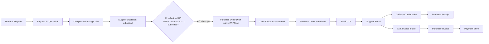

# Supplier Portal — Magic Link và Email OTP

> **Trạng thái:** IMPLEMENTED và đã triển khai vào Docker runtime. Full realtest
> một Supplier đã đạt `REAL_MR_TEST=PASS`; các acceptance gate production còn
> `[ ]` bên dưới vẫn là phần cần kiểm chứng riêng trước khi mở rộng phạm vi.
>
> **Ngày:** 2026-09-10

> **Kết quả runtime gần nhất (2026-09-10):** Docker `up`/readiness và
> `verify` đạt; config/policy zero drift, setup complete, health `200`. Full
> realtest một Supplier đạt `REAL_MR_TEST=PASS`: `MR-20260910-0030` →
> `RFQ-20260910-0030` → `SQ-20260910-0009` (được chọn là rẻ nhất) →
> Lark approval `8599E9FA-804A-4761-88DA-167278832A82` →
> `PO-20260910-0008` → `GRN-20260910-0004` → `INV-20260910-0004`,
> `payment_status=Invoiced`. Email readback tới `leducanh@ledb.vn`, approval
> test được tự duyệt bởi `leducanh@ledb.vn`.

> **Quyết định triển khai:** Có thể tạm defer các acceptance gate còn `[ ]` khi
> chạy development/staging với dữ liệu kiểm thử. Không được bỏ qua khi bật
> production cho Supplier thật: các gate về expiry, isolation, private file,
> deadline và điều kiện mở approval là bắt buộc. PO failure injection và các
> kiểm thử duplicate còn lại có thể hoàn thiện sau nếu các cơ chế idempotency
> vẫn được giữ nguyên.

## 1. Mục tiêu

Thiết kế một cổng dành cho nhà cung cấp với **một URL duy nhất cho mỗi Supplier
trong một procurement process**. Ngay sau khi Material Request được tạo và Supplier đã
được xác định, hệ thống tạo quotation request, tạo Magic Link và gửi email cho
Supplier. Nhà cung cấp dùng cùng URL đó xuyên suốt từ RFQ/Supplier Quotation
đến Purchase Order, giao hàng, hóa đơn và theo dõi thanh toán; quyền thao tác
thay đổi theo trạng thái nghiệp vụ.

Supplier Portal là luồng external riêng. Nó không dùng Lark SSO, không dùng
`letron_sso` và không được trở thành một nhánh của identity `lark + tenant_key +
union_id` dành cho nhân viên.

## 2. Phạm vi

### Có trong phạm vi

- [x] Phát hành một access link theo từng procurement process và Supplier ngay sau
  khi Material Request tạo thành công và quotation request đã được tạo; không
  tạo URL mới khi quy trình chuyển từ RFQ sang PO hoặc các bước sau đó.
- [x] Email Magic Link.
- [x] Email OTP có hạn sử dụng, giới hạn thử và chống gửi lặp.
- [x] Supplier session có phạm vi theo Supplier và procurement process; PO, Receipt,
  Invoice và Payment chỉ là các chứng từ liên kết trong process đó.
- [x] Hiển thị thông tin PO được allowlist.
- [x] Supplier gửi xác nhận giao hàng và chứng từ giao hàng.
- [x] Supplier upload XML invoice.
- [x] Next.js validate rồi tạo và submit native Receipt/Invoice qua Frappe REST.
- [x] Audit event và control-plane revoke operator đã triển khai; các runtime acceptance còn lại được đánh dấu trực tiếp trong Phase 3.
- [x] Expiry và idempotency cho access, OTP, quotation, delivery và XML intake.

### Không có trong phạm vi (N/A)

- [N/A] Supplier tự submit Purchase Receipt.
- [N/A] Supplier tự submit Purchase Invoice.
- [N/A] Supplier tự tạo Payment Entry hoặc xem trạng thái thanh toán chi tiết.
- [N/A] Supplier truy cập ERPNext Desk.
- [N/A] Supplier đăng nhập bằng Lark.
- [N/A] Dùng Delivery Note cho purchase flow.

## 3. Luồng nghiệp vụ chuẩn



Chuỗi purchase chuẩn là:

```text
Material Request
→ Request for Quotation
→ Supplier mở quotation bằng OTP
→ Supplier submit quotation
→ Next.js tạo Supplier Quotation và khóa
→ Cập nhật approval summary: RFQ number + quotation status
→ Chờ tất cả Supplier submit hoặc hết 3 ngày từ lúc MR tạo
→ Next.js chọn quotation có tổng giá thấp nhất
→ ERPNext tạo Purchase Order Draft và cấp số PO thật
→ Lark Approval tổng hợp mở kèm số PO thật và kết quả chọn
→ Approver phê duyệt
→ ERPNext submit đúng PO Draft đã cấp số, không tạo PO thứ hai
→ Purchase Receipt
→ Purchase Invoice
→ Payment Entry
```

`Delivery Note` thuộc nhánh bán hàng/giao cho Customer. Với nhà cung cấp,
Supplier Portal chỉ gửi delivery confirmation; ERPNext tạo `Purchase Receipt`
sau bước kiểm tra nội bộ.

## 4. Boundary và ownership

| Thành phần | Ownership |
|---|---|
| ERPNext | Supplier, Case, MR, RFQ, Supplier Quotation, PO Draft/PO, Purchase Receipt, Purchase Invoice, stock, accounting và mã chứng từ |
| `apps/erp` | Supplier Portal UI, public BFF và orchestration chính |
| `apps/letron_api` | Native ERPNext schema/lifecycle helpers và system automation boundary |
| `apps/erp` | Lark PO approval adapter và procurement orchestration; không quản lý Supplier identity |
| Lark/Auth Server | Gửi Magic Link/OTP qua một Lark Mail adapter server-side; credential refresh token mã hóa trong Neon và refresh được khóa bằng PostgreSQL advisory lock |
| E-invoice provider | Provider lifecycle sau khi Purchase Invoice đã được kiểm tra/submit |

Supplier Portal không gọi generic `/api/v1` Gateway bằng session supplier. Next.js
là BFF duy nhất, gọi trực tiếp Frappe native REST bằng system-automation
signature; supplier session chỉ được dùng để scope dữ liệu và hành động.

`apps/erp` là control-plane owner và điều phối luồng qua các client Frappe server
side. Portal không ghi database trực tiếp và không chuyển credential cho browser
Supplier. Frappe chỉ xác thực system-automation request và thực thi lifecycle
native của chứng từ.

### 4.1. Supplier không có ERP identity

Supplier không có tài khoản ERPNext, không có role ERPNext và không đăng nhập vào
Global Portal. Supplier chỉ được xác thực bằng access record của đúng
`procurement_process`:

```text
Magic Link token
→ Email OTP
→ Supplier session
→ scoped supplier action
```

Supplier session không phải ERP session và không được dùng để gọi generic CRUD.
Next.js là BFF của Supplier Portal; mỗi request BFF kiểm tra access/session scope,
Supplier, process, document link và idempotency trước khi gọi Frappe native REST.

Sau khi kiểm tra hợp lệ, Next.js dùng system automation context để gọi nghiệp vụ
native ERPNext. Internal execution context là actor duy
nhất được phép tạo hoặc submit chứng từ; không phải Supplier và không phụ thuộc
vào việc Supplier có ERP login hay không. Context phải được khôi phục sau request.

| Nghiệp vụ | Request từ Supplier | Actor tạo/submit native document |
|---|---|---|
| Supplier Quotation | Item, quantity, rate thuộc RFQ của access | `apps/erp` qua native Frappe REST |
| Delivery confirmation | PO item và số lượng còn nhận | `apps/erp` qua native Frappe REST |
| XML invoice | File XML và metadata thuộc PO/Supplier | `apps/erp` qua native Frappe REST |
| PO trước approval | Không được tự tạo/chỉnh sửa | `apps/erp` tạo PO Draft native ERPNext |
| PO sau approval | Không được tạo PO mới | Lark callback submit đúng PO Draft đã cấp số |

Nếu HMAC, access/session scope, process link hoặc internal execution context
không hợp lệ thì request fail-closed; không cấp thêm ERP quyền và không tạo
document ngoài process.

### 4.2. Mail delivery và mailbox readback

Luồng nghiệp vụ chỉ cần provider acceptance (`message_id`) từ Lark Mail adapter.
`apps/erp` lưu message ID trong orchestration state và không chờ quét mailbox để
đánh dấu MR, RFQ, quotation, PO, receipt hoặc invoice. Mailbox readback chỉ là
bước kiểm chứng chẩn đoán độc lập, có timeout cố định và ba trạng thái rõ ràng:
`MAIL_PROVIDER_ACCEPTED`, `MAIL_MAILBOX_READBACK_CONFIRMED` hoặc
`MAIL_MAILBOX_READBACK_TIMEOUT`. Retry cùng idempotency key trả lại message ID cũ;
không gửi thêm mail và không tạo thêm access record.

## 5. Trình tự Magic Link và OTP


Magic Link là bearer credential ban đầu và là định danh cố định của process, không
phải định danh của riêng PO. Sau khi Material Request tạo thành công, orchestration
phải tạo quotation request, xác định Supplier, tạo access record và enqueue email
trong cùng một nghiệp vụ. Các document name như Supplier Quotation, PO, Purchase
Receipt, Purchase Invoice và Payment Entry được liên kết dần vào cùng record khi
phát sinh. Không phát hành lại URL chỉ vì process chuyển trạng thái.

OTP phải được gửi tới email snapshot đã được xác định khi phát hành access record;
không dùng email do người dùng nhập ở màn hình để đổi người nhận OTP. Mỗi lần
vào lại URL có thể yêu cầu OTP mới; session chỉ có thời hạn ngắn.

Magic Link và OTP cùng đi qua email nên đây là two-step email verification, chưa
phải MFA độc lập. Nếu cần MFA thật, factor thứ hai phải dùng kênh khác.

## 6. Data model

Access record được lưu trong Redis của Next.js; Frappe không giữ access/session
portal.

| Field | Ý nghĩa |
|---|---|
| `supplier` | Supplier ERPNext được cấp quyền |
| `procurement_process` | Khóa nghiệp vụ duy nhất của Supplier từ RFQ đến Payment |
| `request_for_quotation` | Quotation request/RFQ được tạo ngay sau MR |
| `supplier_quotation` | Supplier Quotation thuộc process, có thể chưa có ở thời điểm phát hành |
| `purchase_order` | PO thuộc process, nullable trước khi PO được tạo |
| `purchase_receipts` | Các Purchase Receipt liên kết phát sinh trong process |
| `purchase_invoices` | Các Purchase Invoice liên kết phát sinh trong process |
| `payment_entries` | Các Payment Entry/status projection được phép hiển thị |
| `contact` | Contact nhận thông báo |
| `email_snapshot` | Email được chốt tại thời điểm phát hành |
| `purpose` | Ví dụ `procurement_followup` |
| `magic_token_hash` | Hash của token ngẫu nhiên; không lưu token gốc |
| `magic_expires_at` | Thời điểm hết hạn link theo lifecycle/process |
| `otp_hash` | Hash OTP hiện tại |
| `otp_expires_at` | Thời điểm hết hạn OTP |
| `otp_attempts` | Số lần verify thất bại |
| `otp_sent_at` | Thời điểm gửi OTP gần nhất |
| `session_hash` | Hash session token |
| `session_expires_at` | Thời điểm hết hạn session |
| `status` | `Issued`, `OtpSent`, `Active`, `Revoked`, `Expired` |
| `revoked_at` | Thời điểm revoke |
| `last_used_at` | Lần sử dụng gần nhất |

Thời hạn mặc định đề xuất:

```text
Magic Link: tồn tại theo lifecycle của process; mặc định 90 ngày không hoạt động
OTP: 5 phút
Supplier session: 2 giờ
OTP attempts: tối đa 5 lần
Resend OTP: tối thiểu 15 giây
```

Rate-limit counter có thể dùng Redis; access record, audit và trạng thái revoke
phải nằm ở storage server-side bền vững.

## 7. Route trong `apps/erp`

```text
src/app/supplier/[magicId]/page.tsx

src/app/api/supplier/[magicId]/otp/request/route.ts
src/app/api/supplier/[magicId]/otp/verify/route.ts
src/app/api/supplier/session/process/route.ts
src/app/api/supplier/session/po/route.ts
src/app/api/supplier/session/delivery/route.ts
src/app/api/supplier/session/xml-invoice/route.ts
src/app/api/supplier/session/payment-status/route.ts
src/app/api/supplier/session/logout/route.ts

src/components/supplier-portal/
src/lib/supplier-portal.ts
```

Các route BFF không trả raw ERPNext error, không expose token, không cho phép
client tự chọn Supplier, process hoặc document ngoài access scope. Mọi request
đều tính lại capability từ trạng thái hiện tại; không tin capability do client
gửi lên.

### Error contract dùng chung cho BFF và client

Mọi lỗi HTTP từ ERP app trả cùng một shape, không phụ thuộc lỗi phát sinh ở
Next.js, Gateway, ERPNext hay Lark:

```json
{
  "error": "stable_error_code",
  "message": "Thông báo an toàn cho người dùng",
  "retryable": false,
  "retry_after_seconds": 15
}
```

`error` là mã máy ổn định để client điều phối; `message` là thông báo đã được
chuẩn hóa; `retryable` chỉ là gợi ý retry. Lỗi không xác định không được đưa
`Error.message`, stack trace, token hoặc raw ERPNext response ra ngoài. Adapter
trung tâm chỉ đọc error envelope đã được khai báo; không parse
`_server_messages`, `exception` hoặc stack trace của Frappe. HTTP 401/403,
404, 409, 429 và 5xx giữ đúng ý nghĩa; lỗi mạng được trả là lỗi hạ tầng có thể
retry. Khi trả 429, server bắt buộc trả thêm `Retry-After` và
`retry_after_seconds`; client không tự retry trước thời điểm đó.

Error domain của Supplier Portal được khai báo tập trung, không suy đoán từ
chuỗi exception:

| Code | HTTP | Ý nghĩa | Client action |
|---|---:|---|---|
| `supplier_portal_not_found` | 404 | Access không tồn tại | Hiển thị lỗi link generic |
| `supplier_portal_access_denied` | 403 | Access đã revoke/hết hạn | Hiển thị lỗi link generic |
| `supplier_otp_rate_limited` | 429 | Access/email đã gửi OTP trong cooldown | Giữ form OTP, chờ `Retry-After` |
| `supplier_portal_rate_limited` | 429 | Quota IP vượt ngưỡng | Chờ `Retry-After`, không gửi lặp |
| `supplier_portal_unavailable` | 503 | ERP/cache/provider tạm thời lỗi | Cho phép retry có kiểm soát |

`request_otp` dùng lock và cooldown 15 giây theo từng access record. Không dùng
quota email toàn cục vì nhiều Supplier có thể dùng chung mailbox nghiệp vụ và
mỗi magic link phải được xác minh độc lập. Quota IP là counter Redis atomic theo
cửa sổ 60 giây (30 request), vì nhiều Supplier có
thể dùng chung NAT. Không có lỗi rate-limit nào được ánh xạ thành “Magic Link
không hợp lệ”.

Client dùng `error` để xử lý trạng thái và hiển thị `message`; không parse
`exception`, `exc` hoặc stack trace. Contract này áp dụng cho các route purchase,
supplier portal, accounting và assets của ERP app.

`proxy.ts` cần bypass chính xác `/supplier/*`; mọi page ERP nội bộ tiếp tục yêu
cầu `letron_sso` và Lark SSO.

## 8. Runtime ownership

Supplier Portal không còn là module nghiệp vụ của Frappe. `apps/erp` giữ access,
Magic Link, OTP, session, submission, deadline gate và approval handoff trong
Redis; Next gọi trực tiếp native Frappe REST API bằng system-automation
signature hiện có (`LETRON_INTERNAL_API_SECRET`). Frappe chỉ xử lý các DocType và
lifecycle native: Material Request, RFQ, Supplier Quotation, Purchase Order,
Purchase Receipt và Purchase Invoice.

Không còn các endpoint:

```text
Frappe không còn `letron_api.supplier_portal.*`.
```

Các route Next phải kiểm tra:

1. System-automation signature giữa `apps/erp` và ERPNext native API.
2. Access record còn hiệu lực.
3. Session đúng access record.
4. Supplier của session đúng Supplier trên PO.
5. Process/document name nằm trong scope của access record.
6. Payload child rows không vượt số lượng PO còn lại.
7. `X-Idempotency-Key` không bị dùng lại cho payload khác.

Không expose các method này qua generic CRUD public resource.

## 9. Supplier Portal UI

```text
/supplier/{magicId}
├── Verify Email OTP
├── Purchase Order Summary
├── Supplier Goods
│   ├── Ordered quantity
│   ├── Delivered quantity
│   ├── Delivery date
│   └── Delivery document upload
├── XML Invoice
│   ├── XML file upload
│   ├── Invoice number
│   ├── Invoice date
│   └── Tax identification
└── Native document status
```

Process Summary chỉ trả các field cần cho supplier:

```text
external reference, transaction date, schedule date, currency,
items, quantities, UOM, delivery address, payment/delivery terms
```

Không trả GL account, cost center, internal approval comment, supplier khác hoặc
process khác. Payment chỉ hiển thị trạng thái tối thiểu được nghiệp vụ cho phép,
không trả chi tiết ledger.

Capability theo lifecycle đề xuất:

| Trạng thái process | Quyền qua cùng một URL |
|---|---|
| RFQ mở | Xem RFQ, nhập/cập nhật Supplier Quotation |
| Chờ duyệt / PO đang tạo | Xem trạng thái, không sửa quote nếu đã khóa |
| PO đã submit | Xem PO, xác nhận giao hàng |
| Đã nhận hàng | Xem receipt, gửi/bổ sung XML invoice |
| Invoice đã submit | Xem invoice và trạng thái thanh toán tối thiểu |
| Đã thanh toán | Read-only |
| Hủy/revoke | Không truy cập được |

## 10. Delivery Confirmation

Supplier submit delivery confirmation được validate rồi tạo và submit Receipt
native ngay:

```text
Supplier Delivery Confirmation
→ Purchase Receipt submitted
→ Native Purchase Receipt draft
→ Internal submit Purchase Receipt
```

Payload tối thiểu:

```json
{
  "purchase_order": "PO-...",
  "delivery_date": "YYYY-MM-DD",
  "items": [
    {
      "purchase_order_item": "...",
      "delivered_qty": 0,
      "rejected_qty": 0,
      "uom": "...",
      "serial_no": "...",
      "batch_no": "..."
    }
  ],
  "attachments": ["..."],
  "idempotency_key": "..."
}
```

ERP phải tự đọc lại PO và tính số lượng còn nhận; không tin `delivered_qty` do
client gửi nếu vượt số lượng còn lại. Nếu PO item là hàng quản lý serial/batch,
supplier bắt buộc gửi `serial_no`/`batch_no`; ERP không tự sinh traceability và
không cho phép submit receipt thiếu dữ liệu đó. Các field này được giữ trong
payload hash để retry cùng idempotency key trả lại đúng submission cũ.

## 11. XML Invoice Intake

XML upload được validate và tạo Purchase Invoice native ngay sau khi đối chiếu PO:

```text
Upload private XML
→ Validate size/type/checksum
→ Parse supplier/tax/total
→ Match PO/Supplier
→ Purchase Invoice submitted
→ Purchase Invoice draft
→ Submit Purchase Invoice
→ E-invoice provider handoff
```

Mỗi file cần có checksum và idempotency key. File phải attach private vào intake
record hoặc Purchase Invoice draft; không dùng public URL và không ghi XML content
vào log.

E-invoice provider lifecycle vẫn tách khỏi accounting submit. Trạng thái provider
đề xuất: `pending`, `submitted`, `issued`, `rejected`, `cancelled`, `adjusted`.

## 12. Email

Email phải có một owner duy nhất là Lark public mailbox
`procurement@letrongroup.com`. Supplier không login và không nhận credential
Lark. App dùng OAuth một lần của user nội bộ `leducanh@ledb.vn` (đã được cấp
quyền send-as cho public mailbox), lưu duy nhất `refresh_token` đã mã hóa trong
Neon; access token chỉ được cache trong memory của Auth process và không bao
giờ lưu vào client, source, log hoặc database.

ERPNext chỉ tạo và trả về mail intent sau khi record nghiệp vụ đã commit. ERP
Next.js là owner duy nhất của orchestration: với mỗi Access/OTP, Next.js gọi
Auth Server bằng một `idempotency_key` duy nhất. Auth Server là adapter duy nhất
gọi Lark và lưu `LarkMailDelivery` để chống gửi trùng. Nếu cùng key đang gửi,
Auth chờ kết quả hiện tại; nếu đã `Sent` thì trả lại `message_id` idempotently.
Không còn Frappe mail worker, scheduler mail, Redis mail lock hoặc retry mail
trong Docker. Mail delivery history được giữ ở Auth Server/Redis,
không còn được đọc hoặc ghi bởi runtime mới.

Lark tenant token vẫn chỉ dùng cho các API hỗ trợ bot/tenant identity (ví dụ
Approval và Messenger). Lark Mail `user_mailboxes/.../messages/send` dùng
user access token của identity đã authorize, nhưng mailbox path/sender là
public mailbox `procurement@letrongroup.com`. Approval submitter/approver vẫn
là user Lark `leducanh@ledb.vn`; đây là identity của Approval, không phải địa
chỉ sender của email. ERPNext/Next.js gọi Auth Server server-side; Auth Server
refresh credential và gửi qua Lark. Supplier chỉ mở Magic Link và nhập OTP.

Template tối thiểu:

```text
Next Redis access record
Supplier Portal OTP
```

Email cần chứa:

- [x] Tên supplier.
- [x] Mã tham chiếu PO đã được phép hiển thị trong email thông báo PO sau approval.
- [x] Thời hạn link hoặc OTP.
- [x] Cảnh báo không chia sẻ mã.
- [x] Link hỗ trợ nội bộ nếu supplier nhận nhầm.

Cấu hình SMTP/Email Account không còn là prerequisite cho Lark Mail provider.
Real test phải kiểm tra credential public mailbox và gửi một email probe trước
khi chạy toàn bộ flow để tránh tạo dữ liệu dang dở khi OAuth credential bị
revoke hoặc hết hạn.
Trong real test, sau khi tạo approval thật, test gọi
`POST /api/internal/lark/approval/approve`; `apps/erp` dùng tenant token gọi
`POST /open-apis/approval/v4/tasks/approve` cho task của approver. Đây là bước
để test chạy tự động; route bị khóa bằng `LETRON_API_KEY` và bị vô hiệu hóa ở
production. Production vẫn yêu cầu người có quyền approve trên Lark.

Cấu hình không-secret của Supplier Portal nằm trong
`config/supplier_portal.json`, gồm `erp_base_url`,
`next_internal_base_url`, `portal_public_base_url`, URL Auth Server, email
submitter approval, user review nội bộ và chu kỳ deadline. Endpoint theo môi
trường được override bằng các biến URL đã có trong
`.env.local`/`.env.production`: `LETRON_AUTH_BASE_URL`,
`FRAPPE_ERP_NEXT_URL` và `LETRON_ERP_APP_BASE_URL`. Local dùng
`http://localhost:3001`,
production dùng HTTPS public domain. Backend nhận endpoint tương ứng qua
Compose. Chỉ các secret mới bắt buộc nằm trong env:
`LETRON_INTERNAL_API_SECRET` và các secret control-plane có sẵn của
hệ thống. Supplier Portal dùng chung `LETRON_INTERNAL_API_SECRET` cho các request
được ký nội bộ; không còn secret alias riêng.

Khi `NODE_ENV=production`, public URL phải là HTTPS và không được là
`localhost`, `127.0.0.1` hoặc `host.docker.internal`; service phải fail closed
nếu vi phạm. Internal URL dùng riêng cho service-to-service và không bao giờ
được đưa vào Magic Link gửi Supplier.

## 13. Security invariants

- [x] Token là random opaque tối thiểu 32 bytes trước khi encode.
- [x] Chỉ lưu token/OTP/session dưới dạng hash hoặc HMAC.
- [x] Dùng constant-time compare khi verify.
- [x] Không đưa token vào analytics, log, error message hoặc referrer.
- [x] Đặt `Referrer-Policy: no-referrer` cho supplier page.
- [x] Cookie supplier tách biệt: HttpOnly, Secure ở production, SameSite=Lax,
  Path cố định `/api/supplier` để cookie được gửi đúng cho các BFF session route.
- [x] OTP request phải rate-limit theo access record, email và IP.
- [x] Link hết hạn hoặc bị revoke trả lỗi generic, không tiết lộ document tồn tại.
- [x] Session không được mở rộng scope bằng query string.
- [x] Mọi mutation chính phải idempotent và ghi audit event.
- [x] Supplier Portal không được sửa role hoặc User ERPNext.
- [x] Không sửa `apps/auth-server/app/login/page.tsx` để thêm supplier login; Lark login của nhân viên giữ nguyên.

Các hành vi expiry/isolation/file và các nhánh deadline/approval failure vẫn
phải có runtime acceptance riêng trong Phase 3 dù phần kiểm soát tương ứng đã
có trong backend.

## 14. Trigger phát hành link

Trigger chuẩn:

```text
Create Material Request
→ Resolve Supplier(s)
→ Create Request for Quotation
→ Create one Redis access record per Supplier
→ Next.js dispatch one Magic Link mail intent per Supplier to Auth Server/Lark
→ Start 3-day approval deadline from MR creation time
```

Đây là một orchestration có idempotency theo `material_request + supplier`. Mỗi
Supplier có một RFQ/access record/Magic Link riêng; không dùng chung link giữa
các Supplier. Nếu
MR tạo thành công nhưng tạo RFQ hoặc access record thất bại thì không gửi email.
Nếu Lark Mail tạm thời lỗi, access record vẫn giữ trạng thái `Issued`; lần gọi
orchestration cùng idempotency key gửi lại cùng mail intent, không tạo access
record hoặc URL thứ hai.

Material Request chưa có Supplier thì chưa thể phát Magic Link. Khi Supplier
được bổ sung và RFQ được tạo, flow trên được chạy cho Supplier đó; mốc 3 ngày
của MR vẫn được tính từ thời điểm MR tạo thành công.

Mỗi lần Supplier submit quotation, `apps/erp` tạo Supplier Quotation ngay lập
tức và khóa quotation sau khi ERPNext xác nhận thành công. Approval request là
một request tổng hợp theo MR/procurement process, chỉ chứa các Supplier
Quotation đã submit; Supplier chưa submit được ghi là `No Response`.

Khi approval gate đạt, Next.js tự chọn quotation có `grand_total` thấp nhất trong
các quotation đã submit. Nếu bằng nhau, chọn `submitted_at` sớm hơn, sau đó
chọn tên Supplier tăng dần. Lark approval chỉ thông báo và phê duyệt kết quả
đã chọn, không cho chọn lại Supplier.

Approval gate:

```text
Open approval immediately when all Suppliers submit
OR
when MR.created_at + 3 days is reached AND at least one Supplier submitted
```

Nếu hết 3 ngày mà chưa có Supplier nào submit thì không mở approval. Timer phải
được thực thi bởi durable scheduler/queue của orchestration layer; không phụ
thuộc vào việc có Supplier đang mở browser hay không.

## 15. Trạng thái thiết kế, luồng chính và điều kiện còn lại

Lõi approval đã truyền `supplier_quotation_name` xuyên suốt:

1. `apps/erp` tạo và lưu một access riêng cho từng Supplier.
2. Supplier submit tạo một Supplier Quotation native và submit ngay.
3. Gate khóa theo Material Request, chọn quotation có tổng tiền thấp nhất rồi
   mới gọi Auth Server/Lark.
4. PO handoff fail-closed nếu quotation chưa submit hoặc không thuộc RFQ/Supplier;
   ERPNext tạo đúng một PO Draft native trước approval và submit lại chính draft
   đó sau callback approve.

Contract triển khai và kiểm chứng liên kết:

```text
Supplier submit quotation
→ Next.js tạo Supplier Quotation
→ Cập nhật approval summary theo MR
→ Đánh giá approval gate
→ Chọn quotation có tổng giá thấp nhất
→ ERPNext tạo PO Draft native và cấp số PO thật
→ Lark Approval
→ Real test auto-approve task (chỉ môi trường non-production)
→ ERPNext submit đúng PO Draft, giữ nguyên số PO
```

Không được mở Lark PO approval chỉ vì đã tạo MR hoặc RFQ.
Approval request chỉ được mở sau khi gate đạt và summary đã ghi đủ:

```text
rfq_number
quotation_status
supplier
procurement_process
supplier_quotation_name (nếu đã tạo)
```

Mỗi Supplier submit chỉ tạo/cập nhật một Supplier Quotation và một dòng trong
approval summary. Approval summary là một request tổng hợp duy nhất theo MR;
không tạo approval riêng cho từng Supplier. `selected_supplier_quotation` phải
được ghi vào process trước khi gọi Lark.

`apps/erp` là nơi điều phối và gọi Auth Server/Lark khi gate đạt. ERPNext kiểm
tra lại correlation, Supplier, RFQ và Supplier Quotation trước khi tạo PO Draft;
callback approval chỉ được submit đúng PO Draft đã cấp số và không được insert
PO mới.

Trạng thái hiện tại:

- [x] Real API flow với hai Supplier đã chạy đến Purchase Invoice và payment
  status `Invoiced`; mỗi Supplier có access/Magic Link riêng.
- [x] Resend OTP trả `429` kèm `Retry-After`; OTP đã verify không thể replay.
- [x] Quotation có tổng giá thấp nhất được chọn trước khi mở Lark approval;
  approval test được auto-approve ở non-production, PO Draft có số native trước
  approval và cùng số đó được readback là `Submitted` sau approval.
- [x] Idempotency của quotation, delivery confirmation và XML invoice; revoke
  access xóa OTP/session và request sau revoke bị từ chối.
- [x] Auth Server, `apps/erp` và Python backend đã qua typecheck/build/lint hoặc
  compile tương ứng; Docker reload/verify đạt health, zero drift và setup
  complete.
- [ ] Chưa hoàn tất runtime acceptance cho expiry link/OTP, Supplier isolation,
  private-file residue cleanup, hai nhánh deadline 3 ngày, `No Response`
  readback và PO failure recovery.

Phân loại gate: nhóm expiry, isolation, private-file, deadline, `No Response`,
điều kiện mở approval và thông tin báo giá thắng là **production blocker**;
không được đánh dấu hoàn tất chỉ vì luồng happy path đã pass. PO failure
injection và các kiểm thử duplicate còn lại là **staging follow-up** nếu chưa
đưa tính năng ra production.

State tối giản:

```text
RFQ: Created → Sent → Opened → Submitted | No Response
Supplier Quotation: Draft → Submitted → Locked
Approval: Waiting → Ready → Opening → Opened → Approved | Rejected
```

Không được chuyển `Approval` sang `Opened` nếu chưa đạt một trong hai điều kiện:

```text
all suppliers have Submitted
OR
MR.created_at + 3 days reached AND at least one Submitted
```

Race condition giữa submit cuối cùng và timer phải dùng một thao tác atomic theo
`material_request`; chỉ một request được phép chuyển `Approval` từ `Waiting`/
`Ready` sang `Opened`.

Redis access record được tạo trước đó và tiếp tục dùng cùng URL.

Supplier không được sửa quotation sau khi submit. Nếu cần điều chỉnh, operator
nội bộ phải reopen quotation; thao tác này phải ghi audit và không được tự động
mở lại approval request đã gửi.

## 16. Kế hoạch triển khai

### Phase 1 — Contract và backend

- [x] Chuẩn hóa error contract `{ error, message, retryable }` cho BFF, Gateway
  và client; không expose raw exception/stack trace.
- [x] Sửa truyền `supplier_quotation_name` qua Auth Server.
- [x] Access/session/submission portal do Next.js quản lý; Frappe chỉ giữ native
  procurement documents và không cần migration cho portal DocType.
- [x] Chuyển access, OTP, summary, quotation và approval gate sang Next.js; không còn explicit portal methods trong Frappe.
- [x] Thêm orchestration sau khi tạo Material Request để tạo RFQ, access record và
  gửi Magic Link qua Auth Server/Lark Mail.
- [x] Tạo Supplier Quotation ngay sau khi từng Supplier submit và khóa sau khi
  ERPNext xác nhận.
- [x] Chọn tự động quotation có `grand_total` thấp nhất; tie-break theo thời gian
  submit rồi tên Supplier.
- [x] Tạo approval request tổng hợp theo MR/procurement process, có trạng thái
  `No Response` cho Supplier chưa submit.
- [x] Chạy deadline 3 ngày tính từ `material_request.created_at` qua internal scheduler endpoint.
- [x] Tạo PO Draft native ERPNext trước khi mở Lark approval và truyền số PO thật
  vào approval form; callback submit cùng `name`, không tạo PO thứ hai.
- [x] Mở approval khi tất cả Supplier submit hoặc deadline đạt và có ít nhất một
  Supplier submit.
- [x] Đảm bảo submit cuối cùng và timer 3 ngày chỉ mở một approval request bằng
  atomic/idempotent gate theo Material Request.
- [x] Chặn mở PO approval cho tới khi approval request pass đầy đủ-field validation.
- [x] Approval payload có RFQ number, RFQ status và supplier response summary
  (`Submitted`/`No Response`).
- [x] Thêm hook/enqueue sau `Purchase Order.on_submit` chỉ để cập nhật liên kết PO
  và capability của access record; không phát hành URL mới.
- [x] Thêm email templates và audit.
- [x] Chuyển mail orchestration khỏi Frappe: Next.js nhận mail intent sau commit,
  Auth Server gọi Lark và `LarkMailDelivery` giữ idempotency.
- [x] Thêm control-plane revoke access; revoke xóa OTP/session ngay và ghi audit.

### Phase 2 — `apps/erp` UI/BFF

- [x] Thêm public supplier route.
- [x] Thêm OTP request/verify.
- [x] Thêm scoped process/quotation summary.
- [x] Bypass đúng public route trong `proxy.ts`.
- [x] Bổ sung delivery confirmation, XML invoice intake, payment-status và logout UI/BFF.

### Phase 3 — Acceptance

- [x] Link hợp lệ và revoke; revoked link trả `403 supplier_portal_access_denied`.
- [ ] Link hết hạn tự chuyển `Expired` và bị từ chối.
- [x] OTP đúng và replay bị từ chối; OTP thành công bị xóa sau lần verify.
- [x] OTP sai và khóa sau quá số lần thử; realtest xác nhận 5 lần bị từ chối,
  OTP cũ bị khóa và OTP mới hoạt động sau cooldown.
- [ ] OTP hết hạn tự bị từ chối.
- [x] Rate-limit resend theo access (15 giây; 30 request/IP/phút), trả `429` và
  `Retry-After` dương.
- [ ] Supplier A không đọc được PO của Supplier B.
- [x] Không vượt quantity còn lại; realtest xác nhận quantity overflow bị từ chối.
- [x] Duplicate delivery/XML upload không tạo record trùng.
- [ ] File private, checksum và residue cleanup.
- [ ] Process chưa có RFQ hợp lệ thì không phát invite.
- [ ] Supplier chưa submit quotation thì không mở Lark PO approval.
- [ ] Approval request thiếu `rfq_number` hoặc `quotation_status` thì không mở Lark
  PO approval.
- [x] Mỗi Supplier có một RFQ/access/Magic Link riêng, không dùng chung link.
- [x] Supplier submit tạo quotation ngay lập tức và quotation bị khóa sau submit.
- [x] Tất cả Supplier submit thì approval mở ngay, không chờ đủ 3 ngày.
- [ ] Hết 3 ngày từ lúc MR tạo, có ít nhất một quotation submit thì approval mở.
- [ ] Hết 3 ngày nhưng không có quotation submit thì approval không mở.
- [ ] Supplier chưa submit được ghi `No Response` trong approval tổng hợp.
- [ ] Approval hiển thị rõ quotation được chọn và lý do chọn giá thấp nhất.
- [ ] Cùng một process chuyển trạng thái không được phát URL thứ hai.
- [ ] PO submit thất bại thì vẫn giữ PO Draft và access record ở trạng thái chờ,
  không mở capability PO và không phát một invite mới.
- [ ] Lark Mail provider readback sau refactor thành công từ public mailbox.
- [x] Browser acceptance bằng link thật từ email: mở link, gửi OTP, verify và
  tải Supplier workspace thành công; cookie session được gửi cho
  `/api/supplier/session/process`.
- [x] Full realtest một Supplier sau refactor: MR → RFQ → Magic Link/OTP → SQ
  → chọn giá thấp nhất → PO Draft native → Lark approval → PO Submitted →
  Receipt → Invoice → Payment status `Invoiced`.
- [x] Full realtest hai Supplier sau refactor: cùng flow với hai access/link
  riêng, cùng email snapshot `leducanh@ledb.vn`, và approval chỉ chọn SQ có
  tổng giá thấp nhất.
- [x] Revoke acceptance riêng: access chuyển `Revoked`, request sau revoke trả
  `403 supplier_portal_access_denied`.
- [x] Quality gates tĩnh: Auth Server 24/24 tests, typecheck/lint; ERP
  typecheck/lint và Python compile.
  đạt service health, config/policy zero drift và setup complete.

Runtime evidence cho error contract: cùng một access hợp lệ trả `200` và gửi
OTP ở request đầu; request lặp trong cooldown trả `429`, mã
`supplier_otp_rate_limited` và `Retry-After` dương. UI không xóa form OTP và
không hiển thị lỗi link cho trường hợp này.

## 17. Mặc định KISS đã chốt

- [x] Supplier gửi delivery confirmation; Next.js validate và ERPNext tạo
  Purchase Receipt submitted.
- [x] Mỗi Supplier process có một Contact/email snapshot nhận Magic Link. Đổi
  Contact cần operator nội bộ revoke/reissue theo cùng process policy.
- [x] Magic Link giữ nguyên đến khi process đóng, revoke hoặc hết 90 ngày không
  hoạt động; không tạo URL mới khi đổi trạng thái chứng từ.
- [x] XML được validate, đối chiếu PO và ERPNext tạo Purchase Invoice submitted.
- [x] OTP qua email là cơ chế xác minh duy nhất trong phase này; không thêm factor
  thứ hai ngoài email.
