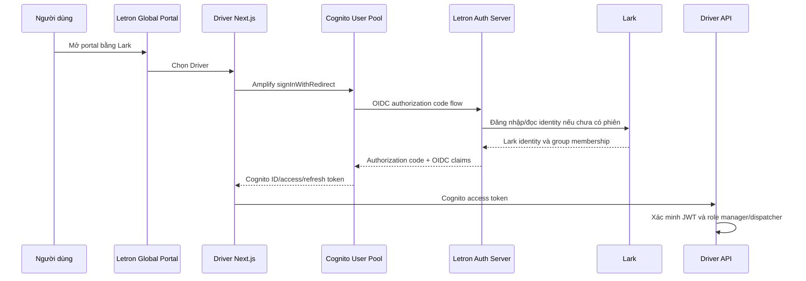

# Action plan tích hợp Driver Amplify vào Letron Lark SSO

- Ngày lập: 2026-09-05
- Trạng thái: Phase 0 đã khảo sát source và AWS live ở chế độ read-only;
  chưa thay đổi Driver/AWS
- Mục tiêu: mở ứng dụng Driver/LeOS Web từ Letron Global Portal bằng phiên Lark
  hiện có, giữ Cognito phát JWT cho hai human role `manager` và `dispatcher`
- Tài liệu liên quan: [Thiết kế Lark User Group và ERP Role](Lark_SSO_Role_Design_and_Next_Steps_2026-09-05.md)

## Quyết định mục tiêu

Trong giai đoạn đầu, không truyền Letron JWT trực tiếp sang Driver và không bỏ
Amplify/Cognito. Amazon Cognito User Pool được cấu hình làm OIDC broker:



Nếu phiên Letron SSO còn hoạt động, bước Lark không yêu cầu nhập lại thông tin.
Driver tiếp tục nhận JWT có issuer là Cognito, nên backend hiện tại có thể được
giữ ổn định trong giai đoạn tích hợp.

## Ranh giới trách nhiệm

| Thành phần | Trách nhiệm |
|---|---|
| Lark | Danh tính, trạng thái nhân viên và membership truy cập ứng dụng |
| Letron Auth Server | Xác thực Lark, phiên SSO chung, OIDC upstream cho Cognito |
| Cognito User Pool | Broker federation và phát JWT cho Driver |
| Amplify Auth | Bắt đầu/completion redirect và quản lý phiên Cognito phía Driver |
| Driver API | Xác minh Cognito access token và enforce role `manager`/`dispatcher` |
| Global Portal | Chỉ hiển thị Driver/feature phù hợp; không phải authorization boundary |

Mapping quyền của ứng dụng phải tách khỏi cấu hình role native của ERPNext; quyền
ERP. Không đưa `manager`/`dispatcher` của LeOS vào managed-role allowlist của
ERPNext.

## Mô hình Lark User Group cho ứng dụng Driver/LeOS Web

Catalog khởi đầu đề xuất:

| Lark User Group | App entitlement |
|---|---|
| `LeOS - Access` | Được mở ứng dụng |
| `LeOS - Manager` | Primary role `manager` |
| `LeOS - Dispatcher` | Primary role `dispatcher` |

`LeOS - Access` là cổng bắt buộc. Mỗi human user phải thuộc đúng một trong hai
group role `LeOS - Manager` hoặc `LeOS - Dispatcher`; nếu thiếu cả hai hoặc có
cả hai thì fail closed để tránh precedence ngầm. Không tồn tại human identity
hoặc role `driver`.

Vehicle/tài xế vận hành được định danh bằng AWS IoT Thing, Thing attributes,
certificate/mTLS và IoT policy. Lark/Cognito SSO không tạo, thay thế hoặc đồng
bộ vehicle identity.

## Phase 0 — Khảo sát Driver hiện tại

### Công việc

- [x] Xác định repository/path của Driver.
- [x] Xác định Amplify Gen 1 hay Gen 2 và phiên bản `aws-amplify`.
- [x] Xác định Driver dùng Cognito User Pool, Identity Pool hay cả hai.
- [x] Ghi nhận User Pool ID, region, app client và Cognito domain bằng giá trị
      đã che; không ghi secret vào tài liệu hoặc log.
- [x] Xác định callback/logout URL hiện tại cho local, preview và production.
- [x] Xác định Driver API đang nhận ID token hay access token.
- [x] Kiểm tra verifier hiện tại có xác minh signature, `iss`, `exp`,
      `token_use`, `client_id`/`aud` và scope/role hay không.
- [x] Thống kê user Cognito hiện hữu và cách Driver liên kết user nội bộ.
- [x] Xác định Driver có cần Cognito Identity Pool/IAM credentials hay chỉ dùng
      User Pool JWT.

### Gate

Không sửa AWS hoặc Auth Server trước khi có sơ đồ đúng của luồng hiện tại và bộ
callback URL theo từng environment.

### Kết quả khảo sát ngày 2026-09-05

| Hạng mục | Bằng chứng đã kiểm tra |
|---|---|
| Source | `D:\BusinessAnalyze\Letron\letron-leos\apps\web`, Next.js 16.2.6, `aws-amplify` 6.16.3 |
| Kiểu cấu hình | Amplify v6 được cấu hình thủ công từ generated infrastructure config; không có Amplify backend Gen 1/Gen 2 |
| Đăng nhập hiện tại | Trang `/login` gọi `USER_PASSWORD_AUTH`; chưa có `signInWithRedirect` hoặc OAuth redirect config |
| User Pool live | `leos-user-pool-dev`, region `ap-southeast-1`; chưa có Cognito domain và chưa có external IdP |
| Web app client live | Chỉ hỗ trợ `COGNITO`; OAuth flow đang tắt; callback/logout URL đều chưa có |
| Identity Pool live | Chỉ cho authenticated identity từ User Pool; không cho guest; có IAM role cấp AWS credentials tạm thời |
| Phụ thuộc AWS credentials | Browser dùng Identity Pool credentials cho AWS IoT MQTT/WebSocket và Kinesis Video Streams WebRTC |
| Token API hiện tại | Web gửi Cognito **ID token** trong `Authorization`; access token hiện không có `custom:tenant_id`/`custom:role` cần cho backend |
| Runtime token test | Cognito password login pass; Identity Pool `GetId` và temporary credentials pass; `GET /fleet/latest` trả 200 với ID token và 403 với access token |
| API verifier live | API Gateway HTTP API dùng JWT authorizer với issuer Cognito và audience là web/mobile app client; Lambda tiếp tục yêu cầu tenant claim |
| User live | 11 record User Pool đều enabled/confirmed/có tenant: 10 record `vehicle`, 1 `manager`; các record `vehicle` không thuộc mô hình human SSO mục tiêu |
| Role contract | Generated `Role` đúng khi chỉ có `dispatcher` và `manager`; nhánh UI string `driver` là contract drift/legacy cần loại bỏ |
| Vehicle identity | Nguồn định danh mục tiêu là AWS IoT Thing + certificate/mTLS + Thing attributes; không account-link vehicle với Lark |
| Đồng bộ profile | Cognito PostConfirmation gọi `leos-identity-sync` để upsert DynamoDB; update role/profile phải gọi sync riêng vì Cognito không có update trigger tương ứng |
| Auth Server | Local health và discovery tại `/api/oidc/.well-known/openid-configuration` đều trả 200, nhưng issuer vẫn là `http://localhost:3000/api/oidc` nên Cognito không thể dùng làm external OIDC IdP |

### Kiểm thử source đã chạy

- `npm test -w web`: pass 49/49 test; bộ test này có cả Mapbox và MQTT
  integration hiện hữu nhưng chưa có test Lark/OIDC.
- `npx tsc --noEmit --incremental false -p apps/web/tsconfig.json`: pass.
- `npm run build -w web`: production compile, TypeScript và standalone output pass.
- `npm run lint -w web`: chưa chạy được do `eslint.config.mjs` import
  `eslint/config` nhưng dependency thực tế là ESLint 8.57.1 không export subpath
  đó. Đây là lỗi tooling có sẵn, tách khỏi SSO.
- Không chạy các script E2E tạo push token, incident hoặc đổi trạng thái chuyến
  đi vì chúng ghi dữ liệu live và không cần thiết cho Phase 0.

### Điều chỉnh bắt buộc sau Phase 0

1. Cognito User Pool và Identity Pool không còn là lựa chọn tạm thời mà là ranh
   giới bắt buộc của giai đoạn đầu, vì MQTT/KVS cần AWS credentials tạm thời.
2. Chưa chuyển browser/API sang access token cho tới khi Pre Token Generation
   phát `tenant_id` và entitlement đã allowlist vào access token, đồng thời có
   acceptance test cho API Gateway và từng Lambda/service.
3. Giữ role contract chỉ gồm `manager` và `dispatcher`; loại bỏ nhánh human
   `role === "driver"` khỏi web. Không map bất kỳ Lark group nào thành `vehicle`.
4. Cognito domain, external OIDC provider, OAuth app-client settings và callback
   URL phải được quản lý bằng Terraform/source contract; không chỉ chỉnh tay
   trên AWS Console.
5. Login cũ có thể giữ sau feature flag trong pilot, nhưng SSO entrypoint phải
   dùng Cognito Hosted UI redirect để Identity Pool tiếp tục nhận Cognito token.

## Phase 1 — Chuẩn bị Letron Auth Server public

### Công việc

- [ ] Deploy Auth Server tại một HTTPS origin ổn định.
- [ ] Đặt `AUTH_BASE_URL` đúng public origin và đăng ký callback Lark chính xác.
- [ ] Kiểm tra OIDC discovery tại
      `${AUTH_BASE_URL}/api/oidc/.well-known/openid-configuration`.
- [ ] Kiểm tra `authorization_endpoint`, `token_endpoint`, `userinfo_endpoint`
      và `jwks_uri` đều là HTTPS public URL.
- [ ] Hoàn thành hai lỗi P0 trong audit SSO: refresh group trước phát hành claim
      và enforcement cho request cookie ERP.

### Gate

Không dùng `localhost` làm upstream OIDC issuer cho Cognito. Cognito yêu cầu
external OIDC endpoints dùng HTTPS public origin.

## Phase 2 — Đăng ký Cognito làm OIDC client của Letron

### Công việc

- [ ] Xác định Cognito callback chính xác:

  ```text
  https://<cognito-user-pool-domain>/oauth2/idpresponse
  ```

- [ ] Tạo confidential OIDC client trên Letron Auth Server:

  ```powershell
  npm run client:create -- `
    --id letron-driver-cognito `
    --redirect-uri https://<cognito-user-pool-domain>/oauth2/idpresponse
  ```

- [ ] Lưu client secret trong AWS secret/configuration; không đưa vào source,
      browser bundle, Git hoặc tài liệu.
- [ ] Xác nhận client chỉ cho `authorization_code`, RS256,
      `client_secret_basic` và callback exact-match.

### PKCE compatibility gate

Letron OIDC hiện bắt buộc PKCE cho mọi client. Tài liệu Cognito xác nhận PKCE ở
luồng Driver → Cognito nhưng không đủ để kết luận Cognito sẽ gửi PKCE tiếp lên
external OIDC IdP. Phải capture request authorization trong môi trường test:

- [ ] Có `code_challenge` và `code_challenge_method=S256`: giữ policy hiện tại.
- [ ] Không có PKCE: chỉ cho phép ngoại lệ với confidential client
      `letron-driver-cognito`; không tắt PKCE toàn cục và không miễn cho public
      client.

## Phase 3 — Cấu hình external OIDC provider trong Cognito

### Công việc

- [ ] Trong Cognito User Pool, thêm OpenID Connect provider tên `LetronSSO`.
- [ ] Cấu hình issuer:

  ```text
  https://<auth-domain>/api/oidc
  ```

- [ ] Cấu hình client ID/secret tạo ở Phase 2.
- [ ] Request đúng scopes:

  ```text
  openid profile email groups
  ```

- [ ] Map tối thiểu `email`, `name` và `email_verified`; `sub` được Cognito dùng
      làm định danh federated.
- [ ] Enable `LetronSSO` cho đúng Cognito app client của Driver.
- [ ] Cấu hình Driver callback/logout URL cho local, preview và production.
- [ ] Bật token revocation và refresh-token rotation nếu phiên bản/flow Amplify
      hiện tại hỗ trợ đúng.

### Gate

Cognito phải lấy được discovery, xác minh RS256/JWKS, gọi UserInfo và phát token
cho một test identity trước khi sửa luồng mặc định của Driver.

Nguồn AWS:

- [Using OIDC identity providers with a user pool](https://docs.aws.amazon.com/cognito/latest/developerguide/cognito-user-pools-oidc-idp.html)
- [OIDC user pool IdP authentication flow](https://docs.aws.amazon.com/cognito/latest/developerguide/cognito-user-pools-oidc-flow.html)

## Phase 4 — Liên kết tài khoản Cognito hiện hữu

Cognito có thể tạo federated profile mới khi human user đăng nhập lần đầu. Nếu
manager/dispatcher đã có user production, phải prestage account link để không
tạo hai actor cho một người.

### Công việc

- [ ] Chọn canonical manager/dispatcher user ID không phụ thuộc email thay đổi.
- [ ] Lập bảng đối chiếu có kiểm duyệt giữa Cognito user hiện hữu và Letron OIDC
      `sub`.
- [ ] Với user đã xác nhận, dùng `AdminLinkProviderForUser` trước lần federated
      login đầu tiên.
- [ ] Không tự động link chỉ vì email trùng; email chỉ được dùng làm dữ liệu đối
      chiếu có kiểm duyệt, không phải stable identity.
- [ ] Backup/export danh sách user và thử migration trên test pool trước.
- [ ] Xác nhận dữ liệu nghiệp vụ vẫn trỏ tới cùng human actor sau khi link.
- [ ] Loại toàn bộ record `vehicle` khỏi tập account-linking Lark; không xóa
      record legacy/test trong cùng thay đổi SSO.

### Gate

Một manager/dispatcher hiện hữu đăng nhập qua LetronSSO phải nhận đúng Cognito
`sub`/actor cũ và không sinh profile trùng.

Nguồn AWS: [Linking federated users to an existing user profile](https://docs.aws.amazon.com/cognito/latest/developerguide/cognito-user-pools-identity-federation-consolidate-users.html).

## Phase 5 — Đưa role manager/dispatcher vào Cognito JWT

Letron Auth Server hiện phát raw Lark group ID trong claim `groups`. Ứng dụng
không được tin vào tên group từ browser và không được dùng ERP role mapping.

### Luồng mục tiêu

```text
trusted Lark group IDs
  -> allowlisted LeOS group-role mapping
  -> exactly one app role: manager | dispatcher
  -> tenant_id + role claims
  -> Cognito access token
  -> Driver API authorization
```

### Công việc

- [ ] Lưu LeOS group-role mapping trong Cognito/IaC hoặc cấu hình
      server-side; group ID thật không nằm trong source public.
- [ ] Dùng Cognito Inbound Federation trigger để đọc claim upstream đã được
      Cognito xác minh và chuẩn hóa group nằm trong allowlist.
- [ ] Dùng Pre Token Generation trigger để phát `tenant_id` và đúng một claim
      `role` (`manager` hoặc `dispatcher`) vào access token.
- [ ] Không cho client ghi custom attribute nguồn của role.
- [ ] Giới hạn kích thước claim và từ chối mapping không hợp lệ.
- [ ] Driver API chỉ dùng access token cho authorization; ID token chỉ phục vụ
      thông tin danh tính phía UI.
- [ ] UI ẩn feature theo cùng role: `manager` có toàn bộ màn quản trị;
      `dispatcher` chỉ có fleet/dispatch được cho phép. Backend vẫn kiểm tra mọi
      API.

### Gate

Token phải có đúng một role `manager`/`dispatcher`, không có group ID ngoài
allowlist và không có quyền mặc định khi mapping thiếu hoặc xung đột.

Nguồn AWS:

- [Inbound federation Lambda trigger](https://docs.aws.amazon.com/cognito/latest/developerguide/user-pool-lambda-inbound-federation.html)
- [Pre token generation Lambda trigger](https://docs.aws.amazon.com/cognito/latest/developerguide/user-pool-lambda-pre-token-generation.html)

## Phase 6 — Tích hợp Amplify trong Driver Next.js

### Công việc

- [ ] Giữ Amplify cấu hình Cognito User Pool/app client hiện tại.
- [ ] Bổ sung OAuth redirect configuration cho mọi environment.
- [ ] Tạo entrypoint `/auth/sso` phía Driver gọi:

  ```ts
  import { signInWithRedirect } from "aws-amplify/auth";

  await signInWithRedirect({
    provider: { custom: "LetronSSO" },
  });
  ```

- [ ] Nạp OAuth listener theo đúng Amplify version và đúng Client Component
      boundary.
- [ ] Không nhận access/ID token qua query string từ Global Portal.
- [ ] Không lưu token vào log; ưu tiên storage/cookie pattern hiện tại đã được
      audit của Driver.
- [ ] Bảo vệ server route/API bằng verifier Cognito, không chỉ redirect UI.

### Gate

Mở trực tiếp Driver khi chưa đăng nhập phải đi qua Cognito → Letron → Lark và
quay lại đúng URL ban đầu. Mở từ Portal khi đã có Letron session không được yêu
cầu đăng nhập Lark lần nữa.

Nguồn Amplify: [Sign in with an external identity provider](https://docs.amplify.aws/nextjs/frontend/auth/sign-in/).

## Phase 7 — Thêm Driver vào Global Portal

Portal hiện mới có catalog ERP. Không đưa các group `LeOS - *` vào ERP mapping
để tận dụng tạm UI.

### Công việc

- [ ] Tổng quát hóa portal thành app catalog server-side.
- [ ] Thêm Driver card với URL `https://<driver-domain>/auth/sso`.
- [ ] Chỉ render Driver card khi có `LeOS - Access` và đúng một role group.
- [ ] Chỉ render nhãn feature Driver theo group/entitlement tương ứng.
- [ ] Số lượng ứng dụng phải được tính động.
- [ ] Thêm empty state khi user không có ứng dụng.
- [ ] Thêm config/readiness check để phát hiện access-group mapping bị thiếu.

### Gate

Ẩn card không được coi là authorization. User không có `LeOS - Access` hoặc
không có đúng một role truy cập thẳng URL vẫn phải bị backend từ chối.

## Phase 8 — Thu hồi quyền và vòng đời phiên

JWT Cognito là self-contained. Việc revoke ở Cognito không làm một JWT đã phát
hết hiệu lực ngay đối với backend chỉ kiểm tra chữ ký và `exp`. Đồng thời phải
kiểm chứng refresh token có nhận entitlement mới hay chỉ tiếp tục dùng profile
Cognito cũ.

### Công việc

- [ ] Đặt access-token TTL ngắn phù hợp với yêu cầu thu hồi quyền.
- [ ] Test việc gỡ `LeOS - Access` hoặc đổi giữa Manager/Dispatcher trong khi
      access token còn hiệu lực.
- [ ] Test token refresh sau khi membership Lark thay đổi; không suy đoán rằng
      Cognito sẽ gọi lại external IdP khi refresh.
- [ ] Nếu refresh không cập nhật entitlement, chọn một trong các biện pháp:
  - Lark event → cập nhật Cognito profile/group và `AdminUserGlobalSignOut`;
  - buộc interactive federation lại khi entitlement quá tuổi;
  - Driver API kiểm tra central entitlement version/status cho action nhạy cảm.
- [ ] Bật refresh-token rotation và xử lý reuse detection nếu flow hỗ trợ.
- [ ] Thiết kế logout ba tầng: Driver local session, Cognito session và Letron
      SSO session; xác định rõ logout một app hay logout toàn hệ thống.
- [ ] Ghi audit cho login, role change, deny và administrative session revoke.

Nguồn AWS:

- [Refresh tokens](https://docs.aws.amazon.com/cognito/latest/developerguide/amazon-cognito-user-pools-using-the-refresh-token.html)
- [Ending sessions with token revocation](https://docs.aws.amazon.com/cognito/latest/developerguide/token-revocation.html)

## Acceptance matrix

| ID | Kịch bản | Kết quả bắt buộc |
|---|---|---|
| DRV-SSO-01 | User chưa đăng nhập mở Driver | Hoàn tất Lark → Letron → Cognito → Driver |
| DRV-SSO-02 | User đã mở Portal rồi chọn Driver | Không hỏi lại thông tin Lark |
| DRV-SSO-03 | Không có `LeOS - Access` | Portal ẩn card và direct URL bị deny |
| DRV-SSO-04 | Có `LeOS - Dispatcher` | Chỉ thấy/gọi được fleet/dispatch được allowlist |
| DRV-SSO-05 | Có `LeOS - Manager` | Có đúng feature/API quản trị của manager |
| DRV-SSO-06 | Có đồng thời Manager + Dispatcher | Fail closed; không tự chọn role theo precedence |
| DRV-SSO-07 | Gỡ Access hoặc đổi role | Phiên/quyền hội tụ trong SLA đã chốt |
| DRV-SSO-08 | Manager/dispatcher Cognito hiện hữu | Không tạo actor/profile trùng |
| DRV-SSO-09 | PKCE upstream | Cognito tương thích hoặc ngoại lệ chỉ theo confidential client |
| DRV-SSO-10 | Auth/Cognito/Lark lỗi | Fail-closed cho login mới, không redirect loop |
| DRV-SSO-11 | JWT giả/sai issuer/sai audience | Driver API trả 401/403 |
| DRV-SSO-12 | Đăng xuất | Hành vi local/global đúng thiết kế và không giữ refresh token dùng được |

## Rollout và rollback

### Rollout

1. Test pool/test Driver environment.
2. Một test user mới.
3. Một manager Cognito hiện hữu đã link.
4. Pilot group nhỏ chỉ có Dispatcher.
5. Pilot Manager.
6. Production theo từng nhóm nghiệp vụ.

### Rollback

- Giữ login Cognito cũ sau feature flag trong giai đoạn pilot.
- Có thể bỏ `LetronSSO` khỏi app client mà không xóa user/data Driver.
- Không xóa federated profile hoặc unlink hàng loạt khi chưa có export và kế
  hoạch khôi phục.
- Rollback UI Portal không được thay đổi backend authorization hiện hữu.

## Definition of done

- Driver vẫn nhận và xác minh Cognito access token đúng contract.
- Lark là nguồn membership duy nhất cho quyền truy cập và human role
  `manager`/`dispatcher`.
- Không có account duplication với user hiện hữu.
- Portal chỉ hiện Driver/feature đúng nhóm, direct URL vẫn được backend bảo vệ.
- Vehicle tiếp tục dùng IoT Thing/certificate và không bị nhập vào human SSO.
- Add/move/remove group hội tụ trong SLA đã đo bằng runtime test.
- PKCE, callback, issuer, audience, token type và logout được kiểm chứng.
- Có audit trail và runbook thu hồi phiên.
- Local, preview và production đều có acceptance evidence riêng.

## Đầu vào còn thiếu để bắt đầu thay đổi

- Public HTTPS origin ổn định cho Letron Auth Server; `localhost` hiện chỉ đủ
  cho test local, không đủ để Cognito federation.
- Domain chính thức của Driver và danh sách callback/logout URL cho local,
  preview và production. Domain đang quan sát được là
  `https://letron-leos-web.vercel.app`, nhưng chưa coi là quyết định production.
- Lark group ID thật cho `LeOS - Access`, `LeOS - Manager` và
  `LeOS - Dispatcher`.
- Quyết định migration cho user `manager` hiện hữu và quy tắc provision
  dispatcher; các record `vehicle` không thuộc tập account-linking nhân sự.
- Môi trường/test pool được phép thay đổi để thử Cognito domain, external IdP,
  app-client OAuth và account linking trước khi đụng live pool hiện tại.
