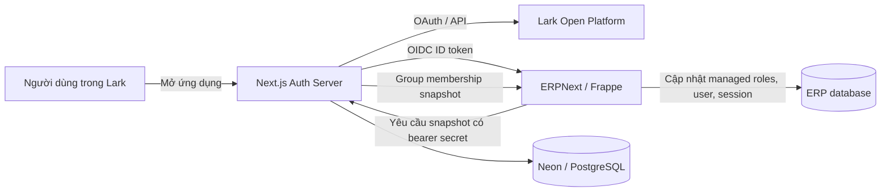

# Báo cáo audit bảo mật Lark SSO và đồng bộ quyền ERP

- Ngày audit: 2026-09-04
- Phạm vi: `apps/auth-server`, tích hợp OIDC với ERPNext và cơ chế chiếu quyền từ Lark sang ERP
- Mô hình quyền: Lark là Source of Truth; ERP chỉ giữ projection của các role được quản lý
- Ngoài phạm vi: audit bảo mật toàn bộ ERPNext/Frappe, hạ tầng Vercel/Neon bên ngoài repository và kiểm thử phá hoại trên production

## Tóm tắt điều hành

Kiến trúc hiện tại đã có các kiểm soát nền tảng tốt: PKCE S256, ràng buộc OAuth state với trình duyệt, nonce, xác minh ID token RS256, định danh ổn định bằng `tenant_key + union_id`, chữ ký bearer dùng so sánh constant-time, giới hạn tuổi snapshot và danh sách role đặc quyền bị cấm quản lý từ Lark.

Tuy nhiên hệ thống **chưa nên được coi là hoàn tất về bảo mật và tính nhất quán quyền**. Audit ghi nhận:

| Mức độ | Số lượng |
|---|---:|
| Critical | 0 |
| High | 3 |
| Medium | 5 |
| Low | 2 |

Hai lỗi cần xử lý trước tiên là:

1. Luồng request dùng cookie `sid` của ERPNext có khả năng không đi qua `auth_hooks`, khiến đồng bộ quyền theo request không chạy trên luồng Desk thông thường.
2. Một phiên đăng nhập còn hiệu lực tại Auth Server có thể hoàn tất OIDC bằng snapshot group cũ mà không buộc refresh từ Lark.

Ngoài ra, endpoint bắt đầu đăng nhập công khai có thể tạo không giới hạn bản ghi OAuth, readiness hiện chưa chứng minh chuỗi SSO đang hoạt động, và việc bỏ cron hoàn toàn để lại khoảng trống hội tụ đối với user không phát sinh HTTP request.

## Kiến trúc và ranh giới tin cậy

Các tài sản cần bảo vệ gồm danh tính Lark, phiên Auth Server, phiên ERPNext, khóa ký OIDC, secret đồng bộ nội bộ, group membership và các role ERP được chiếu từ Lark.

## Các kiểm soát đã xác nhận

- OAuth sử dụng PKCE S256, state gắn với trình duyệt và nonce.
- ID token được xác minh chữ ký RS256, issuer và audience chính xác; email phải được xác minh.
- Liên kết user dùng `tenant_key + union_id`, không hạ cấp sang `open_id`.
- Endpoint nhận snapshot chỉ chấp nhận `POST`, kiểm tra schema, tenant và bearer secret bằng so sánh constant-time.
- Các role `Administrator`, `All`, `Guest` và `System Manager` bị cấm đưa vào tập role do Lark quản lý.
- Snapshot mặc định chỉ hợp lệ trong 120 giây; stale lock mặc định là 600 giây.
- Các file `.env` đang được Git ignore; audit không đưa secret thật vào báo cáo.
- Cấu hình hiện tại bật cả đồng bộ group phía Auth Server và đồng bộ role phía ERP; hai sync secret có cùng độ dài và khớp nhau tại thời điểm kiểm tra.

## Phát hiện chi tiết

### SSO-01 — High — Request dùng cookie ERP có thể bỏ qua đồng bộ quyền theo request

**Bằng chứng**

- [`hooks.py:182`](../../apps/letron_api/letron_api/hooks.py#L182) chỉ đăng ký `rewrite_public_routes` trong `before_request`, còn enforcement SSO được đăng ký tại [`hooks.py:184`](../../apps/letron_api/letron_api/hooks.py#L184) dưới `auth_hooks`.
- Hàm enforcement nằm tại [`sso.py:299`](../../apps/letron_api/letron_api/sso.py#L299).
- Trong mã nguồn Frappe hiện hành, `validate_auth_via_hooks()` chỉ được gọi khi header `Authorization` có đúng hai phần: [Frappe `auth.py`](https://github.com/frappe/frappe/blob/develop/frappe/auth.py).
- Request khôi phục session cookie trước khi chạy `before_request`, sau đó mới gọi `validate_auth`: [Frappe `app.py`](https://github.com/frappe/frappe/blob/develop/frappe/app.py).
- Tài liệu Frappe mô tả auth hook chủ yếu cho cơ chế xác thực tùy chỉnh qua header: [Frappe authentication hooks](https://docs.frappe.io/framework/user/en/python-api/hooks).

**Tác động**

ERP Desk thông thường dùng cookie `sid` và không cần header `Authorization`. Vì vậy người dùng đã bị loại khỏi group Lark có thể tiếp tục dùng phiên ERP cho đến khi phiên hết hạn hoặc một luồng khác vô hiệu hóa user. Cam kết thu hồi quyền theo chu kỳ ngắn không được bảo đảm trên luồng trình duyệt chính.

**Khuyến nghị vá**

- Đăng ký enforcement ở cả `before_request` và `auth_hooks`.
- Làm enforcement idempotent theo từng request để không gọi đồng bộ hai lần.
- Bổ sung regression test cho cả cookie `sid` và API token.

**Lưu ý false positive**

Audit chưa chạy container để đối chiếu đúng commit Frappe đang pin. Kết luận dựa trên cấu trúc tích hợp trong repository, tài liệu chính thức và mã nguồn Frappe hiện hành; cần khóa lại bằng một kiểm thử runtime trên image thực tế.

### SSO-02 — High — Phiên Auth Server cũ có thể phát hành claim từ snapshot group cũ

**Bằng chứng**

- Khi đã có user và session, [`app/login/page.tsx:13`](../../apps/auth-server/app/login/page.tsx#L13) chuyển thẳng sang `/api/auth/session/continue`.
- [`session/continue.ts:15`](../../apps/auth-server/pages/api/auth/session/continue.ts#L15) xác minh session, rotate cookie rồi hoàn tất interaction nhưng không gọi refresh group.
- [`oidc.ts:94`](../../apps/auth-server/src/server/oidc.ts#L94) đọc `groupIds` và `groupsSyncedAt` đã lưu khi dựng account claims mà không áp freshness gate tại điểm phát hành.
- Refresh cho user đã biết có trong [`lark/start.ts:26`](../../apps/auth-server/pages/api/auth/lark/start.ts#L26), nhưng nhánh tiếp tục session hiện tại không đi qua đoạn này.

**Tác động**

- Trong cửa sổ hợp lệ, role cũ có thể tiếp tục được phát hành.
- Sau khi snapshot quá hạn, một user vẫn hợp lệ có thể bị ERP từ chối với lỗi stale dù đang có membership đúng trên Lark.
- Silent OIDC authorization cũng có thể dùng claim đã lưu thay vì trạng thái Lark mới nhất.

**Khuyến nghị vá**

- Đưa kiểm tra freshness và refresh group vào một điểm trung tâm bắt buộc trước mọi lần hoàn tất OIDC hoặc phát hành claim.
- Không chỉ vá riêng trang login; phải bao phủ cả existing session và silent authorization.
- Khi Lark không truy cập được, áp dụng chính sách stale-window rõ ràng và không phát hành claim quá tuổi tối đa.

### SSO-03 — High — Endpoint bắt đầu đăng nhập có thể làm tăng DB không giới hạn

**Bằng chứng**

- [`lark/start.ts:44`](../../apps/auth-server/pages/api/auth/lark/start.ts#L44) tạo transaction và lưu DB cho mỗi request GET chưa xác thực trước khi redirect.
- [`oauth-transaction.ts:8`](../../apps/auth-server/src/server/oauth-transaction.ts#L8) thực hiện insert OAuth transaction.
- Các bảng lưu transaction, session và OIDC artifact nằm tại [`schema.prisma:30`](../../apps/auth-server/prisma/schema.prisma#L30), [`schema.prisma:65`](../../apps/auth-server/prisma/schema.prisma#L65) và [`schema.prisma:80`](../../apps/auth-server/prisma/schema.prisma#L80).
- [`session.ts:67`](../../apps/auth-server/src/server/session.ts#L67) revoke session cũ rồi tạo thêm bản ghi mới khi rotate.
- Không tìm thấy retention/cleanup job hoặc cấu hình rate limit trong repository.

**Tác động**

Bot có thể spam endpoint công khai để tăng số bản ghi và chi phí Neon. Ngay cả lưu lượng hợp lệ cũng tích lũy transaction hết hạn, session đã revoke và artifact cũ.

**Khuyến nghị vá**

- Rate limit theo IP và browser binding tại điểm bắt đầu/callback; bổ sung giới hạn tổng thể ở edge/WAF.
- Xóa có giới hạn các transaction, session và artifact đã hết hạn bằng opportunistic cleanup hoặc maintenance job.
- Tạo index phục vụ điều kiện retention và đo tốc độ tăng bảng.

**Giảm nhẹ có thể tồn tại**

Vercel Firewall/WAF bên ngoài repository có thể đã hạn chế lưu lượng. Audit không nhìn thấy cấu hình đó nên không thể coi là kiểm soát đã xác nhận.

### SSO-04 — Medium — Cấu hình có thể fail-open và readiness không kiểm tra đầy đủ chuỗi SSO

**Bằng chứng**

- [`sso.py:311`](../../apps/letron_api/letron_api/sso.py#L311) từ chối cấu hình sai, nhưng [`sso.py:317`](../../apps/letron_api/letron_api/sso.py#L317) trả về ngay khi role sync bị tắt.
- Health endpoint tại [`api.py:20`](../../apps/letron_api/letron_api/api.py#L20) công khai trạng thái tổng thể `ok` dù trạng thái SSO được trả riêng ở [`api.py:41`](../../apps/letron_api/letron_api/api.py#L41).
- Readiness trong [`docker-start.ps1:62`](../../docker-start.ps1#L62) kiểm tra HTTP/config drift nhưng chưa buộc Auth Server có thể phục vụ role snapshot và hai phía cùng bật enforcement.

**Tác động**

Một lần drift biến môi trường có thể tắt enforcement trong khi role và session cũ vẫn tồn tại. Deployment vẫn có thể báo sẵn sàng dù chuỗi Lark → Auth Server → ERP đang hỏng.

**Khuyến nghị vá**

- Với production, user đã liên kết Lark phải fail-closed khi role sync bị tắt.
- Nếu cần emergency bypass, dùng biến riêng có lý do, người chịu trách nhiệm và thời hạn tự hết hiệu lực.
- Readiness phải xác nhận cả hai cờ đồng bộ, kết nối Auth Server và phản hồi snapshot hợp lệ mà không tiết lộ dữ liệu người dùng.

### SSO-05 — Medium — Bỏ cron hoàn toàn để lại khoảng trống hội tụ

**Bằng chứng**

Cơ chế hiện tại đồng bộ khi có HTTP request. User không hoạt động sẽ không được cập nhật; background job không đi qua request hook; kết nối WebSocket đã mở có thể không bị ngắt ngay khi quyền bị thu hồi.

**Tác động**

Projection trong ERP có thể khác Lark SOT trong thời gian không giới hạn đối với user không tạo request. Đây là khoảng trống coverage, chưa phải bằng chứng rằng một background job cụ thể hiện có thể ghi dữ liệu trái quyền.

**Khuyến nghị vá**

- Ưu tiên webhook/event của Lark cho thay đổi user/group nếu API và loại ứng dụng hỗ trợ, giữ on-request sync làm safety net.
- Nếu không có event phù hợp, duy trì reconciliation tần suất thấp thay vì tuyên bố loại bỏ hoàn toàn mọi tác vụ định kỳ.
- Xác định rõ chính sách ngắt WebSocket và quyền của background job.

### SSO-06 — Medium — Đồng bộ blocking phụ thuộc upstream có thể gây nghẽn request

**Bằng chứng**

- [`sso.py:31`](../../apps/letron_api/letron_api/sso.py#L31) cho phép HTTP sync chờ đến 30 giây.
- [`sso.py:325`](../../apps/letron_api/letron_api/sso.py#L325) khóa các request đồng thời của cùng user trong thời gian có thể lên tới 35 giây.
- [`lark.ts:115`](../../apps/auth-server/src/server/lark.ts#L115) lấy tenant token rồi duyệt tối đa 100 trang membership, mỗi request có timeout riêng.
- Endpoint serverless cho phép tối đa 60 giây tại [`lark-role-snapshots.ts:18`](../../apps/auth-server/pages/api/internal/lark-role-snapshots.ts#L18).

**Tác động**

Sự cố Lark hoặc Auth Server có thể làm request ERP treo lâu và tạo hàng đợi theo user. Sau stale-lock, người dùng hợp lệ cũng bị khóa khi upstream chưa phục hồi.

**Khuyến nghị vá**

- Đặt budget end-to-end ngắn hơn cho request tương tác.
- Thêm circuit breaker, exponential backoff có jitter và metrics cho timeout/stale-lock.
- Dùng projection cập nhật bằng event làm đường chính; on-demand chỉ là fallback có giới hạn.

### SSO-07 — Medium — Cho phép HTTP nội bộ quá rộng theo cấu hình

**Bằng chứng**

- [`sso_protocol.py:75`](../../apps/letron_api/letron_api/sso_protocol.py#L75) chấp nhận scheme `http` khi `allow_internal_http` bật.
- Sync URL gọi validator với tùy chọn này tại [`sso_protocol.py:147`](../../apps/letron_api/letron_api/sso_protocol.py#L147).

**Tác động**

Nếu production bị cấu hình nhầm tới host bên ngoài qua HTTP, bearer sync secret và stable identity có thể truyền không mã hóa.

**Khuyến nghị vá**

Chỉ cho phép HTTP với danh sách host nội bộ cố định như `localhost`, `127.0.0.1` và `host.docker.internal`; mọi host khác bắt buộc HTTPS. URL hiện tại dùng `host.docker.internal` nên phù hợp cho môi trường local.

### SSO-08 — Medium — Dependency production có advisory mức High

**Bằng chứng**

`npm audit --omit=dev --audit-level=low` báo bốn vulnerability mức High trong dependency gián tiếp của Prisma 7.10.0:

- `deepmerge-ts` 7.1.5: [GHSA-ggr8-5vv4-36mx](https://github.com/advisories/GHSA-ggr8-5vv4-36mx).
- `mysql2` 3.15.3: [GHSA-3f6p-5ww8-9rcr](https://github.com/advisories/GHSA-3f6p-5ww8-9rcr) và [GHSA-rgwj-5xj2-c3m3](https://github.com/advisories/GHSA-rgwj-5xj2-c3m3).

`npm ls --omit=dev deepmerge-ts mysql2 --all` xác nhận đường phụ thuộc là `@prisma/client@7.10.0 → prisma@7.10.0 → dependency`.

**Tác động và khả năng khai thác**

Ứng dụng dùng PostgreSQL/Neon, không dùng MySQL, và audit chưa thấy dữ liệu graph đệ quy do attacker kiểm soát đi vào `deepmerge-ts`. Vì vậy mức ứng dụng được đánh giá Medium dù advisory upstream là High.

**Khuyến nghị vá**

Theo dõi và nâng Prisma lên bản tương thích đã cập nhật dependency. Không chạy mù quáng `npm audit fix --force`, vì đề xuất hiện tại có thể hạ Prisma xuống major cũ và tạo breaking change.

### SSO-09 — Low — Auth Server chưa có Content-Security-Policy

**Bằng chứng**

- [`next.config.ts:3`](../../apps/auth-server/next.config.ts#L3) đã đặt `nosniff`, `X-Frame-Options`, `Referrer-Policy` và `Permissions-Policy`, nhưng chưa có CSP.
- Logout source có inline script tại [`oidc.ts:83`](../../apps/auth-server/src/server/oidc.ts#L83), nên việc thêm CSP cần nonce/hash hoặc thay bằng submit không dùng script.

**Tác động**

Thiếu một lớp phòng thủ quan trọng nếu tương lai xuất hiện XSS. Audit hiện chưa tìm thấy sink HTML không tin cậy trực tiếp.

**Khuyến nghị vá**

Triển khai CSP ở chế độ report-only, xử lý inline script, sau đó chuyển sang enforce với `default-src 'self'`, `object-src 'none'`, `base-uri 'none'` và `frame-ancestors 'none'` phù hợp.

### SSO-10 — Low — Health endpoint công khai tiết lộ chi tiết vận hành

**Bằng chứng**

- [`api.py:20`](../../apps/letron_api/letron_api/api.py#L20) cho guest xem version Frappe, installed apps và số liệu/trạng thái SSO.
- [`health.ts:6`](../../apps/auth-server/pages/api/health.ts#L6) công khai số identity đã biết và bị stale.

**Tác động**

Thông tin giúp reconnaissance, fingerprint phiên bản và theo dõi quy mô hoạt động của hệ thống.

**Khuyến nghị vá**

Public liveness chỉ nên trả trạng thái tối thiểu. Chuyển version, installed apps, counters và dependency diagnostics sang endpoint yêu cầu quyền vận hành.

## Thứ tự xử lý đề xuất

### P0 — Trước khi coi cơ chế thu hồi quyền là hoàn chỉnh

1. Vá SSO-01 để mọi request cookie `sid` đều được enforcement.
2. Vá SSO-02 để mọi lần phát hành OIDC claim đều có snapshot đủ mới.

### P1 — Trước khi mở rộng người dùng production

1. Vá SSO-03 bằng rate limit và retention.
2. Vá SSO-04 để production fail-closed và readiness kiểm tra xuyên suốt.

### P2 — Tăng độ bền vận hành

1. Bổ sung event/webhook hoặc reconciliation tối thiểu cho SSO-05.
2. Giảm timeout, thêm circuit breaker/metrics cho SSO-06.
3. Siết URL validation, nâng dependency, thêm CSP và thu gọn health output.

## Bộ kiểm thử chấp nhận bắt buộc

1. User còn trong `ERP - Access`, dùng cookie `sid`, mở Desk và gọi XHR bình thường: snapshot được refresh đúng hạn, user vẫn active.
2. Loại user khỏi group, chờ qua refresh interval, gọi một Desk XHR bằng cookie cũ: request bị từ chối, managed roles bị gỡ, user bị disable và session ERP bị xóa theo policy.
3. User hợp lệ có phiên Auth Server cũ hơn 120 giây vẫn hoàn tất OIDC sau khi hệ thống refresh thành công từ Lark.
4. User đã bị loại khỏi group nhưng còn phiên Auth Server cũ không thể nhận ID token/claim quyền cũ.
5. API token đi qua cùng policy với cookie session và không tạo double-sync trong một request.
6. Khi Lark/Auth Server lỗi: request trong stale window phản hồi nhanh theo policy; quá ngưỡng thì fail-closed, không tạo chuỗi chờ 30 giây.
7. Spam `/api/auth/lark/start` bị rate limit; transaction/session/artifact hết hạn được dọn và kích thước bảng hội tụ.
8. Readiness thất bại nếu hai cờ sync lệch nhau, Auth Server không truy cập được hoặc snapshot contract sai.
9. Hành vi WebSocket và background job khi quyền bị thu hồi được kiểm thử hoặc được ghi nhận rõ là residual risk.

## Giới hạn xác minh

- Audit này là review source/config và dependency, không sửa source code.
- Không khởi động Docker và không chạy end-to-end với phiên Lark thật trong lần audit này.
- Kết quả build/test xanh từ các lần triển khai trước không thay thế bộ acceptance test nêu trên.
- Cấu hình WAF, rate limit, log drain và secret rotation trên Vercel/Neon nằm ngoài repository nên chưa được xác nhận.

## Kết luận

Mô hình chọn Lark làm SOT là khả thi, nhưng trạng thái hiện tại vẫn có hai đường làm sai cam kết đồng bộ quyền: request ERP bằng cookie có thể không kích hoạt enforcement và OIDC có thể phát claim từ session cũ. Sau khi xử lý P0, hệ thống vẫn cần rate limit/retention và readiness fail-closed trước khi có thể gọi là sẵn sàng production. Việc bỏ cron chỉ an toàn khi có event-driven convergence hoặc khi doanh nghiệp chấp nhận rõ residual drift đối với user không hoạt động.
